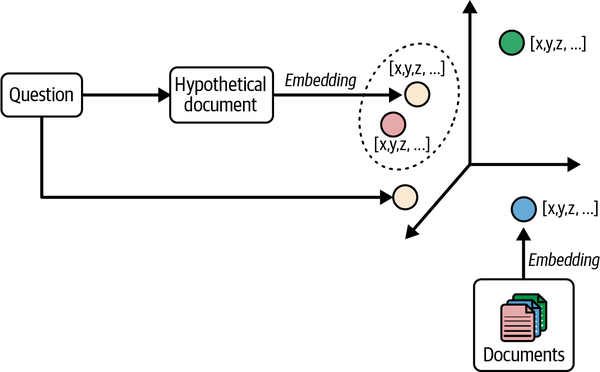
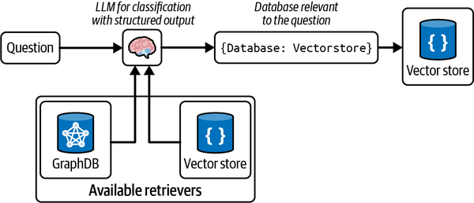
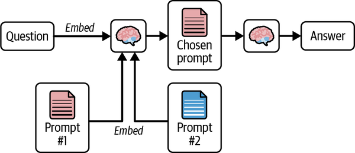
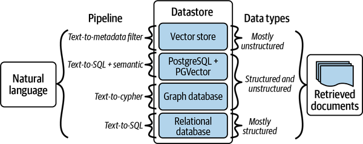
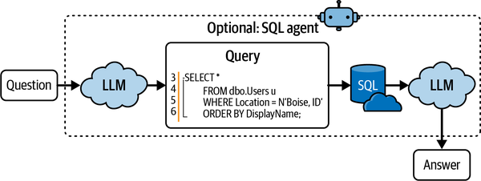

# RAG Bagian II: Mengobrol dengan Data Anda

_Python_

```python
prompt = ChatPromptTemplate.from_template("""Jawab pertanyaan berikut berdasarkan
    konteks ini:

{context}

Pertanyaan: {question}
""")

llm = ChatOpenAI(temperature=0)

@chain
def multi_query_qa(input):
    # ambil dokumen yang relevan
    docs = retrieval_chain.invoke(input)
    # format prompt
    formatted = prompt.invoke({"context": docs, "question": input})
    # buat jawaban
    answer = llm.invoke(formatted)
    return answer

multi_query_qa.invoke("""Siapa saja tokoh kunci dalam sejarah filsafat Yunani kuno
    ?""")
```

_JavaScript_

```javascript
const rewritePrompt = ChatPromptTemplate.fromTemplate(`Jawab pertanyaan berikut 
  berdasarkan konteks ini:

{context}

Pertanyaan: {question}
`)

const llm = new ChatOpenAI({ temperature: 0 })

const multiQueryQa = RunnableLambda.from(async (input) => {
  // ambil dokumen yang relevan
  const docs = await retrievalChain.invoke(input)
  // format prompt
  const formatted = await prompt.invoke({ context: docs, question: input })
  // buat jawaban
  const answer = await llm.invoke(formatted)
  return answer
})

await multiQueryQa.invoke(`Siapa saja tokoh kunci dalam sejarah filsafat Yunani 
  kuno?`)
```

Kekuatan RAG-Fusion terletak pada kemampuannya menangkap ekspresi yang dimaksud pengguna, menavigasi kueri kompleks, dan memperluas cakupan dokumen yang diambil, memungkinkan penemuan tak terduga.

## Embedding Dokumen Hipotesis (Hypothetical Document Embeddings)

_Embedding Dokumen Hipotesis_ (HyDE) adalah strategi yang melibatkan pembuatan dokumen hipotesis berdasarkan kueri pengguna, mengembed dokumen tersebut, dan mengambil dokumen relevan berdasarkan kesamaan vektor.^4 Intuisi di balik HyDE adalah bahwa dokumen hipotesis yang dihasilkan LLM akan lebih mirip dengan dokumen paling relevan daripada kueri asli, seperti ditunjukkan pada [Gambar 3-7](#ch03_figure_7_1736545666780724).



_Ilustrasi HyDE lebih dekat di ruang vektor ke embedding dokumen daripada embedding kueri biasa_

Pertama, definisikan prompt untuk membuat dokumen hipotesis:

_Python_

```python
from langchain.prompts import ChatPromptTemplate
from langchain_core.output_parsers import StrOutputParser
from langchain_openai import ChatOpenAI

prompt_hyde = ChatPromptTemplate.from_template("""Tolong tulis sebuah paragraf untuk
   menjawab pertanyaan.\n Pertanyaan: {question} \n Paragraf:""")

generate_doc = (
    prompt_hyde | ChatOpenAI(temperature=0) | StrOutputParser()
)
```

_JavaScript_

```javascript
import { ChatOpenAI } from "@langchain/openai"
import { ChatPromptTemplate } from "@langchain/core/prompts"
import { RunnableLambda } from "@langchain/core/runnables"

const prompt =
  ChatPromptTemplate.fromTemplate(`Tolong tulis sebuah paragraf untuk 
  menjawab pertanyaan
Pertanyaan: {question}
Paragraf:`)

const llm = new ChatOpenAI({ temperature: 0 })

const generateDoc = prompt.pipe(llm).pipe((msg) => msg.content)
```

Selanjutnya, kita ambil dokumen hipotesis dan gunakan sebagai masukan ke `retriever`, yang akan menghasilkan embedding-nya dan mencari dokumen serupa di toko vektor:

_Python_

```python
retrieval_chain = generate_doc | retriever
```

_JavaScript_

```javascript
const retrievalChain = generateDoc.pipe(retriever)
```

Terakhir, kita ambil dokumen yang diambil, berikan sebagai konteks ke prompt akhir, dan instruksikan model untuk menghasilkan keluaran:

_Python_

```python
prompt = ChatPromptTemplate.from_template("""Jawab pertanyaan berikut berdasarkan
    konteks ini:

{context}

Pertanyaan: {question}
""")

llm = ChatOpenAI(temperature=0)

@chain
def qa(input):
  # ambil dokumen relevan dari rantai pengambilan hyde yang didefinisikan sebelumnya
  docs = retrieval_chain.invoke(input)
  # format prompt
  formatted = prompt.invoke({"context": docs, "question": input})
  # buat jawaban
  answer = llm.invoke(formatted)
  return answer

qa.invoke("""Siapa saja tokoh kunci dalam sejarah filsafat Yunani kuno
    ?""")
```

_JavaScript_

```javascript
const prompt = ChatPromptTemplate.fromTemplate(`Jawab pertanyaan berikut 
  berdasarkan konteks ini:

{context}

Pertanyaan: {question}
`)

const llm = new ChatOpenAI({ temperature: 0 })

const qa = RunnableLambda.from(async (input) => {
  // ambil dokumen relevan dari rantai pengambilan hyde yang didefinisikan sebelumnya
  const docs = await retrievalChain.invoke(input)
  // format prompt
  const formatted = await prompt.invoke({ context: docs, question: input })
  // buat jawaban
  const answer = await llm.invoke(formatted)
  return answer
})

await qa.invoke(`Siapa saja tokoh kunci dalam sejarah filsafat Yunani kuno 
  ?`)
```

Untuk menyegarkan kembali apa yang kita bahas di bagian ini, transformasi kueri terdiri dari mengambil kueri asli pengguna dan melakukan hal berikut:

- Menulis ulang menjadi satu atau lebih kueri
- Menggabungkan hasil kueri-kueri tersebut menjadi satu set hasil paling relevan

Penulisan ulang kueri dapat mengambil banyak bentuk, tetapi biasanya dilakukan dengan cara serupa: ambil kueri asli pengguna—prompt yang Anda tulis—dan minta LLM untuk menulis kueri baru atau beberapa kueri. Beberapa contoh perubahan tipikal yang dibuat adalah:

- Menghapus teks tidak relevan/tidak terkait dari kueri.
- Membumikan kueri dengan riwayat percakapan sebelumnya. Misalnya, untuk memahami kueri seperti _dan bagaimana dengan di LA,_ kita perlu menggabungkannya dengan pertanyaan hipotetis sebelumnya tentang cuaca di SF, untuk sampai pada kueri berguna seperti _cuaca di LA_.
- Memperluas jaring untuk dokumen relevan dengan juga mengambil dokumen untuk kueri terkait.
- Menguraikan pertanyaan kompleks menjadi beberapa pertanyaan lebih sederhana dan kemudian memasukkan hasil untuk semua pertanyaan tersebut ke dalam prompt akhir untuk menghasilkan jawaban.

Strategi penulisan ulang yang tepat akan bergantung pada kasus penggunaan Anda.

Setelah membahas strategi transformasi kueri utama, mari kita bahas pertanyaan utama kedua untuk membangun sistem RAG yang tangguh: Bagaimana kita mengarahkan kueri untuk mengambil data relevan dari berbagai sumber data?

# Pengarahan Kueri (Query Routing)

Meskipun menggunakan satu toko vektor berguna, data yang diperlukan mungkin berada di berbagai sumber data, termasuk basis data relasional atau toko vektor lain.

Misalnya, Anda mungkin memiliki dua toko vektor: satu untuk dokumentasi LangChain Python dan satu lagi untuk dokumentasi LangChain JS. Diberikan pertanyaan pengguna, kita ingin _mengarahkan_ kueri ke sumber data yang disimpulkan sesuai untuk mengambil dokumen relevan. _Pengarah kueri_ adalah strategi yang digunakan untuk meneruskan kueri pengguna ke sumber data yang relevan.

## Pengarahan Logis (Logical Routing)

Dalam* pengarahan logis*, kita memberi LLM pengetahuan tentang berbagai sumber data yang kita miliki dan kemudian membiarkan LLM mempertimbangkan sumber data mana yang akan diterapkan berdasarkan kueri pengguna, seperti yang ditunjukkan pada [Gambar 3-8](#ch03_figure_8_1736545666780744).



_Pengarahan kueri ke sumber data relevan_

Untuk mencapai ini, kita menggunakan model pemanggilan fungsi seperti GPT-3.5 Turbo untuk membantu mengklasifikasikan setiap kueri ke salah satu rute yang tersedia. _Pemanggilan fungsi_ melibatkan definisi skema yang dapat digunakan model untuk menghasilkan argumen fungsi berdasarkan kueri. Ini memungkinkan kita menghasilkan keluaran terstruktur yang dapat digunakan untuk menjalankan fungsi lain. Kode Python berikut mendefinisikan skema untuk router kita berdasarkan tiga dokumen untuk bahasa berbeda:

_Python_

```python
from typing import Literal

from langchain_core.prompts import ChatPromptTemplate
from langchain_core.pydantic_v1 import BaseModel, Field
from langchain_openai import ChatOpenAI

# Model data
class RouteQuery(BaseModel):
    """Arahkan kueri pengguna ke sumber data paling relevan."""

    datasource: Literal["python_docs", "js_docs"] = Field(
        ...,
        description="""Diberikan pertanyaan pengguna, pilih sumber data mana yang akan
            paling relevan untuk menjawab pertanyaan mereka""",
    )

# LLM dengan pemanggilan fungsi
llm = ChatOpenAI(model="gpt-3.5-turbo", temperature=0)
structured_llm = llm.with_structured_output(RouteQuery)

# Prompt
system = """Anda adalah ahli dalam mengarahkan pertanyaan pengguna ke sumber data
    yang sesuai.

Berdasarkan bahasa pemrograman yang dirujuk pertanyaan, arahkan ke sumber data
    relevan."""

prompt = ChatPromptTemplate.from_messages(
    [
        ("system", system),
        ("human", "{question}"),
    ]
)

# Definisikan router
router  =  prompt  |  structured_llm
```

_JavaScript_

```javascript
import { ChatOpenAI } from "@langchain/openai"
import { z } from "zod"

const routeQuery = z
  .object({
    datasource: z.enum(["python_docs", "js_docs"])
      .describe(`Diberikan pertanyaan 
    pengguna, pilih sumber data mana yang paling relevan untuk menjawab 
    pertanyaan mereka`),
  })
  .describe("Arahkan kueri pengguna ke sumber data paling relevan.")

const llm = new ChatOpenAI({ model: "gpt-3.5-turbo", temperature: 0 })
const structuredLlm = llm.withStructuredOutput(routeQuery, {
  name: "RouteQuery",
})

const prompt = ChatPromptTemplate.fromMessages([
  [
    "system",
    `Anda adalah ahli dalam mengarahkan pertanyaan pengguna ke sumber data 
      yang sesuai.

Berdasarkan bahasa pemrograman yang dirujuk pertanyaan, arahkan ke 
  sumber data relevan.`,
  ],
  ["human", "{question}"],
])

const router = prompt.pipe(structuredLlm)
```

Sekarang kita panggil LLM untuk mengekstrak sumber data berdasarkan skema yang telah ditentukan:

_Python_

```python
question = """Mengapa kode berikut tidak berfungsi:

from langchain_core.prompts import ChatPromptTemplate

prompt = ChatPromptTemplate.from_messages(["human", "speak in {language}"])
prompt.invoke("french")
"""

result = router.invoke({"question": question})

result.datasource
# "python_docs"
```

_JavaScript_

```javascript
const question = `Mengapa kode berikut tidak berfungsi:

from langchain_core.prompts import ChatPromptTemplate

prompt = ChatPromptTemplate.from_messages(["human", "speak in {language}"])
prompt.invoke("french")
`

await router.invoke({ question })
```

_Keluaran:_

```
{
    datasource: "python_docs"
}
```

Perhatikan bagaimana LLM menghasilkan keluaran JSON, sesuai dengan skema yang kita definisikan sebelumnya. Ini akan berguna dalam banyak tugas lain.

Setelah kita mengekstrak sumber data relevan, kita dapat meneruskan nilai ke fungsi lain untuk menjalankan logika tambahan sesuai kebutuhan:

_Python_

```python
def choose_route(result):
    if "python_docs" in result.datasource.lower():
        ### Logika di sini
        return "rantai untuk python_docs"
    else:
        ### Logika di sini
        return "rantai untuk js_docs"

full_chain = router | RunnableLambda(choose_route)
```

_JavaScript_

```javascript
function chooseRoute(result) {
  if (result.datasource.toLowerCase().includes("python_docs")) {
    return "rantai untuk python_docs"
  } else {
    return "rantai untuk js_docs"
  }
}

const fullChain = router.pipe(chooseRoute)
```

Perhatikan bagaimana kita tidak melakukan perbandingan string tepat tetapi pertama-tama mengubah keluaran yang dihasilkan menjadi huruf kecil, lalu melakukan pencocokan substring. Ini membuat rantai kita lebih tahan terhadap LLM yang keluar dari skrip dan menghasilkan keluaran yang tidak sepenuhnya sesuai dengan skema yang kita minta.

> **Tip**
> Ketahanan terhadap sifat acak keluaran LLM adalah tema penting yang harus diingat saat membangun aplikasi LLM Anda.

Pengarah logis paling cocok ketika Anda memiliki daftar sumber data tertentu dari mana data relevan dapat diambil dan digunakan oleh LLM untuk menghasilkan keluaran akurat. Ini dapat berkisar dari toko vektor ke basis data dan bahkan API.

## Pengarahan Semantik (Semantic Routing)

Berbeda dengan pengarahan logis, _pengarahan semantik_ melibatkan pengembed berbagai prompt yang mewakili berbagai sumber data bersama kueri pengguna dan kemudian melakukan pencarian kesamaan vektor untuk mengambil prompt paling serupa. [Gambar 3-9](#ch03_figure_9_1736545666780765) mengilustrasikan.



_Pengarahan semantik untuk meningkatkan akurasi dokumen yang diambil_

Berikut adalah contoh pengarahan semantik:

_Python_

```python
from langchain.utils.math import cosine_similarity
from langchain_core.output_parsers import StrOutputParser
from langchain_core.prompts import PromptTemplate
from langchain_core.runnables import chain
from langchain_openai import ChatOpenAI, OpenAIEmbeddings

# Dua prompt
physics_template = """Anda adalah profesor fisika yang sangat pintar. Anda hebat dalam
    menjawab pertanyaan tentang fisika dengan cara ringkas dan mudah dipahami.
    Ketika Anda tidak tahu jawaban suatu pertanyaan, Anda mengakui bahwa Anda tidak tahu.

Ini sebuah pertanyaan:
{query}"""

math_template = """Anda adalah matematikawan yang sangat baik. Anda hebat dalam menjawab
    pertanyaan matematika. Anda sangat baik karena mampu memecah masalah
    sulit menjadi bagian-bagian komponennya, menjawab bagian-bagian komponen, lalu
    menggabungkannya untuk menjawab pertanyaan yang lebih luas.

Ini sebuah pertanyaan:
{query}"""

# Embed prompt
embeddings = OpenAIEmbeddings()
prompt_templates = [physics_template, math_template]
prompt_embeddings = embeddings.embed_documents(prompt_templates)

# Arahkan pertanyaan ke prompt
@chain
def prompt_router(query):
    # Embed pertanyaan
    query_embedding = embeddings.embed_query(query)
    # Hitung kesamaan
    similarity = cosine_similarity([query_embedding], prompt_embeddings)[0]
    # Pilih prompt paling mirip dengan pertanyaan masukan
    most_similar = prompt_templates[similarity.argmax()]
    return PromptTemplate.from_template(most_similar)

semantic_router = (
    prompt_router
    | ChatOpenAI()
    | StrOutputParser()
)

print(semantic_router.invoke("Apa itu lubang hitam"))
```

_JavaScript_

```javascript
import { cosineSimilarity } from "@langchain/core/utils/math"
import { ChatOpenAI, OpenAIEmbeddings } from "@langchain/openai"
import { PromptTemplate } from "@langchain/core/prompts"
import { RunnableLambda } from "@langchain/core/runnables"

const physicsTemplate = `Anda adalah profesor fisika yang sangat pintar. Anda hebat
  dalam menjawab pertanyaan tentang fisika dengan cara ringkas dan mudah dipahami.
  Ketika Anda tidak tahu jawaban suatu pertanyaan, Anda mengakui bahwa Anda
  tidak tahu.

Ini sebuah pertanyaan:
{query}`

const mathTemplate = `Anda adalah matematikawan yang sangat baik. Anda hebat dalam
  menjawab pertanyaan matematika. Anda sangat baik karena mampu memecah
  masalah sulit menjadi bagian-bagian komponennya, menjawab bagian-bagian komponen, dan
  kemudian menggabungkannya untuk menjawab pertanyaan yang lebih luas.

Ini sebuah pertanyaan:
{query}`

const embeddings = new OpenAIEmbeddings()

const promptTemplates = [physicsTemplate, mathTemplate]
const promptEmbeddings = await embeddings.embedDocuments(promptTemplates)

const promptRouter = RunnableLambda.from(async (query) => {
  // Embed pertanyaan
  const queryEmbedding = await embeddings.embedQuery(query)
  // Hitung kesamaan
  const similarities = cosineSimilarity([queryEmbedding], promptEmbeddings)[0]
  // Pilih prompt paling mirip dengan pertanyaan masukan
  const mostSimilar =
    similarities[0] > similarities[1] ? promptTemplates[0] : promptTemplates[1]
  return PromptTemplate.fromTemplate(mostSimilar)
})

const semanticRouter = promptRouter.pipe(new ChatOpenAI())

await semanticRouter.invoke("Apa itu lubang hitam")
```

Setelah Anda melihat cara mengarahkan kueri pengguna ke sumber data relevan, mari kita bahas pertanyaan utama ketiga saat membangun sistem RAG yang tangguh: "Bagaimana kita mengubah bahasa alami menjadi bahasa kueri dari sumber data target?"

# Konstruksi Kueri (Query Construction)

Seperti dibahas sebelumnya, RAG adalah strategi efektif untuk mengembed dan mengambil data tidak terstruktur relevan dari toko vektor berdasarkan kueri. Tetapi sebagian besar data yang tersedia untuk digunakan dalam aplikasi produksi terstruktur dan biasanya disimpan dalam basis data relasional. Selain itu, data tidak terstruktur yang diembed dalam toko vektor juga mengandung metadata terstruktur yang memiliki informasi penting.

_Konstruksi kueri_ adalah proses mengubah kueri bahasa alami menjadi bahasa kueri dari basis data atau sumber data yang Anda gunakan. Lihat [Gambar 3-10](#ch03_figure_10_1736545666780785).



_Ilustrasi bahasa kueri untuk berbagai sumber data_

Misalnya, pertimbangkan kueri: _Apa film tentang alien di tahun 1980?_ Pertanyaan ini mengandung topik tidak terstruktur yang dapat diambil melalui embedding (_alien_), tetapi juga mengandung komponen terstruktur potensial (_tahun == 1980_).

Bagian-bagian berikut membahas lebih dalam berbagai bentuk konstruksi kueri.

## Teks ke Filter Metadata (Text-to-Metadata Filter)

Sebagian besar toko vektor menyediakan kemampuan untuk membatasi pencarian vektor Anda berdasarkan metadata. Selama proses embedding, kita dapat melampirkan pasangan kunci-nilai metadata ke vektor dalam indeks dan kemudian menentukan ekspresi filter saat Anda mengkueri indeks.

LangChain menyediakan `SelfQueryRetriever` yang mengabstraksi logika ini dan memudahkan penerjemahan kueri bahasa alami menjadi kueri terstruktur untuk berbagai sumber data. Pengambilan mandiri (self-querying) menggunakan LLM untuk mengekstrak dan menjalankan filter metadata relevan berdasarkan kueri pengguna dan skema metadata yang telah ditentukan:

_Python_

```python
from langchain.chains.query_constructor.base import AttributeInfo
from langchain.retrievers.self_query.base import SelfQueryRetriever
from langchain_openai import ChatOpenAI

fields = [
    AttributeInfo(
        name="genre",
        description="Genre film",
        type="string or list[string]",
    ),
    AttributeInfo(
        name="year",
        description="Tahun film dirilis",
        type="integer",
    ),
    AttributeInfo(
        name="director",
        description="Nama sutradara film",
        type="string",
    ),
    AttributeInfo(
        name="rating", description="Penilaian film 1-10", type="float"
    ),
]
description = "Ringkasan singkat film"

llm = ChatOpenAI(temperature=0)

retriever = SelfQueryRetriever.from_llm(
    llm, db, description, fields,
)

print(retriever.invoke(
    "Apa film fiksi ilmiah dengan penilaian tinggi (di atas 8.5)?"))
```

_JavaScript_

```javascript
import { ChatOpenAI } from "@langchain/openai"
import { SelfQueryRetriever } from "langchain/retrievers/self_query"
import { FunctionalTranslator } from "@langchain/core/structured_query"

/**
 * Pertama, kita definisikan atribut yang ingin kita kueri.
 * dalam kasus ini, kita ingin dapat mengkueri genre, tahun, sutradara,
 * penilaian, dan panjang film.
 * Kami juga memberikan deskripsi setiap atribut dan jenis atribut.
 * Ini digunakan untuk menghasilkan prompt kueri.
 */
const fields = [
  {
    name: "genre",
    description: "Genre film",
    type: "string or array of strings",
  },
  {
    name: "year",
    description: "Tahun film dirilis",
    type: "number",
  },
  {
    name: "director",
    description: "Sutradara film",
    type: "string",
  },
  {
    name: "rating",
    description: "Penilaian film (1-10)",
    type: "number",
  },
  {
    name: "length",
    description: "Panjang film dalam menit",
    type: "number",
  },
]
const description = "Ringkasan singkat film"

const llm = new ChatOpenAI()
const attributeInfos = fields.map(
  (field) => new AttributeInfo(field.name, field.description, field.type)
)

const selfQueryRetriever = SelfQueryRetriever.fromLLM({
  llm,
  db,
  description,
  attributeInfo: attributeInfos,
  /**
   * Kita perlu menggunakan penerjemah yang menerjemahkan kueri menjadi
   * format filter yang dapat dipahami toko vektor. LangChain menyediakan satu
   * di sini.
   */
  structuredQueryTranslator: new FunctionalTranslator(),
})

await selfQueryRetriever.invoke(
  "Apa film fiksi ilmiah dengan penilaian tinggi (di atas 8.5)?"
)
```

Ini menghasilkan pengambil (retriever) yang akan mengambil kueri pengguna, dan membaginya menjadi:

- Filter untuk diterapkan pada metadata setiap dokumen terlebih dahulu
- Kueri untuk digunakan dalam pencarian semantik pada dokumen

Untuk melakukan ini, kita harus mendeskripsikan bidang apa yang dimiliki metadata dokumen kita; deskripsi itu akan disertakan dalam prompt. Pengambil kemudian akan melakukan hal berikut:

1. Kirim prompt pembuatan kueri ke LLM.
2. Parsing filter metadata dan kueri pencarian yang ditulis ulang dari keluaran LLM.
3. Ubah filter metadata yang dihasilkan LLM ke format yang sesuai untuk toko vektor kita.
4. Lakukan pencarian kesamaan terhadap toko vektor, difilter hanya untuk mencocokkan dokumen yang metadatanya lolos filter yang dihasilkan.

## Teks ke SQL (Text-to-SQL)

SQL dan basis data relasional adalah sumber penting data terstruktur, tetapi mereka tidak berinteraksi langsung dengan bahasa alami. Meskipun kita bisa menggunakan LLM untuk menerjemahkan kueri pengguna ke kueri SQL, margin kesalahan kecil.

Berikut strategi berguna untuk penerjemahan teks ke SQL yang efektif:

**Deskripsi basis data**
Untuk membumikan kueri SQL, LLM harus diberikan deskripsi akurat tentang basis data. Salah satu prompt teks-ke-SQL umum menggunakan ide yang dilaporkan dalam makalah ini dan lainnya: berikan LLM deskripsi `CREATE TABLE` untuk setiap tabel, termasuk nama kolom dan jenis.^5 Kami juga dapat memberikan beberapa (misalnya, tiga) contoh baris dari tabel.

**Contoh sedikit (Few-shot examples)**
Memberi prompt dengan contoh sedikit pertanyaan-kueri yang cocok dapat meningkatkan akurasi pembuatan kueri. Ini dapat dicapai dengan cukup menambahkan contoh statis standar dalam prompt untuk memandu agen tentang cara membangun kueri berdasarkan pertanyaan.

Lihat [Gambar 3-11](#ch03_figure_11_1736545666780807) untuk visualisasi proses.



_Kueri pengguna diubah menjadi kueri SQL_

Berikut contoh kode lengkap:

_Python_

```python
from langchain_community.tools import QuerySQLDatabaseTool
from langchain_community.utilities import SQLDatabase
from langchain.chains import create_sql_query_chain
from langchain_openai import ChatOpenAI

# ganti ini dengan detail koneksi db Anda
db = SQLDatabase.from_uri("sqlite:///Chinook.db")
llm = ChatOpenAI(model="gpt-4", temperature=0)

# ubah pertanyaan menjadi kueri SQL
write_query = create_sql_query_chain(llm, db)

# Jalankan kueri SQL
execute_query = QuerySQLDatabaseTool(db=db)

# gabungkan
chain = write_query | execute_query

# panggil rantai
chain.invoke('Ada berapa banyak karyawan?');
```

_JavaScript_

```javascript
import { ChatOpenAI } from "@langchain/openai"
import { createSqlQueryChain } from "langchain/chains/sql_db"
import { SqlDatabase } from "langchain/sql_db"
import { DataSource } from "typeorm"
import { QuerySqlTool } from "langchain/tools/sql"

const datasource = new DataSource({
  type: "sqlite",
  database: "./Chinook.db", // di sini harus detail basis data Anda
})
const db = await SqlDatabase.fromDataSourceParams({
  appDataSource: datasource,
})
const llm = new ChatOpenAI({ model: "gpt-4", temperature: 0 })

// ubah pertanyaan menjadi kueri SQL
const writeQuery = await createSqlQueryChain({ llm, db, dialect: "sqlite" })

// jalankan kueri
const executeQuery = new QuerySqlTool(db)

// gabungkan
const chain = writeQuery.pipe(executeQuery)

// panggil rantai
await chain.invoke("Ada berapa banyak karyawan?")
```

Kami pertama mengubah kueri pengguna menjadi kueri SQL yang sesuai dengan dialek basis data kami. Kemudian kami jalankan kueri itu di basis data kami. Perhatikan bahwa menjalankan kueri SQL arbitrer di basis data Anda yang dihasilkan oleh LLM dari masukan pengguna berbahaya dalam aplikasi produksi. Untuk menggunakan ide-ide ini dalam produksi, Anda perlu mempertimbangkan sejumlah langkah keamanan untuk mengurangi risiko kueri tak diinginkan yang dijalankan di basis data Anda. Berikut beberapa contoh:

- Jalankan kueri di basis data Anda dengan pengguna yang hanya memiliki izin baca.
- Pengguna basis data yang menjalankan kueri seharusnya hanya memiliki akses ke tabel yang ingin Anda buat tersedia untuk pengkuerian.
- Tambahkan waktu habis (time-out) pada kueri yang dijalankan oleh aplikasi ini; ini akan memastikan bahwa bahkan jika kueri mahal dihasilkan, itu dibatalkan sebelum mengambil terlalu banyak sumber daya basis data Anda.

Ini bukan daftar lengkap pertimbangan keamanan. Keamanan aplikasi LLM adalah area yang saat ini sedang berkembang, dengan lebih banyak langkah keamanan ditambahkan ke rekomendasi saat kerentanan baru ditemukan.

# Ringkasan

Bab ini membahas berbagai strategi mutakhir untuk mengambil dokumen paling relevan secara efisien berdasarkan kueri pengguna dan mensintesisnya dengan prompt Anda untuk membantu LLM menghasilkan keluaran akurat dan terkini.

Seperti dibahas, sistem RAG yang tangguh dan siap produksi memerlukan berbagai strategi efektif yang dapat melakukan transformasi kueri, konstruksi kueri, pengarahan, dan optimasi pengindeksan.

Transformasi kueri memungkinkan aplikasi AI Anda mengubah kueri pengguna yang ambigu atau salah bentuk menjadi kueri representatif yang optimal untuk pengambilan. Konstruksi kueri memungkinkan aplikasi AI Anda mengubah kueri pengguna menjadi sintaks bahasa kueri dari basis data atau sumber data tempat data terstruktur berada. Pengarahan memungkinkan aplikasi AI Anda secara dinamis mengarahkan kueri pengguna untuk mengambil informasi relevan dari sumber data yang relevan.

Di [Bab 4](ch04.xhtml#ch04_using_langgraph_to_add_memory_to_your_chatbot_1736545668266431), kami akan membangun pengetahuan ini untuk menambahkan memori ke chatbot AI Anda sehingga dapat mengingat dan belajar dari setiap interaksi. Ini akan memungkinkan pengguna "mengobrol" dengan aplikasi dalam percakapan multi‑gilir seperti ChatGPT.

1. Patrick Lewis dkk., ["Retrieval-Augmented Generation for Knowledge-Intensive NLP Tasks"](https://oreil.ly/Qzd2K), arXiv, 12 April 2021.
2. Xinbei Ma dkk., ["Query Rewriting for Retrieval-Augmented Large Language Models"](https://oreil.ly/zyw5E), arXiv, 23 Oktober 2023. Penelitian yang ditugaskan oleh Microsoft Research Asia.
3. Zackary Rackauckas, ["RAG-Fusion: A New Take on Retrieval-Augmented Generation"](https://oreil.ly/k7TTY), arXiv, 21 Februari 2024. Dari _International Journal on Natural Language Computing_, vol. 13, no. 1 (Februari 2024).
4. Luyu Gao dkk., ["Precise Zero-Shot Dense Retrieval Without Relevance Labels"](https://oreil.ly/7aTnS), arXiv, 20 Desember 2022.
5. Nitarshan Rajkumar dkk., ["Evaluating the Text-to-SQL Capabilities of Large Language Models"](https://oreil.ly/WOrzt), arXiv, 15 Maret 2022.
