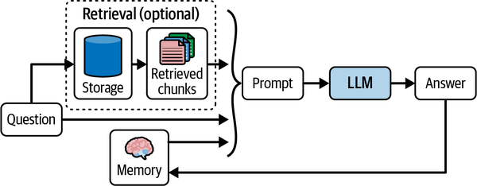
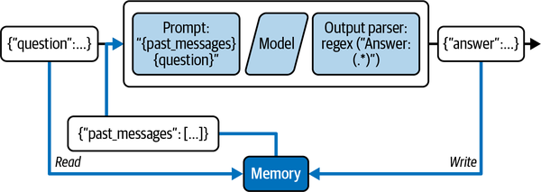
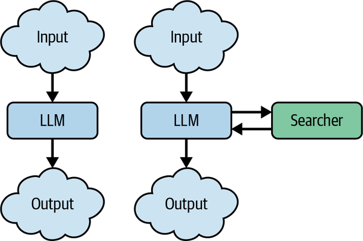
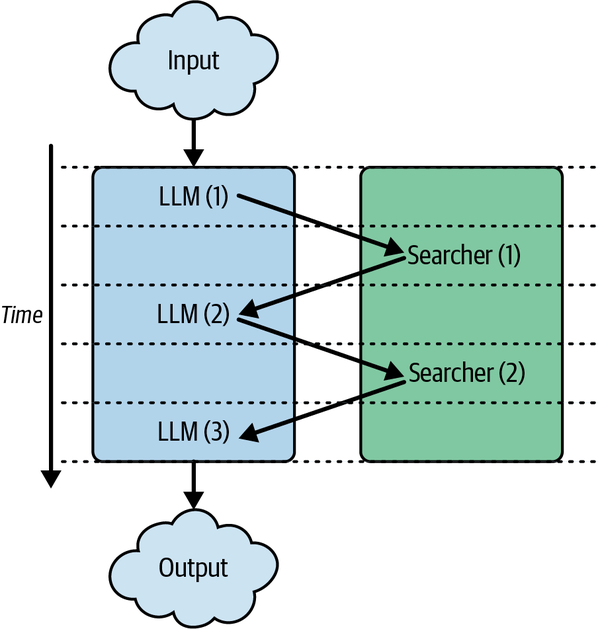
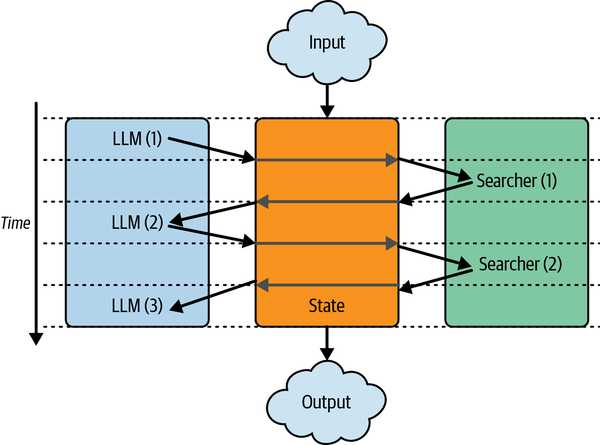
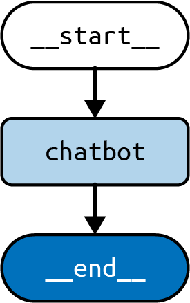

# Bab 4. Menggunakan LangGraph untuk Menambahkan Memori ke Chatbot Anda

Di [Bab 3](ch03.xhtml#ch03_rag_part_ii_chatting_with_your_data_1736545666793580), Anda belajar cara memberikan aplikasi chatbot AI Anda konteks terkini dan relevan. Ini memungkinkan chatbot Anda menghasilkan respons akurat berdasarkan masukan pengguna. Tetapi itu belum cukup untuk membangun aplikasi yang siap produksi. Bagaimana Anda dapat mengaktifkan aplikasi Anda untuk benar-benar "mengobrol" bolak-balik dengan pengguna, sambil mengingat percakapan sebelumnya dan konteks relevan?

Model bahasa besar bersifat <em>tanpa status</em>, yang berarti setiap kali model diminta untuk menghasilkan respons baru, ia tidak memiliki ingatan tentang permintaan sebelumnya atau respons model. Untuk menyediakan informasi historis ini ke model, kita memerlukan sistem memori yang tangguh yang akan melacak percakapan dan konteks sebelumnya. Informasi historis ini kemudian dapat disertakan dalam permintaan akhir yang dikirim ke LLM, sehingga memberinya "memori." [Gambar 4-1](#ch04_figure_1_1736545668257395) mengilustrasikan ini.



<span class="label">Gambar 4-1. </span>Memori dan pengambilan digunakan untuk menghasilkan jawaban sadar konteks dari LLM

Dalam bab ini, Anda akan belajar cara membangun sistem memori penting ini menggunakan modul bawaan LangChain untuk memudahkan proses pengembangan ini.

## Membangun Sistem Memori Chatbot

Ada dua keputusan desain inti di balik sistem memori yang tangguh:

- Bagaimana status disimpan
- Bagaimana status dikueri

Cara sederhana untuk membangun sistem memori chatbot yang menggabungkan solusi efektif untuk keputusan desain ini adalah dengan menyimpan dan menggunakan kembali riwayat semua interaksi obrolan antara pengguna dan model. Status sistem memori ini dapat:

- Disimpan sebagai daftar pesan (lihat [Bab 1](ch01.xhtml#ch01_llm_fundamentals_with_langchain_1736545659776004) untuk mempelajari lebih lanjut tentang pesan)
- Diperbarui dengan menambahkan pesan terbaru setelah setiap giliran
- Ditambahkan ke dalam permintaan dengan menyisipkan pesan ke dalam permintaan

[Gambar 4-2](#ch04_figure_2_1736545668257433) mengilustrasikan sistem memori sederhana ini.



<span class="label">Gambar 4-2. </span>Sistem memori sederhana yang memanfaatkan riwayat obrolan dalam permintaan untuk menghasilkan jawaban model

Berikut contoh kode yang menggambarkan versi sederhana dari sistem memori ini menggunakan LangChain:

<em>Python</em>

```python
from langchain_core.prompts import ChatPromptTemplate
from langchain_openai import ChatOpenAI

prompt = ChatPromptTemplate.from_messages([
    ("system", """Anda adalah asisten yang membantu. Jawab semua pertanyaan sebaik
        kemampuan Anda."""),
    ("placeholder", "{messages}"),
])

model = ChatOpenAI()

chain = prompt | model

chain.invoke({
    "messages": [
        ("human","""Terjemahkan kalimat ini dari Bahasa Inggris ke Prancis: Saya suka
            pemrograman."""),
        ("ai", "J'adore programmer."),
        ("human", "Apa yang baru saja Anda katakan?"),
    ],
})
```

<em>JavaScript</em>

```javascript
import { ChatPromptTemplate } from "@langchain/core/prompts"
import { ChatOpenAI } from "@langchain/openai"

const prompt = ChatPromptTemplate.fromMessages([
  [
    "system",
    `Anda adalah asisten yang membantu. Jawab semua pertanyaan sebaik 
    kemampuan Anda.`,
  ],
  ["placeholder", "{messages}"],
])

const model = new ChatOpenAI()

const chain = prompt.pipe(model)

await chain.invoke({
  messages: [
    [
      "human",
      `Terjemahkan kalimat ini dari Bahasa Inggris ke Prancis: Saya suka 
      pemrograman.`,
    ],
    ["ai", "J'adore programmer."],
    ["human", "Apa yang baru saja Anda katakan?"],
  ],
})
```

<em>Keluaran:</em>

```
Saya berkata, "J'adore programmer," yang berarti "Saya suka pemrograman" dalam bahasa Prancis.
```

Perhatikan bagaimana penggabungan percakapan sebelumnya dalam rantai memungkinkan model menjawab pertanyaan lanjutan dengan cara yang sadar konteks.

Meskipun ini sederhana dan berfungsi, ketika membawa aplikasi Anda ke produksi, Anda akan menghadapi beberapa tantangan lebih terkait pengelolaan memori dalam skala besar, seperti:

- Anda perlu memperbarui memori setelah setiap interaksi, secara atomik (yaitu, jangan hanya mencatat pertanyaan atau hanya jawaban dalam kasus kegagalan).
- Anda ingin menyimpan memori ini dalam penyimpanan tahan lama, seperti basis data relasional.
- Anda ingin mengontrol berapa banyak dan pesan mana yang disimpan untuk nanti, dan berapa banyak dari ini yang digunakan untuk interaksi baru.
- Anda ingin memeriksa dan memodifikasi status ini (untuk saat ini, hanya daftar pesan) di luar panggilan ke LLM.

Kami sekarang akan memperkenalkan beberapa peralatan yang lebih baik, yang akan membantu dengan ini dan semua bab selanjutnya.

## Memperkenalkan LangGraph

Untuk sisa bab ini dan bab-bab berikutnya, kami akan mulai menggunakan [LangGraph](https://oreil.ly/TKCb6), pustaka sumber terbuka yang ditulis oleh LangChain. LangGraph dirancang untuk memungkinkan pengembang mengimplementasikan arsitektur kognitif multiaktor, multilanjut, dan berstatus, yang disebut <em>grafik</em>. Itu banyak kata yang dikemas dalam kalimat pendek; mari kita ambil satu per satu. [Gambar 4-3](#ch04_figure_3_1736545668257457) mengilustrasikan aspek multiaktor.



<span class="label">Gambar 4-3. </span>Dari aplikasi satu-aktor ke aplikasi multiaktor

Tim spesialis dapat membangun sesuatu bersama-sama yang tidak dapat dibangun oleh salah satu dari mereka sendirian. Hal yang sama berlaku untuk aplikasi LLM: permintaan LLM (bagus untuk menghasilkan jawaban dan merencanakan tugas dan banyak hal lainnya) jauh lebih kuat ketika dipasangkan dengan mesin pencari (terbaik dalam menemukan fakta terkini), atau bahkan ketika dipasangkan dengan permintaan LLM yang berbeda. Kami telah melihat pengembang membangun beberapa aplikasi luar biasa, seperti [Perplexity](https://oreil.ly/bVlu7) atau [Arc Search](https://oreil.ly/NPOlF), ketika mereka menggabungkan dua blok bangunan itu (dan lainnya) dengan cara baru.

Dan sama seperti tim manusia memerlukan koordinasi lebih daripada satu orang bekerja sendiri, aplikasi dengan banyak aktor memerlukan lapisan koordinasi untuk melakukan hal-hal ini:

- Tentukan aktor yang terlibat (simpul dalam grafik) dan bagaimana mereka menyerahkan pekerjaan satu sama lain (tepi dalam grafik itu).
- Jadwalkan eksekusi setiap aktor pada waktu yang tepat—secara paralel jika diperlukan—dengan hasil deterministik.

[Gambar 4-4](#ch04_figure_4_1736545668257478) mengilustrasikan dimensi multilanjut.



<span class="label">Gambar 4-4. </span>Dari aplikasi multiaktor ke aplikasi multilanjut

Ketika setiap aktor menyerahkan pekerjaan ke aktor lain (misalnya, permintaan LLM meminta alat pencarian untuk hasil kueri pencarian tertentu), kita perlu memahami bolak-balik antara banyak aktor. Kita perlu tahu urutan kejadiannya, berapa kali setiap aktor dipanggil, dan sebagainya. Untuk melakukan ini, kita dapat memodelkan interaksi antara aktor terjadi dalam banyak langkah diskrit dalam waktu. Ketika satu aktor menyerahkan pekerjaan ke aktor lain, ini menghasilkan penjadwalan langkah komputasi berikutnya, dan seterusnya, sampai tidak ada lagi aktor yang menyerahkan pekerjaan ke yang lain, dan hasil akhir tercapai.

[Gambar 4-5](#ch04_figure_5_1736545668257500) mengilustrasikan aspek berstatus.



<span class="label">Gambar 4-5. </span>Dari aplikasi multilanjut ke aplikasi berstatus

Komunikasi antar langkah memerlukan pelacakan beberapa status—jika tidak, ketika Anda memanggil aktor LLM kedua kalinya, Anda akan mendapatkan hasil yang sama dengan pertama kali. Sangat membantu untuk menarik status ini keluar dari setiap aktor dan membuat semua aktor bekerja sama memperbarui satu status pusat. Dengan satu status pusat, kita dapat:

- Membuat snapshot dan menyimpan status pusat selama atau setelah setiap komputasi.
- Menjeda dan melanjutkan eksekusi, yang memudahkan pemulihan dari kesalahan.
- Mengimplementasikan kontrol manusia-dalam-langkah (lebih lanjut tentang ini di [Bab 8](ch08.xhtml#ch08_patterns_to_make_the_most_of_llms_1736545674143600)).

Setiap <em>grafik</em> kemudian terdiri dari:

Status
: Data yang diterima dari luar aplikasi, dimodifikasi dan diproduksi oleh aplikasi saat berjalan.

Simpul (Nodes)
: Setiap langkah yang akan diambil. Simpul hanyalah fungsi Python/JS, yang menerima status saat ini sebagai masukan dan dapat mengembalikan pembaruan ke status itu (yaitu, mereka dapat menambahkannya dan memodifikasi atau menghapus data yang ada).

Tepi (Edges)
: Koneksi antar simpul. Tepi menentukan jalur yang diambil dari simpul pertama ke terakhir, dan mereka dapat tetap (yaitu, setelah Simpul B, selalu kunjungi simpul D) atau bersyarat (evaluasi fungsi untuk memutuskan simpul berikutnya yang akan dikunjungi setelah simpul C).

LangGraph menawarkan utilitas untuk memvisualisasikan grafik-grafik ini dan banyak fitur untuk mendebug cara kerjanya selama pengembangan. Grafik-grafik ini kemudian dapat dengan mudah diterapkan untuk melayani beban kerja produksi dalam skala besar.

Jika Anda mengikuti instruksi di [Bab 1](ch01.xhtml#ch01_llm_fundamentals_with_langchain_1736545659776004), Anda sudah memiliki LangGraph terpasang. Jika belum, Anda dapat memasangnya dengan menjalankan salah satu perintah berikut di terminal Anda:

<em>Python</em>

```
pip install langgraph
```

<em>JavaScript</em>

```
npm i @langchain/langgraph
```

Untuk membantu Anda terbiasa menggunakan LangGraph, kami akan membuat chatbot sederhana menggunakan LangGraph, yang merupakan contoh bagus dari arsitektur panggilan LLM dengan satu penggunaan LLM. Chatbot ini akan merespons langsung pesan pengguna. Meskipun sederhana, ini mengilustrasikan konsep inti membangun dengan LangGraph.

## Membuat StateGraph

Mulailah dengan membuat `StateGraph`. Kami akan menambahkan simpul untuk mewakili panggilan LLM:

<em>Python</em>

```python
from typing import Annotated, TypedDict

from langgraph.graph import StateGraph, START, END
from langgraph.graph.message import add_messages


class State(TypedDict):
    # Pesan memiliki tipe "list". Fungsi `add_messages`
    # dalam anotasi menentukan bagaimana status ini seharusnya
    # diperbarui (dalam kasus ini, ia menambahkan pesan baru ke
    # daftar, daripada mengganti pesan sebelumnya)
	 messages: Annotated[list, add_messages]

builder = StateGraph(State)
```

<em>JavaScript</em>

```javascript
import {
  StateGraph,
  StateType,
  Annotation,
  messagesStateReducer,
  START,
  END,
} from "@langchain/langgraph"

const State = {
  /**
   * State mendefinisikan tiga hal:
   * 1. Struktur status grafik (yang "saluran" tersedia untuk
   * membaca/menulis)
   * 2. Nilai default untuk saluran status
   * 3. Reducer untuk saluran status. Reducer adalah fungsi yang
   * menentukan cara menerapkan pembaruan ke status. Di bawah, pesan baru
   * ditambahkan ke array pesan.
   */
  messages: Annotation({
    reducer: messagesStateReducer,
    default: () => [],
  }),
}

const builder = new StateGraph(State)
```

> **Catatan**
> Hal pertama yang Anda lakukan saat mendefinisikan grafik adalah mendefinisikan status grafik. <em>Status</em> terdiri dari bentuk, atau skema, status grafik, serta fungsi reducer yang menentukan cara menerapkan pembaruan ke status. Dalam contoh ini, status adalah kamus dengan satu kunci: `messages`. Kunci `messages` diberi anotasi dengan fungsi reducer `add_messages`, yang memberi tahu LangGraph untuk menambahkan pesan baru ke daftar yang ada, daripada menimpanya. Kunci status tanpa anotasi akan ditimpa oleh setiap pembaruan, menyimpan nilai terbaru. Anda dapat menulis fungsi reducer Anda sendiri, yang hanyalah fungsi yang menerima argumen—argumen 1 adalah status saat ini, dan argumen 2 adalah nilai berikutnya yang ditulis ke status—dan harus mengembalikan status berikutnya, yaitu, hasil penggabungan status saat ini dengan nilai baru. Contoh paling sederhana adalah fungsi yang menambahkan nilai berikutnya ke daftar dan mengembalikan daftar itu.

Jadi sekarang grafik kami tahu dua hal:

- Setiap `simpul` yang kami definisikan akan menerima `Status` saat ini sebagai masukan dan mengembalikan nilai yang memperbarui status itu.
- `messages` akan <em>ditambahkan</em> ke daftar saat ini, daripada langsung ditimpa. Ini dikomunikasikan melalui fungsi bawaan [add_messages](https://oreil.ly/sK-Ry) dalam sintaks `Annotated` dalam contoh Python atau fungsi reducer untuk contoh JavaScript.

Selanjutnya, tambahkan simpul `chatbot`. Simpul mewakili unit kerja. Mereka biasanya hanya fungsi:

<em>Python</em>

```python
from langchain_openai import ChatOpenAI

model = ChatOpenAI()

def chatbot(state: State):
    answer = model.invoke(state["messages"])
    return {"messages": [answer]}

# Argumen pertama adalah nama simpul unik
# Argumen kedua adalah fungsi atau Runnable yang akan dijalankan
builder.add_node("chatbot", chatbot)
```

<em>JavaScript</em>

```javascript
import { ChatOpenAI } from "@langchain/openai"
import {
  AIMessage,
  SystemMessage,
  HumanMessage,
} from "@langchain/core/messages"

const model = new ChatOpenAI()

async function chatbot(state) {
  const answer = await model.invoke(state.messages)
  return { messages: answer }
}

builder = builder.addNode("chatbot", chatbot)
```

Simpul ini menerima status saat ini, melakukan satu panggilan LLM, dan kemudian mengembalikan pembaruan ke status yang berisi pesan baru yang dihasilkan oleh LLM. Reducer `add_messages` menambahkan pesan ini ke pesan yang sudah ada dalam status.

Dan akhirnya mari tambahkan tepi:

<em>Python</em>

```python
builder.add_edge(START, 'chatbot')
builder.add_edge('chatbot', END)

graph = builder.compile()
```

<em>JavaScript</em>

```javascript
builder = builder.addEdge(START, "chatbot").addEdge("chatbot", END)

let graph = builder.compile()
```

Ini melakukan beberapa hal:

- Ini memberi tahu grafik di mana memulai pekerjaannya setiap kali Anda menjalankannya.
- Ini menginstruksikan grafik di mana seharusnya keluar (ini opsional, karena LangGraph akan menghentikan eksekusi begitu tidak ada lagi simpul yang dijalankan).
- Ini mengkompilasi grafik menjadi objek yang dapat dijalankan, dengan metode `invoke` dan `stream` yang familiar.

Kami juga dapat menggambar representasi visual grafik:

<em>Python</em>

```python
graph.get_graph().draw_mermaid_png()
```

<em>JavaScript</em>

```javascript
await graph.getGraph().drawMermaidPng()
```

Grafik yang baru kami buat terlihat seperti [Gambar 4-6](#ch04_figure_6_1736545668257524).



<span class="label">Gambar 4-6. </span>Chatbot sederhana

Anda dapat menjalankannya dengan metode `stream()` yang sudah Anda lihat di bab-bab sebelumnya:

<em>Python</em>

```python
input = {"messages": [HumanMessage('hi!')]}
for chunk in graph.stream(input):
    print(chunk)
```

<em>JavaScript</em>

```javascript
const input = { messages: [new HumanMessage("hi!")] }
for await (const chunk of await graph.stream(input)) {
  console.log(chunk)
}
```

<em>Keluaran:</em>

```
{ "chatbot": { "messages": [AIMessage("How can I help you?")] } }
```

Perhatikan bagaimana masukan ke grafik memiliki bentuk yang sama dengan objek `State` yang kami definisikan sebelumnya; yaitu, kami mengirim daftar pesan dalam kunci `messages` dari kamus. Selain itu, fungsi `stream` mengalirkan nilai penuh status setelah setiap langkah grafik.

## Menambahkan Memori ke StateGraph

LangGraph memiliki persistensi bawaan, yang digunakan dengan cara yang sama untuk grafik paling sederhana hingga paling kompleks. Mari kita lihat seperti apa menerapkannya pada arsitektur pertama ini. Kami akan mengkompilasi ulang grafik kami, sekarang melampirkan <em>checkpointer</em>, yang merupakan adaptor penyimpanan untuk LangGraph. LangGraph dikirim dengan kelas dasar yang dapat di-subclass oleh pengguna mana pun untuk membuat adaptor untuk basis data favorit mereka; pada saat penulisan, LangGraph dikirim dengan beberapa adaptor yang dikelola oleh LangChain:

- Adaptor dalam memori, yang akan kami gunakan untuk contoh kami di sini
- Adaptor SQLite, menggunakan basis data dalam proses yang populer, cocok untuk aplikasi lokal dan pengujian
- Adaptor Postgres, dioptimalkan untuk basis data relasional populer dan cocok untuk aplikasi skala besar.

Banyak pengembang telah menulis adaptor untuk sistem basis data lain, seperti Redis atau MySQL:

<em>Python</em>

```python
from langgraph.checkpoint.memory import MemorySaver

graph = builder.compile(checkpointer=MemorySaver())
```

<em>JavaScript</em>

```javascript
import { MemorySaver } from "@langchain/langgraph"

const graph = builder.compile({ checkpointer: new MemorySaver() })
```

Ini mengembalikan objek yang dapat dijalankan dengan metode yang sama seperti yang digunakan dalam blok kode sebelumnya. Tetapi sekarang, ia menyimpan status di akhir setiap langkah, sehingga setiap panggilan setelah yang pertama tidak mulai dari awal yang kosong. Setiap kali grafik dipanggil, ia mulai dengan menggunakan checkpointer untuk mengambil status tersimpan terbaru, jika ada, dan menggabungkan masukan baru dengan status sebelumnya. Dan hanya kemudian ia mengeksekusi simpul pertama.

Mari kita lihat perbedaannya dalam tindakan:

<em>Python</em>

```python
thread1 = {"configurable": {"thread_id": "1"}}
result_1 = graph.invoke(
    { "messages": [HumanMessage("hai, nama saya Jack!")] },
    thread1
)
// { "chatbot": { "messages": [AIMessage("How can I help you, Jack?")] } }

result_2 = graph.invoke(
    { "messages": [HumanMessage("siapa nama saya?")] },
    thread1
)
// { "chatbot": { "messages": [AIMessage("Your name is Jack")] } }
```

<em>JavaScript</em>

```javascript
const thread1 = { configurable: { thread_id: "1" } }
const result_1 = await graph.invoke(
  { messages: [new HumanMessage("hai, nama saya Jack!")] },
  thread1
)
// { "chatbot": { "messages": [AIMessage("How can I help you, Jack?")] } }

const result_2 = await graph.invoke(
  { messages: [new HumanMessage("siapa nama saya?")] },
  thread1
)
// { "chatbot": { "messages": [AIMessage("Your name is Jack")] } }
```

Perhatikan objek `thread1`, yang mengidentifikasi interaksi saat ini sebagai milik riwayat interaksi tertentu—yang disebut <em>threads</em> dalam LangGraph. Thread dibuat secara otomatis saat pertama digunakan. Setiap string adalah pengidentifikasi yang valid untuk thread (biasanya, UUID digunakan). Keberadaan thread membantu Anda mencapai tonggak penting dalam aplikasi LLM Anda; sekarang dapat digunakan oleh banyak pengguna dengan percakapan independen yang tidak pernah tercampur.

Seperti sebelumnya, simpul `chatbot` pertama kali dipanggil dengan satu pesan (yang baru saja kami kirim) dan mengembalikan pesan lain, keduanya kemudian disimpan dalam status.

Kedua kalinya kami menjalankan grafik pada thread yang sama, simpul `chatbot` dipanggil dengan tiga pesan, dua yang disimpan dari eksekusi pertama, dan pertanyaan berikutnya dari pengguna. Ini adalah inti memori: status sebelumnya masih ada, yang memungkinkan, misalnya, menjawab pertanyaan tentang sesuatu yang dikatakan sebelumnya (dan melakukan banyak hal menarik lainnya, yang akan kami lihat lebih banyak nanti).

Anda juga dapat memeriksa dan memperbarui status secara langsung; mari kita lihat caranya:

<em>Python</em>

```python
graph.get_state(thread1)
```

<em>JavaScript</em>

```javascript
await graph.getState(thread1)
```

Ini mengembalikan status saat ini dari thread ini.

Dan Anda dapat memperbarui status seperti ini:

<em>Python</em>

```python
graph.update_state(thread1, [HumanMessage('Saya suka LLMs!')])
```

<em>JavaScript</em>

```javascript
await graph.updateState(thread1, [new HumanMessage("Saya suka LLMs!")])
```

Ini akan menambahkan satu pesan lagi ke daftar pesan dalam status, untuk digunakan saat Anda memanggil grafik pada thread ini.

## Memodifikasi Riwayat Obrolan

Dalam banyak kasus, pesan riwayat obrolan tidak dalam status atau format terbaik untuk menghasilkan respons akurat dari model. Untuk mengatasi masalah ini, kami dapat memodifikasi riwayat obrolan dalam tiga cara utama: memotong, menyaring, dan menggabungkan pesan.

### Memotong Pesan

LLM memiliki <em>jendela konteks</em> terbatas; dengan kata lain, ada jumlah token maksimum yang dapat diterima LLM sebagai permintaan. Dengan demikian, permintaan akhir yang dikirim ke model tidak boleh melebihi batas itu (tertentu untuk setiap model), karena model akan menolak permintaan yang terlalu panjang atau memotongnya. Selain itu, informasi permintaan berlebihan dapat mengganggu model dan menyebabkan halusinasi.

Solusi efektif untuk masalah ini adalah membatasi jumlah pesan yang diambil dari riwayat obrolan dan ditambahkan ke permintaan. Dalam praktiknya, kita hanya perlu memuat dan menyimpan pesan terbaru. Mari gunakan contoh riwayat obrolan dengan beberapa pesan yang sudah dimuat.

Untungnya, LangChain menyediakan pembantu bawaan `trim_messages` yang menggabungkan berbagai strategi untuk memenuhi persyaratan ini. Misalnya, pembantu pemotong memungkinkan menentukan berapa banyak token yang ingin kami pertahankan atau hapus dari riwayat obrolan.

Berikut contoh yang mengambil `max_tokens` terakhir dalam daftar pesan dengan mengatur parameter strategi ke `"last"`:

<em>Python</em>

```python
from langchain_core.messages import SystemMessage, trim_messages
from langchain_openai import ChatOpenAI

trimmer = trim_messages(
    max_tokens=65,
    strategy="last",
    token_counter=ChatOpenAI(model="gpt-4o"),
    include_system=True,
    allow_partial=False,
    start_on="human",
)

messages = [
    SystemMessage(content="kamu adalah asisten yang baik"),
    HumanMessage(content="hai! Saya bob"),
    AIMessage(content="hai!"),
    HumanMessage(content="Saya suka es krim vanilla"),
    AIMessage(content="bagus"),
    HumanMessage(content="berapa 2 + 2"),
    AIMessage(content="4"),
    HumanMessage(content="terima kasih"),
    AIMessage(content="sama-sama!"),
    HumanMessage(content="sedang bersenang-senang?"),
    AIMessage(content="ya!"),
]

trimmer.invoke(messages)
```

<em>JavaScript</em>

```javascript
import {
  AIMessage,
  HumanMessage,
  SystemMessage,
  trimMessages,
} from "@langchain/core/messages"
import { ChatOpenAI } from "@langchain/openai"

const trimmer = trimMessages({
  maxTokens: 65,
  strategy: "last",
  tokenCounter: new ChatOpenAI({ modelName: "gpt-4o" }),
  includeSystem: true,
  allowPartial: false,
  startOn: "human",
})

const messages = [
  new SystemMessage("kamu adalah asisten yang baik"),
  new HumanMessage("hai! Saya bob"),
  new AIMessage("hai!"),
  new HumanMessage("Saya suka es krim vanilla"),
  new AIMessage("bagus"),
  new HumanMessage("berapa 2 + 2"),
  new AIMessage("4"),
  new HumanMessage("terima kasih"),
  new AIMessage("sama-sama!"),
  new HumanMessage("sedang bersenang-senang?"),
  new AIMessage("ya!"),
]

const trimmed = await trimmer.invoke(messages)
```

<em>Keluaran:</em>

```
[SystemMessage(content="kamu adalah asisten yang baik"),
 HumanMessage(content='berapa 2 + 2'),
  AIMessage(content='4'),
  HumanMessage(content='terima kasih'),
  AIMessage(content='sama-sama!'),
  HumanMessage(content='sedang bersenang-senang?'),
  AIMessage(content='ya!')]
```

Perhatikan hal berikut:

- Parameter `strategy` mengontrol apakah akan mulai dari awal atau akhir daftar. Biasanya, Anda ingin memprioritaskan pesan terbaru dan memotong pesan lebih lama jika tidak muat. Yaitu, mulai dari akhir daftar. Untuk perilaku ini, pilih nilai `last`. Opsi lain yang tersedia adalah `first`, yang akan memprioritaskan pesan terlama dan memotong pesan lebih baru jika tidak muat.
- `token_counter` adalah LLM atau model obrolan, yang akan digunakan untuk menghitung token menggunakan tokenizer yang sesuai dengan model itu.
- Kami dapat menambahkan parameter `include_system=True` untuk memastikan pemotong menyimpan pesan sistem.
- Parameter `allow_partial` menentukan apakah akan memotong konten pesan terakhir agar sesuai dalam batas. Dalam contoh kami, kami mengatur ini ke `false`, yang sepenuhnya menghapus pesan yang akan mengirim total melebihi batas.
- Parameter `start_on="human"` memastikan kami tidak pernah menghapus `AIMessage` (yaitu, respons dari model) tanpa juga menghapus `HumanMessage` yang sesuai (pertanyaan untuk respons itu).

### Menyaring Pesan

Saat daftar pesan riwayat obrolan tumbuh, berbagai jenis, subrantai, dan model dapat digunakan. Pembantu `filter_messages` LangChain memudahkan penyaringan pesan riwayat obrolan berdasarkan jenis, ID, atau nama.

Berikut contoh di mana kami menyaring pesan manusia:

<em>Python</em>

```python
from langchain_core.messages import (
    AIMessage,
    HumanMessage,
    SystemMessage,
    filter_messages,
)

messages = [
    SystemMessage("kamu adalah asisten yang baik", id="1"),
    HumanMessage("contoh masukan", id="2", name="example_user"),
    AIMessage("contoh keluaran", id="3", name="example_assistant"),
    HumanMessage("masukan nyata", id="4", name="bob"),
    AIMessage("keluaran nyata", id="5", name="alice"),
]

filter_messages(messages, include_types="human")
```

<em>JavaScript</em>

```javascript
import {
  HumanMessage,
  SystemMessage,
  AIMessage,
  filterMessages,
} from "@langchain/core/messages"

const messages = [
  new SystemMessage({ content: "kamu adalah asisten yang baik", id: "1" }),
  new HumanMessage({
    content: "contoh masukan",
    id: "2",
    name: "example_user",
  }),
  new AIMessage({
    content: "contoh keluaran",
    id: "3",
    name: "example_assistant",
  }),
  new HumanMessage({ content: "masukan nyata", id: "4", name: "bob" }),
  new AIMessage({ content: "keluaran nyata", id: "5", name: "alice" }),
]

filterMessages(messages, { includeTypes: ["human"] })
```

<em>Keluaran:</em>

```
[HumanMessage(content='contoh masukan', name='example_user', id='2'),
 HumanMessage(content='masukan nyata', name='bob', id='4')]
```

Mari coba contoh lain di mana kami menyaring untuk mengecualikan pengguna dan ID, dan menyertakan jenis pesan:

<em>Python</em>

```python
filter_messages(messages, exclude_names=["example_user", "example_assistant"])

"""
[SystemMessage(content='kamu adalah asisten yang baik', id='1'),
HumanMessage(content='masukan nyata', name='bob', id='4'),
AIMessage(content='keluaran nyata', name='alice', id='5')]
"""

filter_messages(
    messages,
    include_types=[HumanMessage, AIMessage],
    exclude_ids=["3"]
)

"""
[HumanMessage(content='contoh masukan', name='example_user', id='2'),
 HumanMessage(content='masukan nyata', name='bob', id='4'),
 AIMessage(content='keluaran nyata', name='alice', id='5')]
"""
```

<em>JavaScript</em>

```javascript
filterMessages(messages, {
  excludeNames: ["example_user", "example_assistant"],
})

/*
[SystemMessage(content='kamu adalah asisten yang baik', id='1'),
HumanMessage(content='masukan nyata', name='bob', id='4'),
AIMessage(content='keluaran nyata', name='alice', id='5')]
*/

filterMessages(messages, { includeTypes: ["human", "ai"], excludeIds: ["3"] })

/*
[HumanMessage(content='contoh masukan', name='example_user', id='2'),
 HumanMessage(content='masukan nyata', name='bob', id='4'),
 AIMessage(content='keluaran nyata', name='alice', id='5')]
*/
```

Pembantu `filter_messages` juga dapat digunakan secara imperatif atau deklaratif, memudahkan untuk disusun dengan komponen lain dalam rantai:

<em>Python</em>

```python
model = ChatOpenAI()

filter_ = filter_messages(exclude_names=["example_user", "example_assistant"])

chain = filter_ | model
```

<em>JavaScript</em>

```javascript
const model = new ChatOpenAI()

const filter = filterMessages({
  excludeNames: ["example_user", "example_assistant"],
})

const chain = filter.pipe(model)
```

### Menggabungkan Pesan Berurutan

Model tertentu tidak mendukung masukan, termasuk pesan berurutan dari jenis yang sama (misalnya, model obrolan Anthropic). Utilitas `merge_message_runs` LangChain memudahkan untuk menggabungkan pesan berurutan dari jenis yang sama:

<em>Python</em>

```python
from langchain_core.messages import (
    AIMessage,
    HumanMessage,
    SystemMessage,
    merge_message_runs,
)

messages = [
    SystemMessage("kamu adalah asisten yang baik."),
    SystemMessage("kamu selalu merespons dengan lelucon."),
    HumanMessage(
        [{"type": "text", "text": "saya penasaran mengapa disebut langchain"}]
    ),
    HumanMessage("dan siapa yang dikejar harrison"),
    AIMessage(
        '''Ya, saya kira mereka berpikir "WordRope" dan "SentenceString" hanya
        tidak terdengar sama bagusnya!'''
    ),
    AIMessage("""Mengapa, dia mungkin mengejar cangkir kopi terakhir di
        kantor!"""),
]

merge_message_runs(messages)
```

<em>JavaScript</em>

```javascript
import {
  HumanMessage,
  SystemMessage,
  AIMessage,
  mergeMessageRuns,
} from "@langchain/core/messages"

const messages = [
  new SystemMessage("kamu adalah asisten yang baik."),
  new SystemMessage("kamu selalu merespons dengan lelucon."),
  new HumanMessage({
    content: [
      { type: "text", text: "saya penasaran mengapa disebut langchain" },
    ],
  }),
  new HumanMessage("dan siapa yang dikejar harrison"),
  new AIMessage(
    `Ya, saya kira mereka berpikir "WordRope" dan "SentenceString" hanya tidak 
      terdengar sama bagusnya!`
  ),
  new AIMessage(
    "Mengapa, dia mungkin mengejar cangkir kopi terakhir di kantor!"
  ),
]

mergeMessageRuns(messages)
```

<em>Keluaran:</em>

```
[SystemMessage(content="kamu adalah asisten yang baik.\nkamu selalu merespons dengan
    lelucon."),
 HumanMessage(content=[{'type': 'text', 'text': "saya penasaran mengapa disebut
    langchain"}, 'dan siapa yang dikejar harrison']),
 AIMessage(content='Ya, saya kira mereka berpikir "WordRope" dan "SentenceString"
    hanya tidak terdengar sama bagusnya!\nMengapa, dia mungkin mengejar
    cangkir kopi terakhir di kantor!')]
```

Perhatikan bahwa jika konten salah satu pesan yang akan digabungkan adalah daftar blok konten, maka pesan yang digabungkan akan memiliki daftar blok konten. Dan jika kedua pesan yang akan digabungkan memiliki konten string, maka itu digabungkan dengan karakter baris baru.

Pembantu `merge_message_runs` dapat digunakan secara imperatif atau deklaratif, memudahkan untuk disusun dengan komponen lain dalam rantai:

<em>Python</em>

```python
model = ChatOpenAI()
merger = merge_message_runs()
chain = merger | model
```

<em>JavaScript</em>

```javascript
const model = new ChatOpenAI()
const merger = mergeMessageRuns()
const chain = merger.pipe(model)
```

## Ringkasan

Bab ini membahas dasar-dasar membangun sistem memori sederhana yang memungkinkan chatbot AI Anda mengingat percakapannya dengan pengguna. Kami membahas cara mengotomatisasi penyimpanan dan pembaruan riwayat obrolan menggunakan LangGraph untuk memudahkan ini. Kami juga membahas pentingnya memodifikasi riwayat obrolan dan mengeksplorasi berbagai strategi untuk memotong, menyaring, dan meringkas pesan obrolan.

Di [Bab 5](ch05.xhtml#ch05_cognitive_architectures_with_langgraph_1736545670030774), Anda akan belajar cara mengaktifkan chatbot AI Anda untuk melakukan lebih dari sekadar mengobrol kembali: misalnya, model baru Anda akan dapat membuat keputusan, memilih tindakan, dan merefleksikan keluaran masa lalunya.
