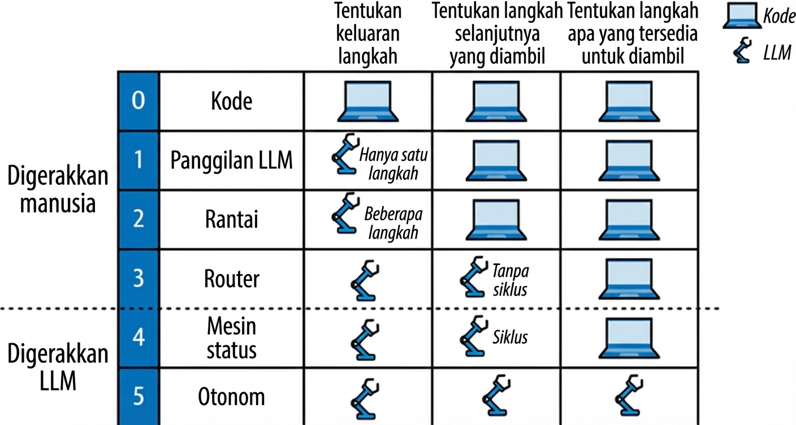
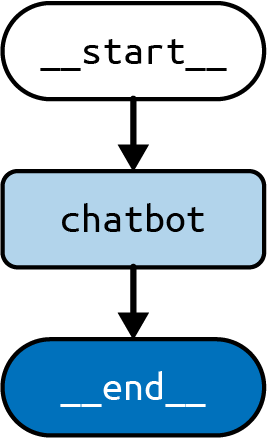
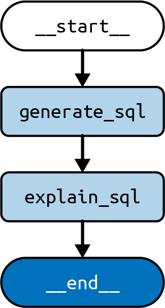
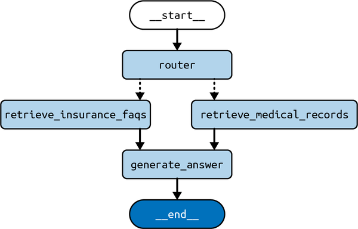

# Arsitektur Kognitif dengan LangGraph

Sejauh ini, kita telah melihat fitur paling umum dari aplikasi LLM:

- Teknik permintaan di [Prakata](preface01.xhtml#pr01_preface_1736545679069216) dan [Bab 1](ch01.xhtml#ch01_llm_fundamentals_with_langchain_1736545659776004)
- RAG di Bab [2](ch02.xhtml#ch02_rag_part_i_indexing_your_data_1736545662500927) dan [3](ch03.xhtml#ch03_rag_part_ii_chatting_with_your_data_1736545666793580)
- Memori di [Bab 4](ch04.xhtml#ch04_using_langgraph_to_add_memory_to_your_chatbot_1736545668266431)

Pertanyaan selanjutnya seharusnya: Bagaimana kita merakit potongan-potongan ini menjadi aplikasi yang koheren yang mencapai tujuan yang kita tetapkan untuk diselesaikan? Untuk menggambar paralel dengan dunia batu bata dan mortir, kolam renang dan rumah satu lantai dibangun dari bahan yang sama, tetapi jelas melayani tujuan yang sangat berbeda. Yang membuat mereka secara unik cocok untuk tujuan berbeda mereka adalah rencana untuk bagaimana bahan-bahan itu digabungkan—yaitu, arsitektur mereka. Hal yang sama berlaku saat membangun aplikasi LLM. Keputusan paling penting yang harus Anda buat adalah bagaimana merakit komponen berbeda yang Anda miliki (seperti RAG, teknik permintaan, memori) menjadi sesuatu yang mencapai tujuan Anda.

Sebelum kita melihat arsitektur spesifik, mari kita telusuri contoh. Setiap aplikasi LLM yang mungkin Anda bangun akan dimulai dari tujuan: apa yang dirancang aplikasi untuk dilakukan. Katakanlah Anda ingin membangun asisten email—aplikasi LLM yang membaca email Anda sebelum Anda melakukannya dan bertujuan mengurangi jumlah email yang perlu Anda lihat. Aplikasi mungkin melakukan ini dengan mengarsipkan beberapa yang tidak menarik, langsung membalas beberapa, dan menandai lainnya sebagai pantas mendapat perhatian Anda nanti.

Anda mungkin juga ingin aplikasi terikat oleh beberapa batasan dalam tindakannya. Mendaftarkan batasan itu sangat membantu, karena mereka akan membantu menginformasikan pencarian arsitektur yang tepat. [Bab 8](ch08.xhtml#ch08_patterns_to_make_the_most_of_llms_1736545674143600) membahas batasan ini lebih detail dan cara bekerja dengannya. Untuk asisten email hipotetis ini, katakanlah Kita ingin melakukan hal berikut:

- Meminimalkan jumlah kali itu mengganggu Anda (bagaimanapun juga, intinya adalah menghemat waktu).
- Menghindari koresponden email Anda menerima balasan yang tidak akan pernah Anda kirim sendiri.

Ini mengisyaratkan trade-off kunci yang sering dihadapi saat membangun aplikasi LLM: trade-off antara agensi dan keandalan. Secara intuitif, asisten email akan lebih berguna jika mengambil lebih banyak tindakan tanpa keterlibatan Anda, tetapi jika Anda terlalu jauh, itu akan mengirim email yang Anda harap tidak dikirim.

Salah satu cara untuk menggambarkan tingkat otonomi aplikasi LLM adalah dengan mengevaluasi seberapa banyak perilaku aplikasi ditentukan oleh LLM (versus kode):

- Memiliki LLM memutuskan keluaran suatu langkah (misalnya, menulis draf balasan ke email).
- Memiliki LLM memutuskan langkah berikutnya yang akan diambil (misalnya, untuk email baru, memutuskan antara tiga tindakan yang dapat dilakukan pada email: arsipkan, balas, atau tandai untuk tinjauan).
- Memiliki LLM memutuskan langkah apa yang tersedia untuk diambil (misalnya, memiliki LLM menulis kode yang menjalankan tindakan dinamis yang tidak Anda program sebelumnya ke dalam aplikasi).

Kita dapat mengklasifikasikan sejumlah _resep_ populer untuk membangun aplikasi LLM berdasarkan di mana mereka berada dalam spektrum otonomi ini, yaitu, mana dari tiga tugas yang baru saja disebutkan yang ditangani oleh LLM dan mana yang tetap di tangan pengembang atau pengguna. Resep ini dapat disebut arsitektur kognitif. Dalam bidang kecerdasan buatan, istilah arsitektur kognitif telah lama digunakan untuk menunjukkan model penalaran manusia (dan implementasinya dalam komputer). Arsitektur kognitif LLM (istilah ini pertama kali diterapkan pada LLM, sepengetahuan Kita, dalam makalah[1]) dapat didefinisikan sebagai resep untuk langkah-langkah yang akan diambil oleh aplikasi LLM (lihat [Gambar 5-1](#ch05_figure_1_1736545670023944)). _Langkah_ adalah, misalnya, pengambilan dokumen relevan (RAG), atau memanggil LLM dengan permintaan chain-of-thought.



**Gambar 5-1.** Arsitektur kognitif untuk aplikasi LLM

Sekarang mari kita lihat masing-masing arsitektur utama, atau resep, yang dapat Anda gunakan saat membangun aplikasi Anda (seperti yang ditunjukkan pada [Gambar 5-1](#ch05_figure_1_1736545670023944)):

**0: Kode**
Ini bukan arsitektur kognitif LLM (karenanya Kita beri nomor **0**), karena tidak menggunakan LLM sama sekali. Anda dapat menganggap ini sebagai perangkat lunak biasa yang biasa Anda tulis. Arsitektur menarik pertama (untuk buku ini, setidaknya) sebenarnya adalah yang berikutnya.

**1: Panggilan LLM**
Ini adalah mayoritas contoh yang telah kita lihat dalam buku sejauh ini, dengan hanya satu panggilan LLM. Ini berguna terutama ketika itu adalah bagian dari aplikasi yang lebih besar yang menggunakan LLM untuk mencapai tugas tertentu, seperti menerjemahkan atau meringkas sepotong teks.

**2: Rantai**
Tingkat berikutnya, bisa dikatakan, hadir dengan penggunaan beberapa panggilan LLM dalam urutan yang telah ditentukan. Misalnya, aplikasi teks-ke-SQL (yang menerima sebagai masukan dari pengguna deskripsi bahasa alami dari beberapa perhitungan untuk dilakukan atas basis data) dapat menggunakan dua panggilan LLM secara berurutan:

Satu panggilan LLM untuk menghasilkan kueri SQL, dari kueri bahasa alami, yang disediakan oleh pengguna, dan deskripsi konten basis data, yang disediakan oleh pengembang.

Dan panggilan LLM lain untuk menulis penjelasan kueri yang sesuai untuk pengguna nonteknis, mengingat kueri yang dihasilkan dalam panggilan sebelumnya. Ini kemudian dapat digunakan untuk memungkinkan pengguna memeriksa apakah kueri yang dihasilkan cocok dengan permintaannya.

**3: Pengarah**
Langkah selanjutnya ini berasal dari menggunakan LLM untuk menentukan urutan langkah yang akan diambil. Artinya, sedangkan arsitektur rantai selalu mengeksekusi urutan langkah statis (berapa pun banyaknya) yang ditentukan oleh pengembang, arsitektur pengarah dicirikan dengan menggunakan LLM untuk memilih antara langkah-langkah yang telah ditentukan. Contohnya adalah aplikasi RAG dengan beberapa indeks dokumen dari domain berbeda, dengan langkah-langkah berikut:

1. Panggilan LLM untuk memilih indeks yang tersedia untuk digunakan, mengingat kueri yang disediakan pengguna dan deskripsi indeks yang disediakan pengembang.
2. Langkah pengambilan yang mengkueri indeks yang dipilih untuk dokumen paling relevan untuk kueri pengguna.
3. Panggilan LLM lain untuk menghasilkan jawaban, mengingat kueri yang disediakan pengguna dan daftar dokumen relevan yang diambil dari indeks.

Sejauh itulah yang akan kita bahas dalam bab ini. Kita akan membicarakan masing-masing arsitektur ini secara bergiliran. Bab-bab berikutnya membahas arsitektur agen, yang bahkan lebih banyak menggunakan LLM. Tetapi pertama-tama mari kita bicara tentang beberapa peralatan yang lebih baik untuk membantu kita dalam perjalanan ini.

## Arsitektur #1: Panggilan LLM

Sebagai contoh arsitektur panggilan LLM, Kita akan kembali ke chatbot yang Kita buat di [Bab 4](ch04.xhtml#ch04_using_langgraph_to_add_memory_to_your_chatbot_1736545668266431). Chatbot ini akan merespons langsung pesan pengguna.

Mulailah dengan membuat `StateGraph`, yang akan Kita tambahkan simpul untuk mewakili panggilan LLM:

_Python_

```python
from typing import Annotated, TypedDict

from langgraph.graph import StateGraph, START, END
from langgraph.graph.message import add_messages
from langchain_openai import ChatOpenAI


model = ChatOpenAI()

class State(TypedDict):
    # Pesan memiliki tipe "list". Fungsi `add_messages`
    # dalam anotasi menentukan bagaimana status ini seharusnya
    # diperbarui (dalam kasus ini, ia menambahkan pesan baru ke
    # daftar, daripada mengganti pesan sebelumnya)
    messages: Annotated[list, add_messages]

def chatbot(state: State):
    answer = model.invoke(state["messages"])
    return {"messages": [answer]}

builder = StateGraph(State)
builder.add_node("chatbot", chatbot)
builder.add_edge(START, 'chatbot')
builder.add_edge('chatbot', END)

graph = builder.compile()
```

_JavaScript_

```javascript
import {
  StateGraph,
  Annotation,
  messagesStateReducer,
  START,
  END,
} from "@langchain/langgraph"
import { ChatOpenAI } from "@langchain/openai"

const model = new ChatOpenAI()

const State = {
  /**
   * State mendefinisikan tiga hal:
   * 1. Struktur status grafik (yang "saluran" tersedia untuk
   * membaca/menulis)
   * 2. Nilai default untuk saluran status
   * 3. Reducer untuk saluran status. Reducer adalah fungsi yang
   * menentukan cara menerapkan pembaruan ke status. Di bawah, pesan baru
   * ditambahkan ke array pesan.
   */
  messages: Annotation({
    reducer: messagesStateReducer,
    default: () => [],
  }),
}

async function chatbot(state) {
  const answer = await model.invoke(state.messages)
  return { messages: answer }
}

const builder = new StateGraph(State)
  .addNode("chatbot", chatbot)
  .addEdge(START, "chatbot")
  .addEdge("chatbot", END)

const graph = builder.compile()
```

Kita juga dapat menggambar representasi visual grafik:

_Python_

```python
graph.get_graph().draw_mermaid_png()
```

_JavaScript_

```javascript
await graph.getGraph().drawMermaidPng()
```

Grafik yang baru Kita buat terlihat seperti [Gambar 5-2](#ch05_figure_2_1736545670023979).



**Gambar 5-2.** Arsitektur panggilan LLM

Anda dapat menjalankannya dengan metode `stream()` yang sudah Anda lihat di bab-bab sebelumnya:

_Python_

```python
input = {"messages": [HumanMessage('hai!')]}
for chunk in graph.stream(input):
    print(chunk)
```

_JavaScript_

```javascript
const input = { messages: [new HumanMessage("hai!")] }
for await (const chunk of await graph.stream(input)) {
  console.log(chunk)
}
```

_Keluaran:_

```
{ "chatbot": { "messages": [AIMessage("Bagaimana saya dapat membantu Anda?")] } }
```

Perhatikan bagaimana masukan ke grafik memiliki bentuk yang sama dengan objek `State` yang Kita definisikan sebelumnya; yaitu, Kita mengirim daftar pesan dalam kunci `messages` dari kamus.

Ini adalah arsitektur paling sederhana yang mungkin untuk menggunakan LLM, yang tidak berarti bahwa itu tidak boleh digunakan. Berikut beberapa contoh di mana Anda mungkin melihatnya dalam tindakan dalam produk populer, di antara banyak lainnya:

- Fitur bertenaga AI seperti ringkasan dan terjemahan (seperti yang dapat Anda temukan di Notion, perangkat lunak penulisan populer) dapat didukung oleh satu panggilan LLM.
- Pembuatan kueri SQL sederhana dapat didukung oleh satu panggilan LLM, tergantung pada UX dan pengguna target yang ada dalam pikiran pengembang.

## Arsitektur #2: Rantai

Arsitektur selanjutnya ini memperluas semua itu dengan menggunakan beberapa panggilan LLM, dalam urutan yang telah ditentukan (yaitu, berbagai pemanggilan aplikasi melakukan urutan panggilan LLM yang sama, meskipun dengan masukan dan hasil yang berbeda).

Mari kita ambil contoh aplikasi teks-ke-SQL, yang menerima sebagai masukan dari pengguna deskripsi bahasa alami dari beberapa perhitungan untuk dilakukan atas basis data. Kita sebutkan sebelumnya bahwa ini dapat dicapai dengan satu panggilan LLM, untuk menghasilkan kueri SQL, tetapi Kita dapat membuat aplikasi yang lebih canggih dengan menggunakan beberapa panggilan LLM secara berurutan. Beberapa penulis menyebut arsitektur ini rekayasa alur.[2]

Pertama mari kita gambarkan alurnya dalam kata-kata:

1. Satu panggilan LLM untuk menghasilkan kueri SQL dari kueri bahasa alami, yang disediakan oleh pengguna, dan deskripsi konten basis data, yang disediakan oleh pengembang.
2. Panggilan LLM lain untuk menulis penjelasan kueri yang sesuai untuk pengguna nonteknis, mengingat kueri yang dihasilkan dalam panggilan sebelumnya. Ini kemudian dapat digunakan untuk memungkinkan pengguna memeriksa apakah kueri yang dihasilkan cocok dengan permintaannya.

Anda juga dapat memperluas ini lebih jauh (tetapi Kita tidak akan melakukannya di sini) dengan langkah-langkah tambahan yang akan diambil setelah dua sebelumnya:

3. Menjalankan kueri terhadap basis data, yang mengembalikan tabel dua dimensi.
4. Menggunakan panggilan LLM ketiga untuk meringkas hasil kueri menjadi jawaban tekstual untuk pertanyaan pengguna asli.

Dan sekarang mari kita implementasikan ini dengan LangGraph:

_Python_

```python
from typing import Annotated, TypedDict

from langchain_core.messages import HumanMessage, SystemMessage
from langchain_openai import ChatOpenAI

from langgraph.graph import END, START, StateGraph
from langgraph.graph.message import add_messages

# berguna untuk menghasilkan kueri SQL
model_low_temp = ChatOpenAI(temperature=0.1)
# berguna untuk menghasilkan keluaran bahasa alami
model_high_temp = ChatOpenAI(temperature=0.7)

class State(TypedDict):
    # untuk melacak riwayat percakapan
    messages: Annotated[list, add_messages]
    # masukan
    user_query: str
    # keluaran
    sql_query: str
    sql_explanation: str

class Input(TypedDict):
    user_query: str

class Output(TypedDict):
    sql_query: str
    sql_explanation: str

generate_prompt = SystemMessage(
    """Anda adalah analis data yang membantu yang menghasilkan kueri SQL untuk pengguna berdasarkan
    pertanyaan mereka."""
)

def generate_sql(state: State) -> State:
    user_message = HumanMessage(state["user_query"])
    messages = [generate_prompt, *state["messages"], user_message]
    res = model_low_temp.invoke(messages)
    return {
        "sql_query": res.content,
        # perbarui riwayat percakapan
        "messages": [user_message, res],
    }

explain_prompt = SystemMessage(
    "Anda adalah analis data yang membantu yang menjelaskan kueri SQL kepada pengguna."
)

def explain_sql(state: State) -> State:
    messages = [
        explain_prompt,
        # berisi kueri pengguna dan kueri SQL dari langkah sebelumnya
        *state["messages"],
    ]
    res = model_high_temp.invoke(messages)
    return {
        "sql_explanation": res.content,
        # perbarui riwayat percakapan
        "messages": res,
    }

builder = StateGraph(State, input=Input, output=Output)
builder.add_node("generate_sql", generate_sql)
builder.add_node("explain_sql", explain_sql)
builder.add_edge(START, "generate_sql")
builder.add_edge("generate_sql", "explain_sql")
builder.add_edge("explain_sql", END)

graph = builder.compile()
```

_JavaScript_

```javascript
import { HumanMessage, SystemMessage } from "@langchain/core/messages"
import { ChatOpenAI } from "@langchain/openai"
import {
  StateGraph,
  Annotation,
  messagesStateReducer,
  START,
  END,
} from "@langchain/langgraph"

// berguna untuk menghasilkan kueri SQL
const modelLowTemp = new ChatOpenAI({ temperature: 0.1 })
// berguna untuk menghasilkan keluaran bahasa alami
const modelHighTemp = new ChatOpenAI({ temperature: 0.7 })

const annotation = Annotation.Root({
  messages: Annotation({ reducer: messagesStateReducer, default: () => [] }),
  user_query: Annotation(),
  sql_query: Annotation(),
  sql_explanation: Annotation(),
})

const generatePrompt = new SystemMessage(
  `Anda adalah analis data yang membantu yang menghasilkan kueri SQL untuk pengguna berdasarkan
    pertanyaan mereka.`
)

async function generateSql(state) {
  const userMessage = new HumanMessage(state.user_query)
  const messages = [generatePrompt, ...state.messages, userMessage]
  const res = await modelLowTemp.invoke(messages)
  return {
    sql_query: res.content,
    // perbarui riwayat percakapan
    messages: [userMessage, res],
  }
}

const explainPrompt = new SystemMessage(
  "Anda adalah analis data yang membantu yang menjelaskan kueri SQL kepada pengguna."
)

async function explainSql(state) {
  const messages = [explainPrompt, ...state.messages]
  const res = await modelHighTemp.invoke(messages)
  return {
    sql_explanation: res.content,
    // perbarui riwayat percakapan
    messages: res,
  }
}

const builder = new StateGraph(annotation)
  .addNode("generate_sql", generateSql)
  .addNode("explain_sql", explainSql)
  .addEdge(START, "generate_sql")
  .addEdge("generate_sql", "explain_sql")
  .addEdge("explain_sql", END)

const graph = builder.compile()
```

Representasi visual grafik ditunjukkan pada [Gambar 5-3](#ch05_figure_3_1736545670024001).



**Gambar 5-3.** Arsitektur rantai

Berikut contoh masukan dan keluaran:

_Python_

```python
graph.invoke({
  "user_query": "Berapa total penjualan untuk setiap produk?"
})
```

_JavaScript_

```javascript
await graph.invoke({
  user_query: "Berapa total penjualan untuk setiap produk?",
})
```

_Keluaran:_

```
{
  "sql_query": "SELECT product_name, SUM(sales_amount) AS total_sales
      FROM
      sales
      GROUP BY product_name;",
  "sql_explanation": "Kueri ini akan mengambil total penjualan untuk setiap produk
      dengan menjumlahkan kolom sales_amount untuk setiap produk dan mengelompokkan
      hasil berdasarkan product_name.",
}
```

Pertama, simpul `generate_sql` dieksekusi, yang mengisi kunci `sql_query` dalam status (yang akan menjadi bagian dari keluaran akhir) dan memperbarui kunci `messages` dengan pesan baru. Kemudian simpul `explain_sql` berjalan, mengambil kueri SQL yang dihasilkan pada langkah sebelumnya dan mengisi kunci `sql_explanation` dalam status. Pada titik ini, grafik selesai berjalan, dan keluaran dikembalikan ke pemanggil.

Perhatikan juga penggunaan skema masukan dan keluaran terpisah saat membuat `StateGraph`. Ini memungkinkan Anda menyesuaikan bagian mana dari status yang diterima sebagai masukan dari pengguna dan mana yang dikembalikan sebagai keluaran akhir. Kunci status yang tersisa digunakan oleh simpul grafik secara internal untuk menjaga status perantara dan tersedia untuk pengguna sebagai bagian dari keluaran streaming yang dihasilkan oleh `stream()`.

## Arsitektur #3: Pengarah

Arsitektur selanjutnya ini naik tangga otonomi dengan menugaskan LLM tanggung jawab berikutnya yang Kita gariskan sebelumnya: memutuskan langkah berikutnya yang akan diambil. Artinya, sedangkan arsitektur rantai selalu mengeksekusi urutan langkah statis (berapa pun banyaknya), arsitektur pengarah dicirikan dengan menggunakan LLM untuk memilih antara langkah-langkah yang telah ditentukan.

Mari kita gunakan contoh aplikasi RAG dengan akses ke beberapa indeks dokumen dari domain berbeda (lihat [Bab 2](ch02.xhtml#ch02_rag_part_i_indexing_your_data_1736545662500927) untuk lebih lanjut tentang pengindeksan). Biasanya Anda dapat mengekstrak kinerja lebih baik dari LLM dengan menghindari penyertaan informasi tidak relevan dalam permintaan. Oleh karena itu, dalam membangun aplikasi ini, Kita harus mencoba memilih indeks yang tepat untuk digunakan untuk setiap kueri dan hanya menggunakan yang itu. Perkembangan kunci dalam arsitektur ini adalah menggunakan LLM untuk membuat keputusan ini, secara efektif menggunakan LLM untuk mengevaluasi setiap kueri masuk dan memutuskan indeks mana yang harus digunakan untuk kueri tertentu itu.

> **Catatan**
> Sebelum munculnya LLM, cara biasa untuk menyelesaikan masalah ini adalah dengan membangun model pengklasifikasi menggunakan teknik ML dan dataset yang memetakan kueri pengguna contoh ke indeks yang tepat. Ini bisa terbukti cukup menantang, karena memerlukan:
>
> - Merakit dataset itu dengan tangan
> - Menghasilkan cukup fitur (atribut kuantitatif) dari setiap kueri pengguna untuk memungkinkan pelatihan pengklasifikasi untuk tugas itu
>
> LLM, mengingat pengkodean bahasa manusia mereka, dapat secara efektif berfungsi sebagai pengklasifikasi ini dengan nol, atau sangat sedikit, contoh atau pelatihan tambahan.

Pertama, mari kita gambarkan alurnya dalam kata-kata:

1. Panggilan LLM untuk memilih indeks yang tersedia untuk digunakan, mengingat kueri yang disediakan pengguna, dan deskripsi indeks yang disediakan pengembang
2. Langkah pengambilan yang mengkueri indeks yang dipilih untuk dokumen paling relevan untuk kueri pengguna
3. Panggilan LLM lain untuk menghasilkan jawaban, mengingat kueri yang disediakan pengguna dan daftar dokumen relevan yang diambil dari indeks

Dan sekarang mari kita implementasikan dengan LangGraph:

_Python_

```python
from typing import Annotated, Literal, TypedDict

from langchain_core.documents import Document
from langchain_core.messages import HumanMessage, SystemMessage
from langchain_core.vectorstores.in_memory import InMemoryVectorStore
from langchain_openai import ChatOpenAI, OpenAIEmbeddings

from langgraph.graph import END, START, StateGraph
from langgraph.graph.message import add_messages

embeddings = OpenAIEmbeddings()
# berguna untuk menghasilkan kueri SQL
model_low_temp = ChatOpenAI(temperature=0.1)
# berguna untuk menghasilkan keluaran bahasa alami
model_high_temp = ChatOpenAI(temperature=0.7)

class State(TypedDict):
    # untuk melacak riwayat percakapan
    messages: Annotated[list, add_messages]
    # masukan
    user_query: str
    # keluaran
    domain: Literal["records", "insurance"]
    documents: list[Document]
    answer: str

class Input(TypedDict):
    user_query: str

class Output(TypedDict):
    documents: list[Document]
    answer: str

# lihat Bab 2 tentang cara mengisi toko vektor dengan dokumen
medical_records_store = InMemoryVectorStore.from_documents([], embeddings)
medical_records_retriever = medical_records_store.as_retriever()

insurance_faqs_store = InMemoryVectorStore.from_documents([], embeddings)
insurance_faqs_retriever = insurance_faqs_store.as_retriever()

router_prompt = SystemMessage(
    """Anda perlu memutuskan domain mana untuk mengarahkan kueri pengguna. Anda memiliki dua
        domain untuk dipilih:
          - records: berisi catatan medis pasien, seperti
          diagnosis, perawatan, dan resep.
          - insurance: berisi pertanyaan yang sering diajukan tentang asuransi
          kebijakan, klaim, dan cakupan.

Keluarkan hanya nama domain."""
)

def router_node(state: State) -> State:
    user_message = HumanMessage(state["user_query"])
    messages = [router_prompt, *state["messages"], user_message]
    res = model_low_temp.invoke(messages)
    return {
        "domain": res.content,
        # perbarui riwayat percakapan
        "messages": [user_message, res],
    }

def pick_retriever(
    state: State,
) -> Literal["retrieve_medical_records", "retrieve_insurance_faqs"]:
    if state["domain"] == "records":
        return "retrieve_medical_records"
    else:
        return "retrieve_insurance_faqs"

def retrieve_medical_records(state: State) -> State:
    documents = medical_records_retriever.invoke(state["user_query"])
    return {
        "documents": documents,
    }

def retrieve_insurance_faqs(state: State) -> State:
    documents = insurance_faqs_retriever.invoke(state["user_query"])
    return {
        "documents": documents,
    }

medical_records_prompt = SystemMessage(
    """Anda adalah chatbot medis yang membantu yang menjawab pertanyaan berdasarkan
        catatan medis pasien, seperti diagnosis, perawatan, dan
        resep."""
)

insurance_faqs_prompt = SystemMessage(
    """Anda adalah chatbot asuransi medis yang membantu yang menjawab pertanyaan yang sering diajukan
        tentang kebijakan asuransi, klaim, dan cakupan."""
)

def generate_answer(state: State) -> State:
    if state["domain"] == "records":
        prompt = medical_records_prompt
    else:
        prompt = insurance_faqs_prompt
    messages = [
        prompt,
        *state["messages"],
        HumanMessage(f"Dokumen: {state["documents"]}"),
    ]
    res = model_high_temp.invoke(messages)
    return {
        "answer": res.content,
        # perbarui riwayat percakapan
        "messages": res,
    }

builder = StateGraph(State, input=Input, output=Output)
builder.add_node("router", router_node)
builder.add_node("retrieve_medical_records", retrieve_medical_records)
builder.add_node("retrieve_insurance_faqs", retrieve_insurance_faqs)
builder.add_node("generate_answer", generate_answer)
builder.add_edge(START, "router")
builder.add_conditional_edges("router", pick_retriever)
builder.add_edge("retrieve_medical_records", "generate_answer")
builder.add_edge("retrieve_insurance_faqs", "generate_answer")
builder.add_edge("generate_answer", END)

graph = builder.compile()
```

_JavaScript_

```javascript
import { HumanMessage, SystemMessage } from "@langchain/core/messages"
import { ChatOpenAI, OpenAIEmbeddings } from "@langchain/openai"
import { MemoryVectorStore } from "langchain/vectorstores/memory"
import { DocumentInterface } from "@langchain/core/documents"
import {
  StateGraph,
  Annotation,
  messagesStateReducer,
  START,
  END,
} from "@langchain/langgraph"

const embeddings = new OpenAIEmbeddings()
// berguna untuk menghasilkan kueri SQL
const modelLowTemp = new ChatOpenAI({ temperature: 0.1 })
// berguna untuk menghasilkan keluaran bahasa alami
const modelHighTemp = new ChatOpenAI({ temperature: 0.7 })

const annotation = Annotation.Root({
  messages: Annotation({ reducer: messagesStateReducer, default: () => [] }),
  user_query: Annotation(),
  domain: Annotation(),
  documents: Annotation(),
  answer: Annotation(),
})

// lihat Bab 2 tentang cara mengisi toko vektor dengan dokumen
const medicalRecordsStore = await MemoryVectorStore.fromDocuments(
  [],
  embeddings
)
const medicalRecordsRetriever = medicalRecordsStore.asRetriever()

const insuranceFaqsStore = await MemoryVectorStore.fromDocuments([], embeddings)
const insuranceFaqsRetriever = insuranceFaqsStore.asRetriever()

const routerPrompt = new SystemMessage(
  `Anda perlu memutuskan domain mana untuk mengarahkan kueri pengguna. Anda memiliki dua
      domain untuk dipilih:
        - records: berisi catatan medis pasien, seperti diagnosis,
        perawatan, dan resep.
        - insurance: berisi pertanyaan yang sering diajukan tentang asuransi
        kebijakan, klaim, dan cakupan.

Keluarkan hanya nama domain.`
)

async function routerNode(state) {
  const userMessage = new HumanMessage(state.user_query)
  const messages = [routerPrompt, ...state.messages, userMessage]
  const res = await modelLowTemp.invoke(messages)
  return {
    domain: res.content,
    // perbarui riwayat percakapan
    messages: [userMessage, res],
  }
}

function pickRetriever(state) {
  if (state.domain === "records") {
    return "retrieve_medical_records"
  } else {
    return "retrieve_insurance_faqs"
  }
}

async function retrieveMedicalRecords(state) {
  const documents = await medicalRecordsRetriever.invoke(state.user_query)
  return {
    documents,
  }
}

async function retrieveInsuranceFaqs(state) {
  const documents = await insuranceFaqsRetriever.invoke(state.user_query)
  return {
    documents,
  }
}

const medicalRecordsPrompt = new SystemMessage(
  `Anda adalah chatbot medis yang membantu yang menjawab pertanyaan berdasarkan
    catatan medis pasien, seperti diagnosis, perawatan, dan
    resep.`
)

const insuranceFaqsPrompt = new SystemMessage(
  `Anda adalah chatbot asuransi medis yang membantu yang menjawab pertanyaan yang sering diajukan
    tentang kebijakan asuransi, klaim, dan cakupan.`
)

async function generateAnswer(state) {
  const prompt =
    state.domain === "records" ? medicalRecordsPrompt : insuranceFaqsPrompt
  const messages = [
    prompt,
    ...state.messages,
    new HumanMessage(`Dokumen: ${state.documents}`),
  ]
  const res = await modelHighTemp.invoke(messages)
  return {
    answer: res.content,
    // perbarui riwayat percakapan
    messages: res,
  }
}

const builder = new StateGraph(annotation)
  .addNode("router", routerNode)
  .addNode("retrieve_medical_records", retrieveMedicalRecords)
  .addNode("retrieve_insurance_faqs", retrieveInsuranceFaqs)
  .addNode("generate_answer", generateAnswer)
  .addEdge(START, "router")
  .addConditionalEdges("router", pickRetriever)
  .addEdge("retrieve_medical_records", "generate_answer")
  .addEdge("retrieve_insurance_faqs", "generate_answer")
  .addEdge("generate_answer", END)

const graph = builder.compile()
```

Representasi visual ditunjukkan pada [Gambar 5-4](#ch05_figure_4_1736545670024020).



**Gambar 5-4.** Arsitektur pengarah

Perhatikan bagaimana ini sekarang mulai menjadi lebih berguna, karena menunjukkan dua jalur yang mungkin melalui grafik, melalui `retrieve_medical_records` atau melalui `retrieve_insurance_faqs`, dan bahwa untuk keduanya, Kita pertama mengunjungi simpul `router` dan selesai dengan mengunjungi simpul `generate_answer`. Dua jalur yang mungkin ini diimplementasikan melalui penggunaan tepi bersyarat, diimplementasikan dalam fungsi `pick_retriever`, yang memetakan `domain` yang dipilih oleh LLM ke salah satu dari dua simpul yang disebutkan sebelumnya. Tepi bersyarat ditunjukkan pada [Gambar 5-4](#ch05_figure_4_1736545670024020) sebagai garis putus-putus dari simpul sumber ke simpul tujuan.

Dan sekarang untuk contoh masukan dan keluaran, kali ini dengan keluaran streaming:

_Python_

```python
input = {
    "user_query": "Apakah saya dicakup untuk perawatan COVID-19?"
}
for c in graph.stream(input):
    print(c)
```

_JavaScript_

```javascript
const input = {
  user_query: "Apakah saya dicakup untuk perawatan COVID-19?",
}
for await (const chunk of await graph.stream(input)) {
  console.log(chunk)
}
```

_Keluaran_ (jawaban aktual tidak ditampilkan, karena akan tergantung pada dokumen Anda):

```
{
    "router": {
        "messages": [
            HumanMessage(content="Apakah saya dicakup untuk perawatan COVID-19?"),
            AIMessage(content="insurance"),
        ],
        "domain": "insurance",
    }
}
{
    "retrieve_insurance_faqs": {
        "documents": [...]
    }
}
{
    "generate_answer": {
        "messages": AIMessage(
            content="...",
        ),
        "answer": "...",
    }
}
```

Aliran keluaran ini berisi nilai yang dikembalikan oleh setiap simpul yang berjalan selama eksekusi grafik ini. Mari kita ambil satu per satu. Kunci tingkat atas dalam setiap kamus adalah nama simpul, dan nilai untuk kunci itu adalah apa yang dikembalikan simpul itu:

1. Simpul `router` mengembalikan pembaruan ke `messages` (ini akan memungkinkan Kita dengan mudah melanjutkan percakapan ini menggunakan teknik memori yang dijelaskan sebelumnya), dan `domain` yang dipilih LLM untuk kueri pengguna ini, dalam kasus ini `insurance`.
2. Kemudian fungsi `pick_retriever` berjalan dan mengembalikan nama simpul berikutnya yang akan dijalankan, berdasarkan `domain` yang diidentifikasi oleh panggilan LLM pada langkah sebelumnya.
3. Kemudian simpul `retrieve_insurance_faqs` berjalan, mengembalikan sekumpulan dokumen relevan dari indeks itu. Ini berarti bahwa pada gambar grafik yang terlihat sebelumnya, Kita mengambil jalur kiri, seperti yang diputuskan oleh LLM.
4. Terakhir, simpul `generate_answer` berjalan, yang mengambil dokumen-dokumen itu dan kueri pengguna asli dan menghasilkan jawaban untuk pertanyaan, yang ditulis ke status (bersama dengan pembaruan akhir ke kunci `messages`).

## Ringkasan

Bab ini membicarakan trade-off kunci saat membangun aplikasi LLM: agensi versus pengawasan. Semakin otonom aplikasi LLM, semakin banyak yang dapat dilakukannya—tetapi itu meningkatkan kebutuhan lebih banyak mekanisme kontrol atas tindakannya. Kita melanjutkan ke arsitektur kognitif berbeda yang mencapai keseimbangan berbeda antara agensi dan pengawasan.

[Bab 6](ch06.xhtml#ch06_agent_architecture_1736545671750341) membicarakan yang paling kuat dari arsitektur kognitif yang telah kita lihat sejauh ini: arsitektur agen.

---

1. Theodore R. Sumers dkk., ["Cognitive Architectures for Language Agents"](https://oreil.ly/cuQnT), arXiv, 5 September 2023, diperbarui 15 Maret 2024.

2. Tal Ridnik dkk., ["Code Generation with AlphaCodium: From Prompt Engineering to Flow Engineering"](https://oreil.ly/0wHX4), arXiv, 16 Januari 2024.
