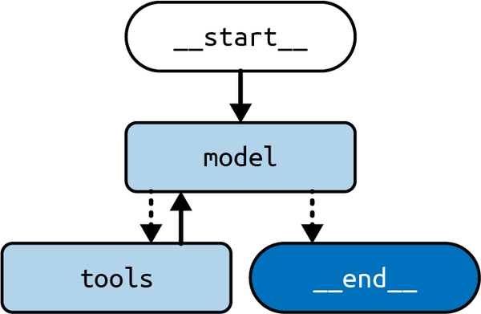
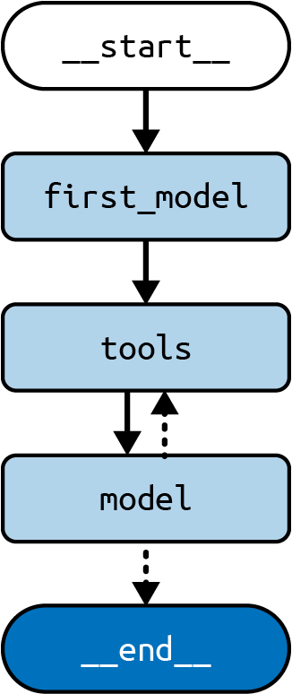
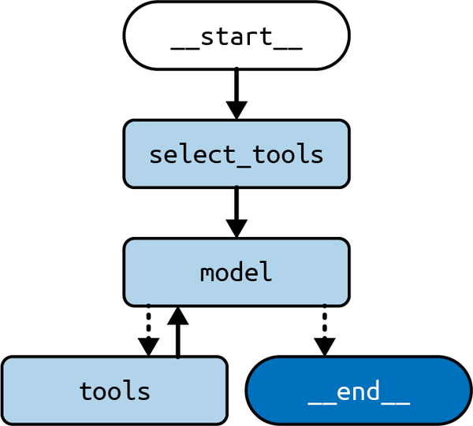

# Arsitektur Agen

Membangun di atas arsitektur yang dijelaskan di [Bab 5](ch05.xhtml#ch05_cognitive_architectures_with_langgraph_1736545670030774), bab ini akan membahas apa yang mungkin paling penting dari semua arsitektur LLM saat ini, arsitektur agen. Pertama, kami memperkenalkan apa yang membuat agen LLM unik, kemudian kami menunjukkan cara membangunnya dan cara memperluasnya untuk kasus penggunaan umum.

Dalam bidang kecerdasan buatan, ada sejarah panjang menciptakan agen (cerdas), yang paling sederhana dapat didefinisikan sebagai "sesuatu yang bertindak," menurut kata-kata Stuart Russell dan Peter Norvig dalam buku teks mereka _Artificial Intelligence_ (Pearson, 2020). Kata _bertindak_ sebenarnya membawa sedikit lebih banyak makna daripada yang terlihat:

- Bertindak memerlukan beberapa kapasitas untuk memutuskan apa yang harus dilakukan.
- Memutuskan apa yang harus dilakukan menyiratkan memiliki akses ke lebih dari satu kemungkinan tindakan. Bagaimanapun juga, keputusan tanpa pilihan bukanlah keputusan sama sekali.
- Untuk memutuskan, agen juga memerlukan akses ke informasi tentang lingkungan eksternal (apa pun di luar agen itu sendiri).

Jadi aplikasi LLM _agen_ haruslah yang menggunakan LLM untuk memilih dari satu atau lebih kemungkinan tindakan, mengingat beberapa konteks tentang status dunia saat ini atau beberapa status berikutnya yang diinginkan. Atribut ini biasanya diimplementasikan dengan mencampur dua teknik permintaan yang pertama kami temui di [Prakata](preface01.xhtml#pr01_preface_1736545679069216):

<dl>
	<dt>Pemanggilan alat (Tool calling)</dt>
	<dd>
	<p>Sertakan daftar fungsi eksternal yang dapat digunakan LLM dalam permintaan Anda (yaitu, tindakan yang dapat diputuskan untuk diambil) dan berikan instruksi tentang cara memformat pilihannya dalam keluaran yang dihasilkan. Anda akan melihat sebentar lagi seperti apa ini dalam permintaan.</p>
	</dd>
	<dt>Rantai-pemikiran (Chain-of-thought)</dt>
	<dd>
	<p>Peneliti menemukan bahwa LLM "membuat keputusan lebih baik" ketika diberikan instruksi untuk bernalar tentang masalah kompleks dengan memecahnya menjadi langkah-langkah granular yang akan diambil secara berurutan. Ini biasanya dilakukan dengan menambahkan instruksi seperti "pikirkan langkah demi langkah" atau menyertakan contoh pertanyaan dan dekomposisinya menjadi beberapa langkah/tindakan.</p>
	</dd>
</dl>

Berikut contoh permintaan menggunakan pemanggilan alat dan rantai-pemikiran:

```
Alat:
pencarian: alat ini menerima kueri pencarian web dan mengembalikan hasil teratas.
kalkulator: alat ini menerima ekspresi matematika dan mengembalikan hasilnya.

Jika Anda ingin menggunakan alat untuk sampai pada jawaban, keluarkan daftar alat dan
masukan dalam format CSV, dengan baris header: alat,masukan.

Pikirkan langkah demi langkah; jika Anda perlu membuat beberapa panggilan alat untuk sampai
pada jawaban, kembalikan hanya yang pertama.

Berapa usia presiden ke‑30 Amerika Serikat ketika dia meninggal?

alat,masukan
```

Dan keluaran, ketika dijalankan terhadap `gpt-3.5-turbo` pada suhu 0 (untuk memastikan LLM mengikuti format keluaran yang diinginkan, CSV) dan newline sebagai urutan berhenti (yang menginstruksikan LLM untuk berhenti menghasilkan keluaran ketika mencapai karakter ini). Ini membuat LLM menghasilkan satu tindakan (seperti yang diharapkan, mengingat permintaan meminta ini):

```
pencarian,presiden ke‑30 Amerika Serikat
```

LLM dan model obrolan terbaru telah disesuaikan untuk meningkatkan kinerja mereka untuk aplikasi pemanggilan alat dan rantai-pemikiran, menghilangkan kebutuhan menambahkan instruksi spesifik ke permintaan:

```
tambahkan contoh permintaan dan keluaran untuk model pemanggilan alat
```

## Lingkaran Rencana‑Lakukan

Apa yang membuat arsitektur agen berbeda dari arsitektur yang dibahas di [Bab 5](ch05.xhtml#ch05_cognitive_architectures_with_langgraph_1736545670030774) adalah konsep yang belum kami bahas: lingkaran yang digerakkan LLM.

Setiap pemrogram pernah menemui lingkaran dalam kode mereka sebelumnya. Dengan _lingkaran_, kami maksud menjalankan kode yang sama beberapa kali hingga kondisi berhenti tercapai. Kunci arsitektur agen adalah memiliki LLM mengontrol kondisi berhenti—yaitu, memutuskan kapan harus berhenti berputar.

Apa yang akan kami jalankan dalam lingkaran ini akan menjadi beberapa variasi dari berikut:

- Merencanakan satu atau beberapa tindakan
- Mengeksekusi tindakan tersebut

Mengambil contoh di bagian sebelumnya, kami selanjutnya akan menjalankan alat `pencarian` dengan masukan `presiden ke‑30 Amerika Serikat`, yang menghasilkan keluaran ini:

```
Calvin Coolidge (lahir John Calvin Coolidge Jr.; /ˈkuːlɪdʒ/; 4 Juli 1872 – 5
Januari 1933) adalah seorang pengacara dan politisi Amerika yang menjabat sebagai presiden ke‑30
Amerika Serikat dari 1923 hingga 1929. John Calvin Coolidge Jr.
```

Dan kemudian kami akan menjalankan ulang permintaan, dengan tambahan kecil:

```
Alat:
pencarian: alat ini menerima kueri pencarian web dan mengembalikan hasil teratas.
kalkulator: alat ini menerima ekspresi matematika dan mengembalikan hasilnya.
keluaran: alat ini mengakhiri interaksi. Gunakan ketika Anda memiliki jawaban akhir.

Jika Anda ingin menggunakan alat untuk sampai pada jawaban, keluarkan daftar alat dan
masukan dalam format CSV, dengan baris header ini: alat,masukan

Pikirkan langkah demi langkah; jika Anda perlu membuat beberapa panggilan alat untuk sampai
pada jawaban, kembalikan hanya yang pertama.

Berapa usia presiden ke‑30 Amerika Serikat ketika dia meninggal?

alat,masukan

pencarian,presiden ke‑30 Amerika Serikat

pencarian: Calvin Coolidge (lahir John Calvin Coolidge Jr.; /ˈkuːlɪdʒ/; 4 Juli 1872 –
5 Januari 1933) adalah seorang pengacara dan politisi Amerika yang menjabat sebagai presiden ke‑30
Amerika Serikat dari 1923 hingga 1929. John Calvin Coolidge Jr.

alat,masukan
```

Dan keluaran:

```
kalkulator,1933 - 1872
```

Perhatikan kami menambahkan dua hal:

- Alat "keluaran"—yang harus digunakan LLM ketika telah menemukan jawaban akhir, dan yang akan kami gunakan sebagai sinyal untuk menghentikan lingkaran.
- Hasil panggilan alat dari iterasi sebelumnya, cukup dengan nama alat dan keluaran (teks)-nya. Ini disertakan untuk memungkinkan LLM melanjutkan ke langkah berikutnya dalam interaksi. Dengan kata lain, kami memberi tahu LLM, "Hei, kami mendapatkan hasil yang Anda minta, apa yang ingin Anda lakukan selanjutnya?"

Mari lanjutkan dengan iterasi ketiga:

```
Alat:
pencarian: alat ini menerima kueri pencarian web dan mengembalikan hasil teratas.
kalkulator: alat ini menerima ekspresi matematika dan mengembalikan hasilnya.

Jika Anda ingin menggunakan alat untuk sampai pada jawaban, keluarkan daftar alat dan
masukan dalam format CSV, dengan baris header ini: alat,masukan.
keluaran: alat ini mengakhiri interaksi. Gunakan ketika Anda memiliki jawaban akhir.

Pikirkan langkah demi langkah; jika Anda perlu membuat beberapa panggilan alat untuk sampai
pada jawaban, kembalikan hanya yang pertama.

Berapa usia presiden ke‑30 Amerika Serikat ketika dia meninggal?

alat,masukan

pencarian,presiden ke‑30 Amerika Serikat

pencarian: Calvin Coolidge (lahir John Calvin Coolidge Jr.; /ˈkuːlɪdʒ/; 4 Juli 1872 –
5 Januari 1933) adalah seorang pengacara dan politisi Amerika yang menjabat sebagai presiden ke‑30
Amerika Serikat dari 1923 hingga 1929. John Calvin Coolidge Jr.
alat,masukan

kalkulator,1933-1872

kalkulator: 61

alat, masukan
```

Dan keluaran:

```
keluaran, 61
```

Dengan hasil dari alat `kalkulator`, LLM sekarang memiliki informasi cukup untuk memberikan jawaban akhir, jadi ia memilih alat `keluaran` dan memilih "61" sebagai jawaban akhir.

Inilah yang membuat arsitektur agen sangat berguna—LLM diberi agensi untuk memutuskan. Langkah selanjutnya adalah sampai pada jawaban dan memutuskan berapa banyak langkah yang harus diambil—yaitu, kapan berhenti.

Arsitektur ini, disebut [ReAct](https://oreil.ly/M7hF-), pertama kali diusulkan oleh Shunyu Yao dkk. Sisa bab ini mengeksplorasi cara meningkatkan kinerja arsitektur agen, dimotivasi oleh contoh asisten email dari [Bab 5](ch05.xhtml#ch05_cognitive_architectures_with_langgraph_1736545670030774).

Tetapi pertama, mari kita lihat seperti apa mengimplementasikan arsitektur agen dasar menggunakan model obrolan dan LangGraph.

## Membangun Agen LangGraph

Untuk contoh ini, kami perlu memasang dependensi tambahan untuk alat pencarian yang kami pilih untuk digunakan, DuckDuckGo. Untuk memasangnya untuk Python:

_Python_

```
pip install duckduckgo-search
```

Dan untuk JS, kami juga perlu memasang dependensi untuk alat kalkulator:

_JavaScript_

```
npm i duck-duck-scrape expr-eval
```

Dengan itu selesai, mari masuk ke kode aktual untuk mengimplementasikan arsitektur agen:

_Python_

```python
import ast
from typing import Annotated, TypedDict

from langchain_community.tools import DuckDuckGoSearchRun
from langchain_core.tools import tool
from langchain_openai import ChatOpenAI

from langgraph.graph import START, StateGraph
from langgraph.graph.message import add_messages
from langgraph.prebuilt import ToolNode, tools_condition

@tool
def calculator(query: str) -> str:
    """Alat kalkulator sederhana. Masukan harus berupa ekspresi matematika."""
    return ast.literal_eval(query)

search = DuckDuckGoSearchRun()
tools = [search, calculator]
model = ChatOpenAI(temperature=0.1).bind_tools(tools)

class State(TypedDict):
    messages: Annotated[list, add_messages]

def model_node(state: State) -> State:
    res = model.invoke(state["messages"])
    return {"messages": res}

builder = StateGraph(State)
builder.add_node("model", model_node)
builder.add_node("tools", ToolNode(tools))
builder.add_edge(START, "model")
builder.add_conditional_edges("model", tools_condition)
builder.add_edge("tools", "model")

graph = builder.compile()
```

_JavaScript_

```javascript
import { DuckDuckGoSearch } from "@langchain/community/tools/duckduckgo_search"
import { Calculator } from "@langchain/community/tools/calculator"
import {
  StateGraph,
  Annotation,
  messagesStateReducer,
  START,
} from "@langchain/langgraph"
import { ToolNode, toolsCondition } from "@langchain/langgraph/prebuilt"

const search = new DuckDuckGoSearch()
const calculator = new Calculator()
const tools = [search, calculator]
const model = new ChatOpenAI({
  temperature: 0.1,
}).bindTools(tools)

const annotation = Annotation.Root({
  messages: Annotation({
    reducer: messagesStateReducer,
    default: () => [],
  }),
})

async function modelNode(state) {
  const res = await model.invoke(state.messages)
  return { messages: res }
}

const builder = new StateGraph(annotation)
  .addNode("model", modelNode)
  .addNode("tools", new ToolNode(tools))
  .addEdge(START, "model")
  .addConditionalEdges("model", toolsCondition)
  .addEdge("tools", "model")

const graph = builder.compile()
```

Representasi visual ditunjukkan pada [Gambar 6-1](#ch06_figure_1_1736545671744632).



Beberapa hal untuk diperhatikan di sini:

- Kami menggunakan dua alat dalam contoh ini: alat pencarian dan alat kalkulator, tetapi Anda dapat dengan mudah menambahkan lebih banyak atau mengganti yang kami gunakan. Dalam contoh Python, Anda juga melihat contoh membuat alat khusus.
- Kami telah menggunakan dua fungsi kenyamanan yang dikirim dengan LangGraph. `ToolNode` berfungsi sebagai simpul dalam grafik kami; ia mengeksekusi panggilan alat yang diminta dalam pesan AI terbaru yang ditemukan dalam status dan mengembalikan `ToolMessage` dengan hasil masing-masing. `ToolNode` juga menangani pengecualian yang dimunculkan oleh alat—menggunakan pesan kesalahan untuk membangun `ToolMessage` yang kemudian diteruskan ke LLM—yang mungkin memutuskan apa yang harus dilakukan dengan kesalahan.
- `tools_condition` berfungsi sebagai fungsi tepi bersyarat yang melihat pesan AI terbaru dalam status dan mengarahkan ke simpul `tools` jika ada alat yang harus dieksekusi. Jika tidak, ia mengakhiri grafik.
- Terakhir, perhatikan bahwa grafik ini berputar antara simpul model dan alat. Artinya, model itu sendiri yang bertanggung jawab memutuskan kapan mengakhiri komputasi, yang merupakan atribut kunci arsitektur agen. Kapan pun kami mengkodekan lingkaran dalam LangGraph, kami kemungkinan ingin menggunakan tepi bersyarat, karena itu memungkinkan Anda mendefinisikan _kondisi berhenti_ ketika grafik harus keluar dari lingkaran dan berhenti mengeksekusi.

Sekarang mari kita lihat bagaimana kinerjanya dalam contoh sebelumnya:

_Python_

```python
input = {
    "messages": [
        HumanMessage("""Berapa usia presiden ke‑30 Amerika Serikat
            ketika dia meninggal?""")
    ]
}
for c in graph.stream(input):
    print(c)
```

_JavaScript_

```javascript
const input = {
  messages: [
    HumanMessage(`Berapa usia presiden ke‑30 Amerika Serikat ketika dia
      meninggal?`),
  ],
}
for await (const c of await graph.stream(input)) {
  console.log(c)
}
```

_Keluaran:_

```
{
    "model": {
        "messages": AIMessage(
            content="",
            tool_calls=[
                {
                    "name": "duckduckgo_search",
                    "args": {
                        "query": "presiden ke‑30 Amerika Serikat usia saat
                            meninggal"
                    },
                    "id": "call_ZWRbPmjvo0fYkwyo4HCYUsar",
                    "type": "tool_call",
                }
            ],
        )
    }
}
{
    "tools": {
        "messages": [
            ToolMessage(
                content="Calvin Coolidge (lahir 4 Juli 1872, Plymouth, Vermont,
                    AS—meninggal 5 Januari 1933, Northampton, Massachusetts) adalah
                    presiden ke‑30 Amerika Serikat (1923-29). Coolidge
                    naik ke kepresidenan setelah kematian dalam jabatan
                    Warren G. Harding, tepat ketika skandal Harding terungkap....",
                name="duckduckgo_search",
                tool_call_id="call_ZWRbPmjvo0fYkwyo4HCYUsar",
            )
        ]
    }
}
{
    "model": {
        "messages": AIMessage(
            content="Calvin Coolidge, presiden ke‑30 Amerika Serikat,
                meninggal pada 5 Januari 1933, pada usia 60.",
        )
    }
}
```

Menelusuri keluaran ini:

1. Pertama simpul `model` dieksekusi dan memutuskan untuk memanggil alat `duckduckgo_search`, yang menyebabkan tepi bersyarat mengarahkan kami ke simpul `tools` setelahnya.
2. `ToolNode` mengeksekusi alat pencarian dan mendapatkan hasil pencarian yang dicetak di atas, yang sebenarnya mengandung jawaban "Usia dan Tahun Kematian . 5 Januari 1933 (usia 60)".
3. Alat `model` dipanggil lagi, kali ini dengan hasil pencarian sebagai pesan terbaru, dan menghasilkan jawaban akhir (tanpa panggilan alat lagi); oleh karena itu, tepi bersyarat mengakhiri grafik.

Selanjutnya, mari kita lihat beberapa ekstensi berguna untuk arsitektur agen dasar ini, menyesuaikan perencanaan dan pemanggilan alat.

## Selalu Memanggil Alat Pertama

Dalam arsitektur agen standar, LLM selalu dipanggil untuk memutuskan alat apa yang akan dipanggil berikutnya. Pengaturan ini memiliki keuntungan jelas: memberi LLM fleksibilitas tertinggi untuk menyesuaikan perilaku aplikasi dengan setiap kueri pengguna yang masuk. Tetapi fleksibilitas ini datang dengan biaya: ketidakpastian. Jika, misalnya, Anda, pengembang aplikasi, tahu bahwa alat pencarian harus selalu dipanggil pertama, itu sebenarnya dapat bermanfaat bagi aplikasi Anda:

1. Ini akan mengurangi latensi keseluruhan, karena akan melewatkan panggilan LLM pertama yang akan menghasilkan permintaan untuk memanggil alat pencarian.
2. Ini akan mencegah LLM dari salah memutuskan bahwa tidak perlu memanggil alat pencarian untuk beberapa kueri pengguna.

Di sisi lain, jika aplikasi Anda tidak memiliki aturan jelas seperti "Anda harus selalu memanggil alat ini pertama," memperkenalkan batasan seperti itu akan membuat aplikasi Anda lebih buruk.

Mari kita lihat seperti apa melakukannya:

_Python_

```python
import ast
from typing import Annotated, TypedDict
from uuid import uuid4

from langchain_community.tools import DuckDuckGoSearchRun
from langchain_core.messages import AIMessage, HumanMessage, ToolCall
from langchain_core.tools import tool
from langchain_openai import ChatOpenAI

from langgraph.graph import START, StateGraph
from langgraph.graph.message import add_messages
from langgraph.prebuilt import ToolNode, tools_condition

@tool
def calculator(query: str) -> str:
    """Alat kalkulator sederhana. Masukan harus berupa ekspresi matematika."""
    return ast.literal_eval(query)

search = DuckDuckGoSearchRun()
tools = [search, calculator]
model = ChatOpenAI(temperature=0.1).bind_tools(tools)

class State(TypedDict):
    messages: Annotated[list, add_messages]

def model_node(state: State) -> State:
    res = model.invoke(state["messages"])
    return {"messages": res}

def first_model(state: State) -> State:
    query = state["messages"][-1].content
    search_tool_call = ToolCall(
        name="duckduckgo_search", args={"query": query}, id=uuid4().hex
    )
    return {"messages": AIMessage(content="", tool_calls=[search_tool_call])}

builder = StateGraph(State)
builder.add_node("first_model", first_model)
builder.add_node("model", model_node)
builder.add_node("tools", ToolNode(tools))
builder.add_edge(START, "first_model")
builder.add_edge("first_model", "tools")
builder.add_conditional_edges("model", tools_condition)
builder.add_edge("tools", "model")

graph = builder.compile()
```

_JavaScript_

```javascript
import { DuckDuckGoSearch } from "@langchain/community/tools/duckduckgo_search"
import { Calculator } from "@langchain/community/tools/calculator"
import { AIMessage } from "@langchain/core/messages"
import {
  StateGraph,
  Annotation,
  messagesStateReducer,
  START,
} from "@langchain/langgraph"
import { ToolNode, toolsCondition } from "@langchain/langgraph/prebuilt"

const search = new DuckDuckGoSearch()
const calculator = new Calculator()
const tools = [search, calculator]
const model = new ChatOpenAI({ temperature: 0.1 }).bindTools(tools)

const annotation = Annotation.Root({
  messages: Annotation({ reducer: messagesStateReducer, default: () => [] }),
})

async function firstModelNode(state) {
  const query = state.messages[state.messages.length - 1].content
  const searchToolCall = {
    name: "duckduckgo_search",
    args: { query },
    id: Math.random().toString(),
  }
  return {
    messages: [new AIMessage({ content: "", tool_calls: [searchToolCall] })],
  }
}

async function modelNode(state) {
  const res = await model.invoke(state.messages)
  return { messages: res }
}

const builder = new StateGraph(annotation)
  .addNode("first_model", firstModelNode)
  .addNode("model", modelNode)
  .addNode("tools", new ToolNode(tools))
  .addEdge(START, "first_model")
  .addEdge("first_model", "tools")
  .addEdge("tools", "model")
  .addConditionalEdges("model", toolsCondition)

const graph = builder.compile()
```

Representasi visual ditunjukkan pada [Gambar 6-2](#ch06_figure_2_1736545671744669).



Perhatikan perbedaan dibandingkan bagian sebelumnya:

- Sekarang, kami memulai semua pemanggilan dengan memanggil `first_model`, yang sama sekali tidak memanggil LLM. Itu hanya membuat panggilan alat untuk alat pencarian, menggunakan pesan pengguna secara verbatim sebagai kueri pencarian. Arsitektur sebelumnya akan memiliki LLM menghasilkan panggilan alat ini (atau respons lain yang dianggap lebih baik).
- Setelah itu, kami melanjutkan ke `tools`, yang identik dengan contoh sebelumnya, dan dari sana kami melanjutkan ke simpul `agent` seperti sebelumnya.

Sekarang mari kita lihat beberapa contoh keluaran, untuk kueri yang sama seperti sebelumnya:

_Python_

```python
input = {
    "messages": [
        HumanMessage("""Berapa usia presiden ke‑30 Amerika Serikat
            ketika dia meninggal?""")
    ]
}
for c in graph.stream(input):
print(c)
```

_JavaScript_

```javascript
const input = {
  messages: [
    HumanMessage(`Berapa usia presiden ke‑30 Amerika Serikat ketika dia
        meninggal?`),
  ],
}
for await (const c of await graph.stream(input)) {
  console.log(c)
}
```

_Keluaran:_

```
{
    "first_model": {
        "messages": AIMessage(
            content="",
            tool_calls=[
                {
                    "name": "duckduckgo_search",
                    "args": {
                        "query": "Berapa usia presiden ke‑30 Amerika Serikat
                            ketika dia meninggal?"
                    },
                    "id": "9ed4328dcdea4904b1b54487e343a373",
                    "type": "tool_call",
                }
            ],
        )
    }
}
{
    "tools": {
        "messages": [
            ToolMessage(
                content="Calvin Coolidge (lahir 4 Juli 1872, Plymouth, Vermont,
                    AS—meninggal 5 Januari 1933, Northampton, Massachusetts) adalah
                    presiden ke‑30 Amerika Serikat (1923-29). Coolidge
                    naik ke kepresidenan setelah kematian dalam jabatan
                    Warren G. Harding, tepat ketika skandal Harding terungkap....",
                name="duckduckgo_search",
                tool_call_id="9ed4328dcdea4904b1b54487e343a373",
            )
        ]
    }
}
{
    "model": {
        "messages": AIMessage(
            content="Calvin Coolidge, presiden ke‑30 Amerika Serikat,
                lahir pada 4 Juli 1872, dan meninggal pada 5 Januari 1933. Untuk
                menghitung usianya pada saat kematian, kita dapat mengurangi
                tahun kelahirannya dari tahun kematiannya. \n\nUsia saat meninggal = Tahun kematian -
                Tahun kelahiran\nUsia saat meninggal = 1933 - 1872\nUsia saat meninggal = 61
                tahun\n\nCalvin Coolidge berusia 61 tahun ketika dia meninggal.",
        )
    }
}
```

Kali ini, kami melewatkan panggilan LLM awal. Kami pertama pergi ke simpul `first_model`, yang langsung mengembalikan panggilan alat untuk alat pencarian. Dari sana kami pergi ke alur sebelumnya—yaitu, kami mengeksekusi alat pencarian dan akhirnya kembali ke simpul `model` untuk menghasilkan jawaban akhir.

Selanjutnya mari kita bahas apa yang dapat Anda lakukan ketika Anda memiliki banyak alat yang ingin Anda buat tersedia untuk LLM.

## Menangani Banyak Alat

LLM jauh dari sempurna, dan mereka saat ini lebih kesulitan ketika diberikan banyak pilihan atau informasi berlebihan dalam permintaan. Keterbatasan ini juga meluas ke perencanaan tindakan berikutnya yang akan diambil. Ketika diberikan banyak alat (katakanlah, lebih dari 10) kinerja perencanaan (yaitu, kemampuan LLM untuk memilih alat yang tepat) mulai menderita. Solusi untuk masalah ini adalah mengurangi jumlah alat yang dapat dipilih LLM. Tetapi bagaimana jika Anda memang memiliki banyak alat yang ingin Anda lihat digunakan untuk kueri pengguna berbeda?

Satu solusi elegan adalah menggunakan langkah RAG untuk memilih sebelumnya alat paling relevan untuk kueri saat ini dan kemudian memberi makan LLM hanya subset alat itu daripada seluruh persenjataan. Ini juga dapat membantu mengurangi biaya memanggil LLM (LLM komersial biasanya mengenakan biaya berdasarkan panjang permintaan dan keluaran). Di sisi lain, langkah RAG ini memperkenalkan latensi tambahan ke aplikasi Anda, jadi hanya harus dilakukan ketika Anda melihat kinerja menurun setelah menambahkan lebih banyak alat.

Mari kita lihat cara melakukannya:

_Python_

```python
import ast
from typing import Annotated, TypedDict

from langchain_community.tools import DuckDuckGoSearchRun
from langchain_core.documents import Document
from langchain_core.messages import HumanMessage
from langchain_core.tools import tool
from langchain_core.vectorstores.in_memory import InMemoryVectorStore
from langchain_openai import ChatOpenAI, OpenAIEmbeddings

from langgraph.graph import START, StateGraph
from langgraph.graph.message import add_messages
from langgraph.prebuilt import ToolNode, tools_condition

@tool
def calculator(query: str) -> str:
    """Alat kalkulator sederhana. Masukan harus berupa ekspresi matematika."""
    return ast.literal_eval(query)

search = DuckDuckGoSearchRun()
tools = [search, calculator]

embeddings = OpenAIEmbeddings()
model = ChatOpenAI(temperature=0.1)

tools_retriever = InMemoryVectorStore.from_documents(
    [Document(tool.description, metadata={"name": tool.name}) for tool in tools],
    embeddings,
).as_retriever()

class State(TypedDict):
    messages: Annotated[list, add_messages]
    selected_tools: list[str]

def model_node(state: State) -> State:
    selected_tools = [
        tool for tool in tools if tool.name in state["selected_tools"]
    ]
    res = model.bind_tools(selected_tools).invoke(state["messages"])
    return {"messages": res}

def select_tools(state: State) -> State:
    query = state["messages"][-1].content
    tool_docs = tools_retriever.invoke(query)
    return {"selected_tools": [doc.metadata["name"] for doc in tool_docs]}

builder = StateGraph(State)
builder.add_node("select_tools", select_tools)
builder.add_node("model", model_node)
builder.add_node("tools", ToolNode(tools))
builder.add_edge(START, "select_tools")
builder.add_edge("select_tools", "model")
builder.add_conditional_edges("model", tools_condition)
builder.add_edge("tools", "model")

graph = builder.compile()
```

_JavaScript_

```javascript
import { DuckDuckGoSearch } from "@langchain/community/tools/duckduckgo_search";
import { Calculator } from "@langchain/community/tools/calculator";
import { ChatOpenAI } from "@langchain/openai";
import { OpenAIEmbeddings } from "@langchain/openai";
import { Document } from "@langchain/core/documents";
import { MemoryVectorStore } from "langchain/vectorstores/memory";
import {
  StateGraph,
  Annotation,
  messagesStateReducer,
  START,
} from "@langchain/langgraph";
import { ToolNode, toolsCondition } from "@langchain/langgraph/prebuilt";
import { HumanMessage } from "@langchain/core/messages";

const search = new DuckDuckGoSearch();
const calculator = new Calculator();
const tools = [search, calculator];

const embeddings = new OpenAIEmbeddings();
const model = new ChatOpenAI({ temperature: 0.1 });

const toolsStore = await MemoryVectorStore.fromDocuments(
  tools.map(
    (tool) =>
      new Document({
        pageContent: tool.description,
        metadata: { name: tool.constructor.name },
      })
  ),
  embeddings
);
const toolsRetriever = toolsStore.asRetriever();

const annotation = Annotation.Root({
  messages: Annotation({ reducer: messagesStateReducer, default: () => [] }),
  selected_tools: Annotation(),
});

async function modelNode(state) {
  const selectedTools = tools.filter((tool) =>
    state.selected_tools.includes(tool.constructor.name)
  );
  const res = await model.bindTools(selectedTools).invoke(state.messages);
  return { messages: res };
}

async function selectTools(state) {
  const query = state.messages[state.messages.length - 1].content;
  const toolDocs = await toolsRetriever.invoke(query as string);
  return {
    selected_tools: toolDocs.map((doc) => doc.metadata.name),
  };
}

const builder = new StateGraph(annotation)
  .addNode("select_tools", selectTools)
  .addNode("model", modelNode)
  .addNode("tools", new ToolNode(tools))
  .addEdge(START, "select_tools")
  .addEdge("select_tools", "model")
  .addConditionalEdges("model", toolsCondition)
  .addEdge("tools", "model");
```

Anda dapat melihat representasi visual pada [Gambar 6-3](#ch06_figure_3_1736545671744693).



> Catatan
> Ini sangat mirip dengan arsitektur agen biasa. Satu‑satunya perbedaan adalah kami berhenti di simpul `select_tools` sebelum memasuki lingkaran agen sebenarnya. Setelah itu, ia bekerja persis seperti arsitektur agen biasa yang telah kami lihat sebelumnya.

Sekarang mari kita lihat beberapa contoh keluaran untuk kueri yang sama seperti sebelumnya:

_Python_

```python
input = {
  "messages": [
    HumanMessage("""Berapa usia presiden ke‑30 Amerika Serikat ketika
        dia meninggal?""")
  ]
}
for c in graph.stream(input):
print(c)
```

_JavaScript_

```javascript
const input = {
  messages: [
    HumanMessage(`Berapa usia presiden ke‑30 Amerika Serikat ketika dia
      meninggal?`),
  ],
}
for await (const c of await graph.stream(input)) {
  console.log(c)
}
```

_Keluaran:_

```
{
    "select_tools": {
        "selected_tools': ['duckduckgo_search', 'calculator']
    }
}
{
    "model": {
        "messages": AIMessage(
            content="",
            tool_calls=[
                {
                    "name": "duckduckgo_search",
                    "args": {
                        "query": "presiden ke‑30 Amerika Serikat"
                    },
                    "id": "9ed4328dcdea4904b1b54487e343a373",
                    "type": "tool_call",
                }
            ],
        )
    }
}
{
    "tools": {
        "messages": [
            ToolMessage(
                content="Calvin Coolidge (lahir 4 Juli 1872, Plymouth, Vermont,
                    AS—meninggal 5 Januari 1933, Northampton, Massachusetts) adalah
                    presiden ke‑30 Amerika Serikat (1923-29). Coolidge
                    naik ke kepresidenan setelah kematian dalam jabatan
                    Warren G. Harding, tepat ketika skandal Harding terungkap....",
                name="duckduckgo_search",
                tool_call_id="9ed4328dcdea4904b1b54487e343a373",
            )
        ]
    }
}
{
    "model": {
        "messages": AIMessage(
            content="Calvin Coolidge, presiden ke‑30 Amerika Serikat,
                lahir pada 4 Juli 1872, dan meninggal pada 5 Januari 1933. Untuk
                menghitung usianya pada saat kematian, kita dapat mengurangi
                tahun kelahirannya dari tahun kematiannya. \n\nUsia saat meninggal = Tahun kematian -
                Tahun kelahiran\nUsia saat meninggal = 1933 - 1872\nUsia saat meninggal = 61
                tahun\n\nCalvin Coolidge berusia 61 tahun ketika dia meninggal.",
        )
    }
}
```

Perhatikan bagaimana hal pertama yang kami lakukan adalah mengkueri pengambil untuk mendapatkan alat paling relevan untuk kueri pengguna saat ini. Kemudian, kami melanjutkan ke arsitektur agen biasa.

## Ringkasan

Bab ini memperkenalkan konsep _agensi_ dan membahas apa yang diperlukan untuk membuat aplikasi LLM _agen_: memberi LLM kemampuan untuk memutuskan antara beberapa opsi dengan menggunakan informasi eksternal.

Kami menelusuri arsitektur agen standar yang dibangun dengan LangGraph dan melihat dua ekstensi berguna: cara selalu memanggil alat tertentu pertama dan cara menangani banyak alat.

[Bab 7](ch07.xhtml#ch07_agents_ii_1736545673023633) melihat ekstensi tambahan untuk arsitektur agen.
