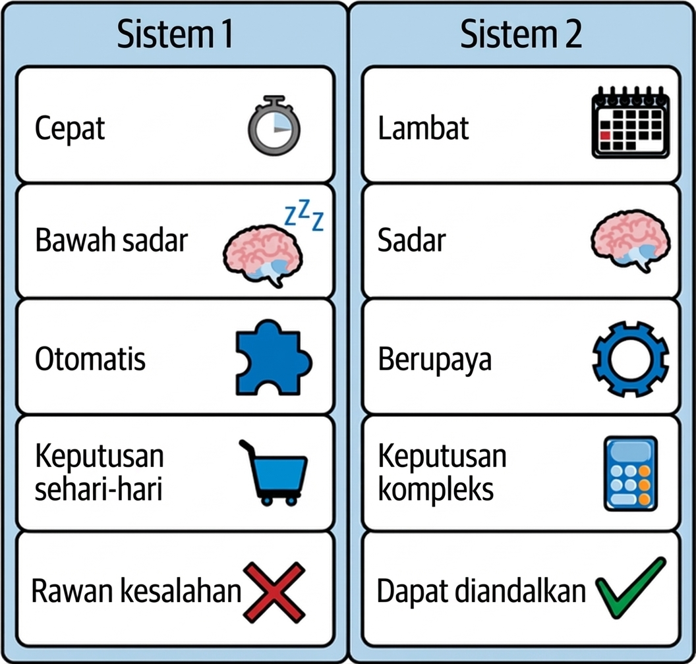
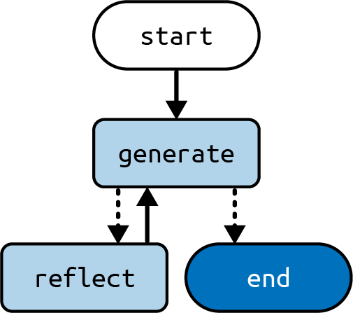
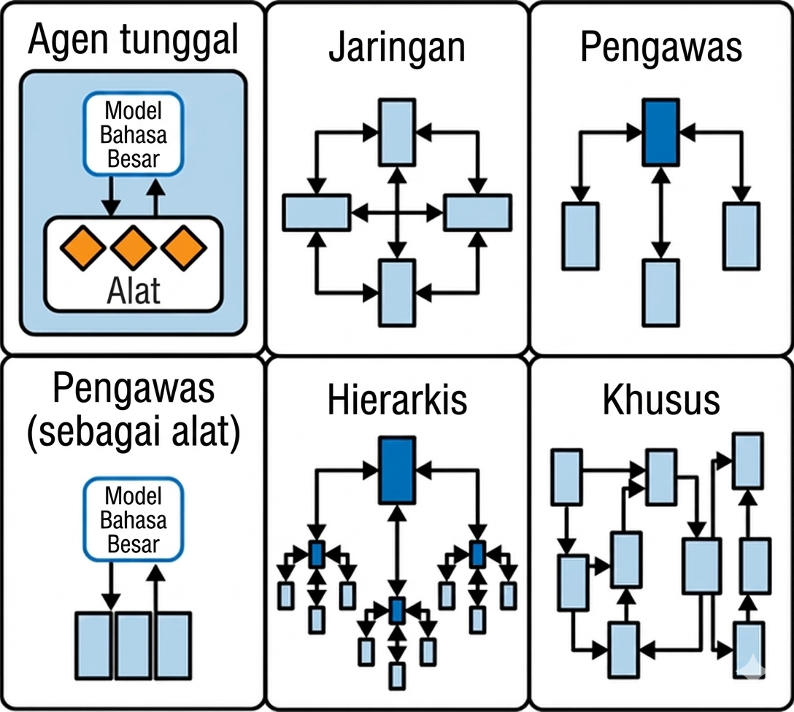

# Bab 7. Agen II

[Bab 6](ch06.xhtml#ch06_agent_architecture_1736545671750341) memperkenalkan arsitektur _agen_, yang paling kuat dari arsitektur LLM yang telah kita lihat hingga sekarang. Sulit untuk melebih-lebihkan potensi kombinasi teknik permintaan rantai-pemikiran, penggunaan alat, dan perulangan ini.

Bab ini membahas dua ekstensi untuk arsitektur agen yang meningkatkan kinerja untuk beberapa kasus penggunaan:

**Refleksi**
: Mengambil halaman lain dari repertoar pola pemikiran manusia, ini tentang memberi aplikasi LLM Anda kesempatan untuk menganalisis keluaran dan pilihannya di masa lalu, bersama dengan kemampuan untuk mengingat refleksi dari iterasi sebelumnya.

**Multi-agen**
: Sama seperti tim dapat mencapai lebih dari satu orang, ada masalah yang dapat ditangani paling baik oleh tim agen LLM.

Mari kita mulai dengan refleksi.

## Refleksi

Satu teknik permintaan yang belum kita bahas adalah _refleksi_ (juga dikenal sebagai _kritik diri_). _Refleksi_ adalah pembuatan lingkaran antara permintaan pembuat dan permintaan peninjau. Ini mencerminkan proses penciptaan untuk banyak artefak buatan manusia, seperti bab yang sedang Anda baca sekarang, yang merupakan hasil bolak-balik antara penulis, peninjau, dan editor sampai semua puas dengan produk akhir.

Seperti banyak teknik permintaan yang telah kita lihat sejauh ini, refleksi dapat digabungkan dengan teknik lain, seperti rantai-pemikiran dan pemanggilan alat. Dalam bagian ini, kita akan melihat refleksi secara terisolasi.

Paralel dapat ditarik ke mode pemikiran manusia yang dikenal sebagai _Sistem 1_ (reaktif atau instingtif) dan _Sistem 2_ (metodis dan reflektif), pertama kali diperkenalkan oleh Daniel Kahneman dalam buku _Thinking, Fast and Slow_ (Farrar, Straus and Giroux, 2011). Ketika diterapkan dengan benar, kritik diri dapat membantu aplikasi LLM lebih dekat ke sesuatu yang menyerupai perilaku Sistem 2 ([Gambar 7-1](#ch07_figure_1_1736545673018473)).



kita akan mengimplementasikan refleksi sebagai grafik dengan dua simpul: `generate` dan `reflect`. Grafik ini akan diberi tugas menulis esai tiga-paragraf, dengan simpul `generate` menulis atau merevisi draf esai, dan `reflect` menulis kritik untuk menginformasikan revisi berikutnya. kita akan menjalankan lingkaran sejumlah tetap kali, tetapi variasi teknik ini akan memiliki simpul `reflect` memutuskan kapan harus selesai. Mari kita lihat seperti apa:

_Python_

```python
from typing import Annotated, TypedDict

from langchain_core.messages import (
    AIMessage,
    BaseMessage,
    HumanMessage,
    SystemMessage,
)
from langchain_openai import ChatOpenAI

from langgraph.graph import END, START, StateGraph
from langgraph.graph.message import add_messages

model = ChatOpenAI()

class State(TypedDict):
    messages: Annotated[list[BaseMessage], add_messages]

generate_prompt = SystemMessage(
    """Anda adalah asisten esai yang ditugaskan menulis esai 3-paragraf yang
        sangat baik."""
    "Hasilkan esai terbaik yang mungkin untuk permintaan pengguna."
    """Jika pengguna memberikan kritik, tanggapi dengan versi revisi dari
        upaya Anda sebelumnya."""
)

def generate(state: State) -> State:
    answer = model.invoke([generate_prompt] + state["messages"])
    return {"messages": [answer]}

reflection_prompt = SystemMessage(
    """Anda adalah guru yang menilai pengajuan esai. Hasilkan kritik dan
        rekomendasi untuk pengajuan pengguna."""
    """Berikan rekomendasi terperinci, termasuk permintaan untuk panjang, kedalaman,
        gaya, dll."""
)

def reflect(state: State) -> State:
    # Balikkan pesan untuk membuat LLM berefleksi pada keluaran sendiri
    cls_map = {AIMessage: HumanMessage, HumanMessage: AIMessage}
    # Pesan pertama adalah permintaan pengguna asli.
    # kita pertahankan sama untuk semua simpul
    translated = [reflection_prompt, state["messages"][0]] + [
        cls_map[msg.__class__](content=msg.content)
            for msg in state["messages"][1:]
    ]
    answer = model.invoke(translated)
    # kita perlakukan keluaran ini sebagai umpan balik manusia untuk generator
    return {"messages": [HumanMessage(content=answer.content)]}

def should_continue(state: State):
    if len(state["messages"]) > 6:
        # Berhenti setelah 3 iterasi, masing-masing dengan 2 pesan
        return END
    else:
        return "reflect"

builder = StateGraph(State)
builder.add_node("generate", generate)
builder.add_node("reflect", reflect)
builder.add_edge(START, "generate")
builder.add_conditional_edges("generate", should_continue)
builder.add_edge("reflect", "generate")

graph = builder.compile()
```

_JavaScript_

```javascript
import {
  AIMessage,
  BaseMessage,
  SystemMessage,
  HumanMessage,
} from "@langchain/core/messages";
import { ChatOpenAI } from "@langchain/openai";
import {
  StateGraph,
  Annotation,
  messagesStateReducer,
  START,
  END,
} from "@langchain/langgraph";

const model = new ChatOpenAI();

const annotation = Annotation.Root({
  messages: Annotation({ reducer: messagesStateReducer, default: () => [] }),
});

// perbaiki string multi-baris
const generatePrompt = new SystemMessage(
  `Anda adalah asisten esai yang ditugaskan menulis esai 3-paragraf yang sangat baik.
  Hasilkan esai terbaik yang mungkin untuk permintaan pengguna.
  Jika pengguna memberikan kritik, tanggapi dengan versi revisi dari
    upaya Anda sebelumnya.`
);

async function generate(state) {
  const answer = await model.invoke([generatePrompt, ...state.messages]);
  return { messages: [answer] };
}

const reflectionPrompt = new SystemMessage(
  `Anda adalah guru yang menilai pengajuan esai. Hasilkan kritik dan
    rekomendasi untuk pengajuan pengguna.
  Berikan rekomendasi terperinci, termasuk permintaan untuk panjang, kedalaman,
    gaya, dll.`
);

async function reflect(state) {
  // Balikkan pesan untuk membuat LLM berefleksi pada keluaran sendiri
  const clsMap: { [key: string]: new (content: string) => BaseMessage } = {
    ai: HumanMessage,
    human: AIMessage,
  };
  // Pesan pertama adalah permintaan pengguna asli.
  // kita pertahankan sama untuk semua simpul
  const translated = [
    reflectionPrompt,
    state.messages[0],
    ...state.messages
      .slice(1)
      .map((msg) => new clsMap[msg._getType()](msg.content as string)),
  ];
  const answer = await model.invoke(translated);
  // kita perlukan keluaran ini sebagai umpan balik manusia untuk generator
  return { messages: [new HumanMessage({ content: answer.content })] };
}

function shouldContinue(state) {
  if (state.messages.length > 6) {
    // Berhenti setelah 3 iterasi, masing-masing dengan 2 pesan
    return END;
  } else {
    return "reflect";
  }
}

const builder = new StateGraph(annotation)
  .addNode("generate", generate)
  .addNode("reflect", reflect)
  .addEdge(START, "generate")
  .addConditionalEdges("generate", shouldContinue)
  .addEdge("reflect", "generate");

const graph = builder.compile();
```

Representasi visual grafik ditunjukkan pada [Gambar 7-2](#ch07_figure_2_1736545673018506).



Perhatikan bagaimana simpul `reflect` menipu LLM untuk berpikir itu sedang mengkritik esai yang ditulis oleh pengguna. Dan bersamaan, simpul `generate` dibuat untuk berpikir bahwa kritik berasal dari pengguna. Tipu daya ini diperlukan karena LLM yang disetel dialog dilatih pada pasangan pesan manusia-AI, jadi urutan banyak pesan dari partisipan yang sama akan menghasilkan kinerja buruk.

Satu hal lagi untuk dicatat: Anda mungkin, pada pandangan pertama, mengharapkan akhir datang setelah langkah revisi, tetapi dalam arsitektur ini kita memiliki jumlah iterasi tetap dari lingkaran `generate-reflect`; oleh karena itu kita berhenti setelah `generate` (sehingga set revisi terakhir yang diminta ditangani). Variasi pada arsitektur ini akan memiliki langkah `reflect` membuat keputusan untuk mengakhiri proses (setelah tidak ada lagi komentar).

Mari kita lihat seperti apa salah satu kritik:

```
{
    'messages': [
        HumanMessage(content='Esai Anda tentang ketepatan waktu "Pangeran Kecil"
            dan pesannya dalam kehidupan modern ditulis dengan baik dan berwawasan. Anda
            telah efektif menyoroti relevansi abadi dari tema buku
            dan pentingnya dalam masyarakat saat ini. Namun, ada
            beberapa area di mana Anda dapat meningkatkan esai Anda:\n\n1. **Kedalaman**:
            Sementara Anda menyentuh tema menghargai kesenangan sederhana,
            memelihara koneksi, dan memahami hubungan manusia,
            pertimbangkan untuk menyelami lebih dalam setiap tema ini. Berikan contoh spesifik
            dari buku untuk mendukung poin Anda dan jelajahi bagaimana tema-tema ini
            terwujud dalam kehidupan kontemporer.\n\n2. **Analisis**: Pertimbangkan
            menganalisis bagaimana pesan buku dapat diterapkan pada masalah
            masyarakat saat ini atau pengalaman pribadi. Misalnya, Anda bisa
            membahas bagaimana perspektif Pangeran Kecil tentang materialisme berkaitan
            dengan budaya konsumen atau jelajahi bagaimana pendekatannya terhadap hubungan
            dapat menginformasikan dinamika interpersonal di era digital.\n\n3.
            **Panjang**: Kembangkan ide Anda dengan menambahkan lebih banyak contoh,
            membahas argumen tandingan, atau mengeksplorasi dampak budaya dari
            "Pangeran Kecil" di bagian dunia yang berbeda. Ini akan
            memperkaya kedalaman analisis Anda dan memberikan pemahaman yang lebih komprehensif
            tentang relevansi buku.\n\n4. **Gaya**: Esai Anda
            jelas dan terstruktur dengan baik. Untuk meningkatkan keterlibatan
            pembaca Anda, pertimbangkan menggabungkan kutipan dari buku untuk mengilustrasikan
            poin kunci atau menyertakan anekdot untuk mempersonalisasi analisis Anda.
            \n\n5. **Kesimpulan**: Akhiri esai Anda dengan meringkas
            signifikansi abadi "Pangeran Kecil" dan bagaimana pesannya
            dapat menginspirasi perubahan positif dalam masyarakat modern. Refleksikan pada
            implikasi yang lebih luas dari tema buku dan tinggalkan pembaca
            dengan kesan yang bertahan.\n\nDengan memperluas analisis Anda,
            menggabungkan lebih banyak contoh, dan memperdalam eksplorasi Anda tentang
            pesan buku, Anda dapat membuat esai yang lebih komprehensif dan
            menarik tentang ketepatan waktu "Pangeran Kecil" dalam kehidupan modern
            hidup. Kerja bagus pada analisis Anda yang bijaksana, dan pertahankan kerja baiknya!', id='70c22b1d-ec96-4dc3-9fd0-d2c6463f9e2c'),
    ],
}
```

Dan keluaran akhir:

```
{
    'messages': [
        AIMessage(content='"Pangeran Kecil" oleh Antoine de Saint-Exupéry
            berdiri sebagai mahakarya abadi yang terus menawarkan wawasan mendalam
            ke dalam hubungan dan nilai manusia, beresonansi dengan
            pembaca lintas generasi. Narasi perjalanan Pangeran Kecil
            dan pertemuannya dengan berbagai karakter berfungsi sebagai
            permadani kaya representasi alegoris, ....', response_metadata=
            {'token_usage': {'completion_tokens': 420, 'prompt_tokens': 2501,
            'total_tokens': 2921}, 'model_name': 'gpt-3.5-turbo',
            'system_fingerprint': None, 'finish_reason': 'stop', 'logprobs':
            None}, id='run-2e8f9f13-f625-4820-9c8b-b64e1c23daa2-0',
            usage_metadata={'input_tokens': 2501, 'output_tokens': 420,
            'total_tokens': 2921}),
    ],
}
```

Jenis refleksi sederhana ini terkadang dapat meningkatkan kinerja dengan memberi LLM beberapa upaya untuk menyempurnakan keluarannya dan dengan membiarkan simpul refleksi mengadopsi persona berbeda sambil mengkritik keluaran.

Ada beberapa variasi mungkin dari arsitektur ini. Salah satunya, kita dapat menggabungkan langkah refleksi dengan arsitektur agen dari [Bab 6](ch06.xhtml#ch06_agent_architecture_1736545671750341), menambahkannya sebagai simpul terakhir tepat sebelum mengirim keluaran ke pengguna. Ini akan membuat kritik tampak berasal dari pengguna, dan memberi aplikasi kesempatan untuk meningkatkan keluaran akhir tanpa intervensi pengguna langsung. Tentu saja pendekatan ini akan datang dengan pengorbanan latensi yang lebih tinggi.

Dalam kasus penggunaan tertentu, mungkin membantu membumikan kritik dengan informasi eksternal. Misalnya, jika Anda menulis agen pembuatan kode, Anda dapat memiliki langkah sebelum `reflect` yang akan menjalankan kode melalui linter atau kompiler dan melaporkan kesalahan apa pun sebagai masukan ke `reflect`.

> **Tip**
>
> Kapan pun pendekatan ini memungkinkan, kita sangat merekomendasikan mencobanya, karena kemungkinan akan meningkatkan kualitas keluaran akhir.

## Subgrafik di LangGraph

Sebelum kita menyelami arsitektur multi-agen, mari kita lihat konsep teknis penting di LangGraph yang memungkinkannya. _Subgrafik_ adalah grafik yang digunakan sebagai bagian dari grafik lain. Berikut beberapa kasus penggunaan untuk subgrafik:

- Membangun sistem multi-agen (dibahas di bagian berikutnya).
- Ketika Anda ingin menggunakan kembali sekumpulan simpul di beberapa grafik, Anda dapat mendefinisikannya sekali dalam subgrafik dan kemudian menggunakannya di beberapa grafik induk.
- Ketika Anda ingin tim berbeda mengerjakan bagian berbeda dari grafik secara independen, Anda dapat mendefinisikan setiap bagian sebagai subgrafik, dan selama antarmuka subgrafik (skema masukan dan keluaran) dihormati, grafik induk dapat dibangun tanpa mengetahui detail apa pun dari subgrafik.

Ada dua cara untuk menambahkan simpul subgrafik ke grafik induk:

**Tambahkan simpul yang memanggil subgrafik langsung**
: Ini berguna ketika grafik induk dan subgrafik berbagi kunci status, dan Anda tidak perlu mengubah status saat masuk atau keluar.

**Tambahkan simpul dengan fungsi yang memanggil subgrafik**
: Ini berguna ketika grafik induk dan subgrafik memiliki skema status berbeda, dan Anda perlu mengubah status sebelum atau setelah memanggil subgrafik.

Mari kita lihat masing-masing secara bergantian.

### Memanggil Subgrafik Langsung

Cara paling sederhana untuk membuat simpul subgrafik adalah dengan melampirkan subgrafik langsung sebagai simpul. Saat melakukannya, penting bahwa grafik induk dan subgrafik berbagi kunci status, karena kunci bersama itu akan digunakan untuk berkomunikasi. (Jika grafik dan subgrafik Anda tidak berbagi kunci apa pun, lihat bagian berikutnya.)

> **Catatan**
>
> Jika Anda meneruskan kunci tambahan ke simpul subgrafik (yaitu, selain kunci bersama), mereka akan diabaikan oleh simpul subgrafik. Demikian juga, jika Anda mengembalikan kunci tambahan dari subgrafik, mereka akan diabaikan oleh grafik induk.

Mari kita lihat seperti apa dalam tindakan:

_Python_

```python
from langgraph.graph import START, StateGraph
from typing import TypedDict

class State(TypedDict):
    foo: str # kunci ini dibagikan dengan subgrafik

class SubgraphState(TypedDict):
    foo: str # kunci ini dibagikan dengan grafik induk
    bar: str

# Definisikan subgrafik
def subgraph_node(state: SubgraphState):
    # perhatikan bahwa simpul subgrafik ini dapat berkomunikasi dengan grafik induk
    # melalui kunci bersama "foo"
    return {"foo": state["foo"] + "bar"}

subgraph_builder = StateGraph(SubgraphState)
subgraph_builder.add_node(subgraph_node)
...
subgraph = subgraph_builder.compile()

# Definisikan grafik induk
builder = StateGraph(State)
builder.add_node("subgraph", subgraph)
...
graph = builder.compile()
```

_JavaScript_

```javascript
import { StateGraph, Annotation, START } from "@langchain/langgraph";

const StateAnnotation = Annotation.Root({
  foo: Annotation(),
});

const SubgraphStateAnnotation = Annotation.Root({
  // perhatikan bahwa kunci ini dibagikan dengan status grafik induk
  foo: Annotation(),
  bar: Annotation(),
});

// Definisikan subgrafik
const subgraphNode = async (state) => {
  // perhatikan bahwa simpul subgrafik ini dapat berkomunikasi dengan
  // grafik induk melalui kunci bersama "foo"
  return { foo: state.foo + "bar" };
};

const subgraph = new StateGraph(SubgraphStateAnnotation)
  .addNode("subgraph", subgraphNode);
  ...
  .compile();

// Definisikan grafik induk
const parentGraph = new StateGraph(StateAnnotation)
  .addNode("subgraph", subgraph)
  .addEdge(START, "subgraph")
  // Pengaturan grafik induk tambahan akan ditempatkan di sini
  .compile();
```

### Memanggil Subgrafik dengan Fungsi

Anda mungkin ingin mendefinisikan subgrafik dengan skema yang sepenuhnya berbeda. Dalam kasus itu, Anda dapat membuat simpul dengan fungsi yang memanggil subgrafik. Fungsi ini perlu mengubah status masukan (induk) ke status subgrafik sebelum memanggil subgrafik dan mengubah hasil kembali ke status induk sebelum mengembalikan pembaruan status dari simpul.

Mari kita lihat seperti apa:

_Python_

```python
class State(TypedDict):
    foo: str

class SubgraphState(TypedDict):
    # tidak ada kunci ini yang dibagikan dengan status grafik induk
    bar: str
    baz: str

# Definisikan subgrafik
def subgraph_node(state: SubgraphState):
    return {"bar": state["bar"] + "baz"}

subgraph_builder = StateGraph(SubgraphState)
subgraph_builder.add_node(subgraph_node)
...
subgraph = subgraph_builder.compile()

# Definisikan grafik induk
def node(state: State):
    # ubah status ke status subgrafik
    response = subgraph.invoke({"bar": state["foo"]})
    # ubah respons kembali ke status induk
    return {"foo": response["bar"]}

builder = StateGraph(State)
# perhatikan bahwa kita menggunakan fungsi `node` alih-alih subgrafik yang dikompilasi
builder.add_node(node)
...
graph = builder.compile()
```

_JavaScript_

```javascript
import { StateGraph, START, Annotation } from "@langchain/langgraph";

const StateAnnotation = Annotation.Root({
  foo: Annotation(),
});

const SubgraphStateAnnotation = Annotation.Root({
  // perhatikan bahwa tidak ada kunci ini yang dibagikan dengan status grafik induk
  bar: Annotation(),
  baz: Annotation(),
});

// Definisikan subgrafik
const subgraphNode = async (state) => {
  return { bar: state.bar + "baz" };
};

const subgraph = new StateGraph(SubgraphStateAnnotation)
  .addNode("subgraph", subgraphNode);
  ...
  .compile();

// Definisikan grafik induk
const subgraphWrapperNode = async (state) => {
  // ubah status ke status subgrafik
  const response = await subgraph.invoke({
    bar: state.foo,
  });
  // ubah respons kembali ke status induk
  return {
    foo: response.bar,
  };
}

const parentGraph = new StateGraph(StateAnnotation)
  .addNode("subgraph", subgraphWrapperNode)
  .addEdge(START, "subgraph")
  // Pengaturan grafik induk tambahan akan ditempatkan di sini
  .compile();
```

Sekarang kita tahu cara menggunakan subgrafik, mari kita lihat salah satu kasus penggunaan besar untuk mereka: arsitektur multi-agen.

## Arsitektur Multi-Agen

Saat agen LLM tumbuh dalam ukuran, cakupan, atau kompleksitas, beberapa masalah dapat muncul dan memengaruhi kinerja mereka, seperti berikut:

- Agen diberi terlalu banyak alat untuk dipilih dan membuat keputusan buruk tentang alat mana yang akan dipanggil berikutnya ([Bab 6](ch06.xhtml#ch06_agent_architecture_1736545671750341) membahas beberapa pendekatan untuk masalah ini).
- Konteks tumbuh terlalu kompleks untuk satu agen untuk melacak; yaitu, ukuran permintaan dan jumlah hal yang mereka sebutkan tumbuh melampaui kemampuan model yang Anda gunakan.
- Anda ingin menggunakan subsistem khusus untuk area tertentu, misalnya, perencanaan, penelitian, menyelesaikan masalah matematika, dan sebagainya.

Untuk menangani masalah ini, Anda mungkin mempertimbangkan memecah aplikasi Anda menjadi beberapa agen yang lebih kecil, independen dan menyusunnya menjadi sistem multi-agen. Agen independen ini dapat sesederhana permintaan dan panggilan LLM atau serumit agen ReAct (diperkenalkan di [Bab 6](ch06.xhtml#ch06_agent_architecture_1736545671750341)). [Gambar 7-3](#ch07_figure_3_1736545673018556) mengilustrasikan beberapa cara untuk menghubungkan agen dalam sistem multi-agen.



Mari kita lihat [Gambar 7-3](#ch07_figure_3_1736545673018556) lebih detail:

**Jaringan**
: Setiap agen dapat berkomunikasi dengan setiap agen lain. Setiap agen dapat memutuskan agen lain mana yang akan dieksekusi berikutnya.

**Pengawas**
: Setiap agen berkomunikasi dengan satu agen, disebut _pengawas_. Agen pengawas membuat keputusan tentang agen mana (atau agen) yang harus dipanggil berikutnya. Kasus khusus dari arsitektur ini mengimplementasikan agen pengawas sebagai panggilan LLM dengan alat, seperti dibahas di [Bab 6](ch06.xhtml#ch06_agent_architecture_1736545671750341).

**Hierarki**
: Anda dapat mendefinisikan sistem multi-agen dengan pengawas dari pengawas. Ini adalah generalisasi dari arsitektur pengawas dan memungkinkan alur kontrol yang lebih kompleks.

**Alur kerja multi-agen khusus**
: Setiap agen berkomunikasi hanya dengan subset agen. Bagian dari alur bersifat deterministik, dan hanya agen tertentu yang dapat memutuskan agen lain mana yang akan dipanggil berikutnya.

Bagian berikutnya menyelami lebih dalam arsitektur pengawas, yang kita pikir memiliki keseimbangan baik antara kemampuan dan kemudahan penggunaan.

### Arsitektur Pengawas

Dalam arsitektur ini, kita menambahkan setiap agen ke grafik sebagai simpul dan juga menambahkan simpul pengawas, yang memutuskan agen mana yang harus dipanggil berikutnya. kita menggunakan tepi bersyarat untuk mengarahkan eksekusi ke simpul agen yang sesuai berdasarkan keputusan pengawas. Lihat kembali [Bab 5](ch05.xhtml#ch05_cognitive_architectures_with_langgraph_1736545670030774) untuk pengantar LangGraph, yang membahas konsep simpul, tepi, dan lainnya.

Pertama mari kita lihat seperti apa simpul pengawas:

_Python_

```python
from typing import Literal
from langchain_openai import ChatOpenAI
from pydantic import BaseModel

class SupervisorDecision(BaseModel):
    next: Literal["researcher", "coder", "FINISH"]

model = ChatOpenAI(model="gpt-4o", temperature=0)
model = model.with_structured_output(SupervisorDecision)

agents = ["researcher", "coder"]

system_prompt_part_1 = f"""Anda adalah pengawas yang ditugaskan mengelola
percakapan antara pekerja berikut: {agents}. Mengingat permintaan pengguna berikut,
tanggapi dengan pekerja yang akan bertindak berikutnya. Setiap pekerja akan melakukan
tugas dan menanggapi dengan hasil dan status mereka. Ketika selesai,
tanggapi dengan FINISH."""

system_prompt_part_2 = f"""Mengingat percakapan di atas, siapa yang harus bertindak berikutnya? Atau
haruskah kita FINISH? Pilih salah satu: {', '.join(agents)}, FINISH"""

def supervisor(state):
    messages = [
        ("system", system_prompt_part_1),
        *state["messages"],
        ("system", 	system_prompt_part_2)
    ]
    return model.invoke(messages)
```

_JavaScript_

```javascript
import { ChatOpenAI } from "langchain-openai"
import { z } from "zod"

const SupervisorDecision = z.object({
  next: z.enum(["researcher", "coder", "FINISH"]),
})

const model = new ChatOpenAI({ model: "gpt-4o", temperature: 0 })
const modelWithStructuredOutput = model.withStructuredOutput(SupervisorDecision)

const agents = ["researcher", "coder"]

const systemPromptPart1 = `Anda adalah pengawas yang ditugaskan mengelola 
  percakapan antara pekerja berikut: ${agents.join(", ")}. Mengingat 
  permintaan pengguna berikut, tanggapi dengan pekerja yang akan bertindak berikutnya. Setiap pekerja 
  akan melakukan tugas dan menanggapi dengan hasil dan status mereka. Ketika 
  selesai, tanggapi dengan FINISH.`

const systemPromptPart2 = `Mengingat percakapan di atas, siapa yang harus bertindak berikutnya? Atau 
  haruskah kita FINISH? Pilih salah satu: ${agents.join(", ")}, FINISH`

const supervisor = async (state) => {
  const messages = [{ role: "system", content: systemPromptPart1 }, ...state.messages, { role: "system", content: systemPromptPart2 }]

  return await modelWithStructuredOutput.invoke({ messages })
}
```

> **Catatan**
>
> Kode dalam permintaan memerlukan nama subagen Anda untuk dapat menjelaskan diri sendiri dan berbeda. Misalnya, jika mereka hanya disebut `agent_1` dan `agent_2`, LLM tidak akan memiliki informasi untuk memutuskan mana yang sesuai untuk setiap tugas. Jika diperlukan, Anda dapat memodifikasi permintaan untuk menambahkan deskripsi setiap agen, yang dapat membantu LLM dalam memilih agen untuk setiap kueri.

Sekarang mari kita lihat cara mengintegrasikan simpul pengawas ini ke dalam grafik yang lebih besar yang mencakup dua subagen lain, yang akan kita sebut peneliti dan pengkode. Tujuan keseluruhan kita dengan grafik ini adalah menangani kueri yang dapat dijawab baik oleh peneliti sendiri atau pengkode sendiri, atau bahkan keduanya secara berurutan. Contoh ini tidak menyertakan implementasi untuk peneliti atau pengkode—ide kuncinya adalah mereka bisa menjadi grafik atau simpul LangGraph lainnya:

_Python_

```python
from typing import Literal
from langchain_openai import ChatOpenAI
from langgraph.graph import StateGraph, MessagesState, START

model = ChatOpenAI()

class AgentState(BaseModel):
    next: Literal["researcher", "coder", "FINISH"]

def researcher(state: AgentState):
    response = model.invoke(...)
    return {"messages": [response]}

def coder(state: AgentState):
    response = model.invoke(...)
    return {"messages": [response]}

builder = StateGraph(AgentState)
builder.add_node(supervisor)
builder.add_node(researcher)
builder.add_node(coder)

builder.add_edge(START, "supervisor")
# arahkan ke salah satu agen atau keluar berdasarkan keputusan pengawas
builder.add_conditional_edges("supervisor", lambda state: state["next"])
builder.add_edge("researcher", "supervisor")
builder.add_edge("coder", "supervisor")

supervisor = builder.compile()
```

_JavaScript_

```javascript
import {
  StateGraph,
  Annotation,
  MessagesAnnotation,
  START,
  END,
} from "@langchain/langgraph";
import { ChatOpenAI } from "@langchain/openai";

const model = new ChatOpenAI({
  model: "gpt-4o",
});

const StateAnnotation = Annotation.Root({
  ...MessagesAnnotation.spec,
  next: Annotation(),
});

const researcher = async (state) => {
  const response = await model.invoke(...);
  return { messages: [response] };
};

const coder = async (state) => {
  const response = await model.invoke(...);
  return { messages: [response] };
};

const graph = new StateGraph(StateAnnotation)
  .addNode("supervisor", supervisor)
  .addNode("researcher", researcher)
  .addNode("coder", coder)
  .addEdge(START, "supervisor")
  // arahkan ke salah satu agen atau keluar berdasarkan keputusan pengawas
  .addConditionalEdges("supervisor", async (state) =>
    state.next === 'FINISH' ? END : state.next)
  .addEdge("researcher", "supervisor")
  .addEdge("coder", "supervisor")
  .compile();
```

Beberapa hal untuk diperhatikan: Dalam contoh ini, kedua subagen (peneliti dan pengkode) dapat melihat pekerjaan satu sama lain, karena semua kemajuan dicatat dalam daftar pesan. Ini bukan satu-satunya cara untuk mengatur ini. Masing-masing subagen bisa lebih kompleks. Misalnya, subagen bisa menjadi grafiknya sendiri yang mempertahankan status internal dan hanya mengeluarkan ringkasan pekerjaan yang dilakukannya.

Setelah setiap agen mengeksekusi, kita mengarahkan kembali ke simpul pengawas, yang memutuskan apakah ada lebih banyak pekerjaan yang harus dilakukan dan agen mana untuk mendelegasikannya jika ya. Pengarahan ini bukan persyaratan keras untuk arsitektur ini; kita dapat memiliki setiap subagen membuat keputusan apakah keluarannya harus dikembalikan langsung ke pengguna. Untuk melakukan itu, kita akan mengganti tepi keras antara, katakanlah, peneliti dan pengawas, dengan tepi bersyarat (yang akan membaca beberapa kunci status yang diperbarui oleh peneliti).

## Ringkasan

Bab ini membahas dua ekstensi penting untuk arsitektur agen: refleksi dan arsitektur multi-agen. Bab ini juga melihat cara bekerja dengan subgrafik di LangGraph, yang merupakan blok bangunan kunci untuk sistem multi-agen.

Ekstensi ini menambah lebih banyak kekuatan ke arsitektur agen LLM, tetapi mereka seharusnya bukan hal pertama yang Anda raih saat membuat agen baru. Tempat terbaik untuk memulai biasanya arsitektur langsung yang kita bahas di [Bab 6](ch06.xhtml#ch06_agent_architecture_1736545671750341).

[Bab 8](ch08.xhtml#ch08_patterns_to_make_the_most_of_llms_1736545674143600) kembali ke trade-off antara keandalan dan agensi, yang merupakan keputusan desain kunci saat membangun aplikasi LLM saat ini. Ini sangat penting saat menggunakan arsitektur agen atau multi-agen, karena kekuatan mereka datang dengan pengorbanan keandalan jika tidak dicek. Setelah menyelami lebih dalam mengapa trade-off ini ada, [Bab 8](ch08.xhtml#ch08_patterns_to_make_the_most_of_llms_1736545674143600) akan membahas teknik paling penting yang tersedia bagi Anda untuk menavigasi keputusan itu, dan pada akhirnya meningkatkan aplikasi dan agen LLM Anda.
