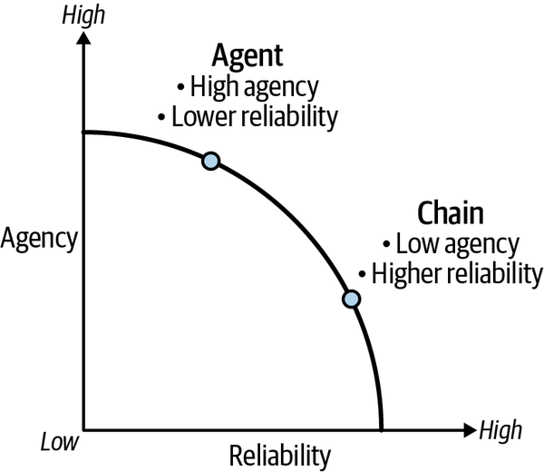
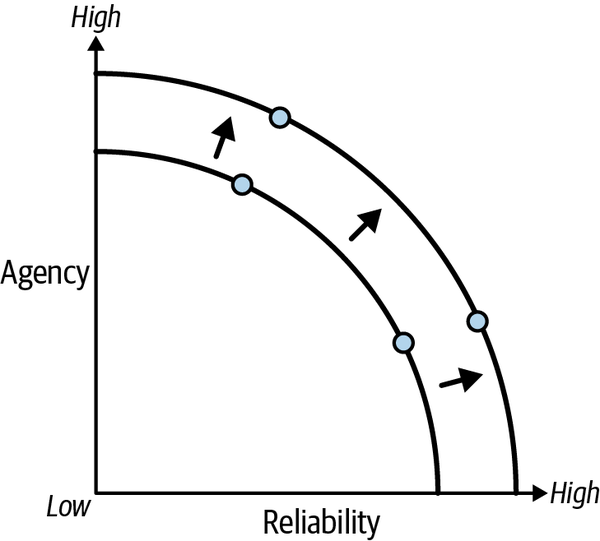
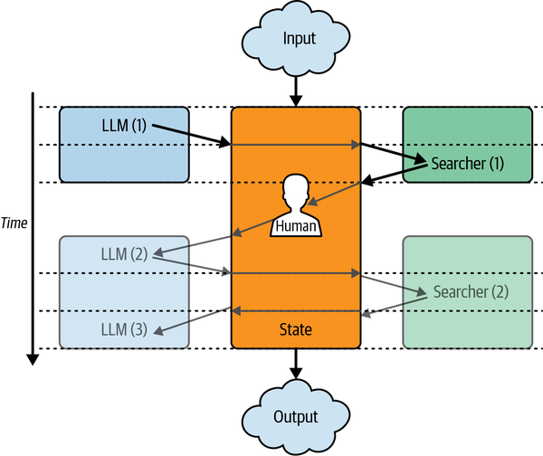
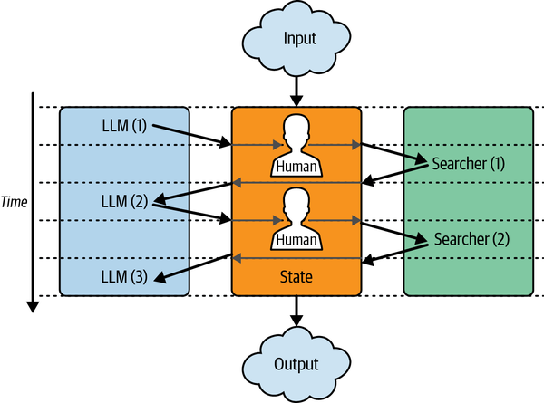

# Bab 8. Pola untuk Memaksimalkan LLM

LLM saat ini punya beberapa batasan besar, tapi itu tidak berarti aplikasi LLM impianmu tidak mungkin dibangun. Pengalaman yang kamu rancang untuk pengguna aplikasi harus bisa mengatasi, dan idealnya bekerja bersama, batasan-batasan itu.

[Bab 5](ch05.xhtml#ch05_cognitive_architectures_with_langgraph_1736545670030774) menyentuh pertukaran kunci yang kita hadapi saat membangun aplikasi LLM: pertukaran antara keagenan dan keandalan. Secara intuitif, setiap aplikasi LLM akan lebih berguna bagi kita jika melakukan lebih banyak tindakan tanpa campur tangan kita, tapi jika kita membiarkan keagenan terlalu jauh, aplikasi pasti akan melakukan hal-hal yang kita harap tidak dilakukan.

[Gambar 8-1](#ch08_figure_1_1736545674134403) menggambarkan pertukaran ini.



Untuk meminjam konsep dari bidang lain,^1 kita bisa memvisualisasikan pertukaran sebagai sebuah garis batas—semua titik di garis lengkung batas adalah arsitektur LLM optimal untuk suatu aplikasi, menandai pilihan berbeda antara keagenan dan keandalan. (Lihat [Bab 5](ch05.xhtml#ch05_cognitive_architectures_with_langgraph_1736545670030774) untuk ikhtisar berbagai arsitektur aplikasi LLM.) Sebagai contoh, perhatikan bagaimana arsitektur rantai punya keagenan relatif rendah tetapi keandalan lebih tinggi, sedangkan arsitektur Agen punya keagenan lebih tinggi dengan mengorbankan keandalan lebih rendah.

Mari kita sentuh sebanyak beberapa tujuan tambahan (tapi masih penting) yang mungkin ingin dimiliki aplikasi LLM-mu. Setiap aplikasi LLM akan dirancang untuk campuran satu atau lebih dari tujuan-tujuan ini:

**Laten**
: Minimalkan waktu untuk mendapatkan jawaban akhir

**Otonomi**
: Minimalkan interupsi untuk masukan manusia

**Varians**
: Minimalkan variasi antar pemanggilan

Ini bukan dimaksudkan sebagai daftar lengkap semua tujuan yang mungkin, melainkan sebagai ilustrasi pertukaran yang kamu hadapi saat membangun aplikasimu. Setiap tujuan agak bertentangan dengan semua yang lain (misalnya, jalan termudah untuk keandalan lebih tinggi memerlukan latensi lebih tinggi atau otonomi lebih rendah). Setiap tujuan akan meniadakan yang lain jika diberi bobot penuh (misalnya, aplikasi latensi minimal adalah yang tidak melakukan apa pun). [Gambar 8-2](#ch08_figure_2_1736545674134438) menggambarkan konsep ini.



Yang benar-benar kita inginkan sebagai pengembang aplikasi adalah menggeser garis batas ke luar. Untuk tingkat keandalan yang sama, kita ingin mencapai keagenan lebih tinggi; dan untuk tingkat keagenan yang sama, kita ingin mencapai keandalan lebih tinggi. Bab ini membahas sejumlah teknik yang bisa kamu gunakan untuk mencapai ini:

**Aliran keluaran / keluaran antara**
: Laten lebih tinggi lebih mudah diterima jika ada komunikasi kemajuan/keluaran antara di sepanjang proses.

**Keluaran terstruktur**
: Meminta LLM menghasilkan keluaran dalam format yang sudah ditentukan membuatnya lebih mungkin sesuai dengan harapan.

**Manusia dalam putaran**
: Arsitektur berkeagenan tinggi mendapat manfaat dari intervensi manusia saat berjalan: menginterupsi, menyetujui, bercabang, atau membatalkan.

**Mode pengiriman ganda**
: Semakin lama aplikasi LLM menjawab, semakin besar kemungkinan pengguna mungkin mengirim masukan baru sebelum yang sebelumnya selesai diproses.

## Keluaran Terstruktur

Sering kali penting untuk membuat LLM mengembalikan keluaran terstruktur, baik karena penggunaan hilir dari keluaran itu mengharapkan hal-hal dalam skema tertentu (definisi nama dan tipe berbagai bidang dalam sebuah keluaran terstruktur) atau murni untuk mengurangi varians yang seharusnya berupa keluaran teks bebas sepenuhnya.

Ada beberapa strategi berbeda yang bisa kamu gunakan untuk ini dengan LLM berbeda:

**Pemberian petunjuk**
: Ini adalah ketika kamu meminta LLM (dengan sangat baik) untuk mengembalikan keluaran dalam format yang diinginkan (misalnya, JSON, XML, atau CSV). Keuntungan besar pemberian petunjuk adalah bahwa ia bekerja sampai batas tertentu dengan LLM apa pun; kelemahannya adalah ia bertindak lebih sebagai saran bagi LLM dan bukan sebagai jaminan bahwa keluaran akan keluar dalam format ini.

**Pemanggilan alat**
: Ini tersedia untuk LLM yang telah disesuaikan untuk memilih dari daftar skema keluaran yang mungkin, dan menghasilkan sesuatu yang sesuai dengan yang dipilih. Ini biasanya melibatkan penulisan, untuk setiap skema keluaran yang mungkin: nama untuk mengidentifikasinya, deskripsi untuk membantu LLM memutuskan kapan itu pilihan yang tepat, dan skema untuk format keluaran yang diinginkan (biasanya dalam notasi JSONSchema).

**Mode JSON**
: Ini adalah mode yang tersedia di beberapa LLM (seperti model OpenAI terbaru) yang memaksa LLM untuk mengeluarkan dokumen JSON yang valid.

Model berbeda mungkin mendukung varian berbeda dari ini, dengan parameter yang sedikit berbeda. Untuk memudahkan mendapatkan LLM mengembalikan keluaran terstruktur, model LangChain mengimplementasikan antarmuka umum, sebuah metode bernama `.with_structured_output`. Dengan memanggil metode ini—dan meneruskan skema JSON atau model Pydantic (di Python) atau Zod (di JS)—model akan menambahkan parameter model dan pengurai keluaran apa pun yang diperlukan untuk menghasilkan dan mengembalikan keluaran terstruktur. Ketika model tertentu mengimplementasikan lebih dari satu dari strategi sebelumnya, kamu dapat mengonfigurasi metode mana yang akan digunakan.

Mari kita buat skema untuk digunakan:

_Python_

```python
from pydantic import BaseModel, Field


class Joke(BaseModel):
    setup: str = Field(description="Pengaturan lelucon")
    punchline: str = Field(description="Punchline lelucon")
```

_JavaScript_

```javascript
import { z } from "zod"

const joke = z.object({
  setup: z.string().describe("Pengaturan lelucon"),
  punchline: z.string().describe("Punchline lelucon"),
})
```

Perhatikan bagaimana kita berhati-hati menambahkan deskripsi ke setiap bidang. Ini kunci karena—bersama dengan nama bidang—ini adalah informasi yang akan digunakan LLM untuk memutuskan bagian keluaran mana yang harus masuk ke setiap bidang. Kita juga bisa mendefinisikan skema dalam notasi JSONSchema mentah, yang akan terlihat seperti ini:

```
{'properties': {'setup': {'description': 'Pengaturan lelucon',
    'title': 'Setup',
    'type': 'string'},
 'punchline': {'description': 'Punchline lelucon',
    'title': 'Punchline',
    'type': 'string'}},
 'required': ['setup', 'punchline'],
 'title': 'Joke',
 'type': 'object'}
```

Dan sekarang mari kita buat LLM menghasilkan keluaran yang sesuai dengan skema ini:

_Python_

```python
from langchain_openai import ChatOpenAI

model = ChatOpenAI(model="gpt-3.5-turbo", temperature=0)
model = model.with_structured_output(Joke)

model.invoke("Ceritakan lelucon tentang kucing")
```

_JavaScript_

```javascript
import { ChatOpenAI } from "@langchain/openai"

let model = new ChatOpenAI({
  model: "gpt-3.5-turbo",
  temperature: 0,
})
model = model.withStructuredOutput(joke)

await structuredLlm.invoke("Ceritakan lelucon tentang kucing")
```

_Contoh keluaran_

```
{
    setup: "Mengapa kucing tidak bermain poker di alam liar?",
    punchline: "Terlalu banyak cheetah."
}
```

Beberapa hal yang perlu diperhatikan:

- Kita membuat instance model seperti biasa, menentukan nama model yang akan digunakan dan parameter lain.
- Suhu rendah biasanya cocok untuk keluaran terstruktur, karena mengurangi kemungkinan LLM menghasilkan keluaran tidak valid yang tidak sesuai dengan skema.
- Setelah itu, kita lampirkan skema ke model, yang mengembalikan objek baru, yang akan menghasilkan keluaran yang sesuai dengan skema yang diberikan. Ketika kamu meneruskan objek Pydantic atau Zod untuk skema, ini akan digunakan untuk validasi juga; artinya, jika LLM menghasilkan keluaran yang tidak sesuai, kesalahan validasi akan dikembalikan kepadamu alih-alih keluaran yang gagal.
- Akhirnya, kita panggil model dengan masukan (bebas) kita, dan menerima kembali keluaran yang sesuai dengan struktur yang kita inginkan.

Pola menggunakan keluaran terstruktur ini bisa sangat berguna baik sebagai alat mandiri maupun sebagai bagian dari aplikasi yang lebih besar; misalnya, lihat kembali [Bab 5](ch05.xhtml#ch05_cognitive_architectures_with_langgraph_1736545670030774), di mana kita menggunakan kemampuan ini untuk mengimplementasikan langkah perutean dari arsitektur perute.

### Keluaran Antara

Semakin kompleks arsitektur LLM-mu, semakin besar kemungkinan butuh waktu lebih lama untuk dieksekusi. Jika kamu mengingat diagram arsitektur di Bab [5](ch05.xhtml#ch05_cognitive_architectures_with_langgraph_1736545670030774) dan [6](ch06.xhtml#ch06_agent_architecture_1736545671750341), setiap kali kamu melihat banyak langkah (atau simpul) terhubung secara berurutan atau dalam lingkaran, itu adalah indikasi bahwa waktu yang dibutuhkan untuk pemanggilan penuh meningkat.

Peningkatan latensi ini—jika tidak ditangani—bisa menjadi penghalang bagi adopsi pengguna aplikasi LLM, dengan sebagian besar pengguna mengharapkan aplikasi komputer menghasilkan beberapa keluaran dalam hitungan detik. Ada beberapa strategi untuk membuat latensi lebih tinggi lebih bisa diterima, tetapi semuanya berada di bawah payung _aliran keluaran_, yaitu menerima keluaran dari aplikasi saat masih berjalan.

Untuk bagian ini, kita akan menggunakan arsitektur terakhir yang dijelaskan dalam "Menangani Banyak Alat". Lihat kembali [Bab 6](ch06.xhtml#ch06_agent_architecture_1736545671750341) untuk potongan kode lengkapnya.

Untuk menghasilkan keluaran antara dengan LangGraph, yang harus kamu lakukan adalah memanggil grafik dengan metode `stream`, yang akan menghasilkan keluaran setiap simpul segera setelah masing-masing selesai. Mari kita lihat seperti apa:

_Python_

```python
input = {
    "messages": [
        HumanMessage("""Berapa usia presiden ke‑30 Amerika Serikat
            ketika dia meninggal?""")
    ]
}
for c in graph.stream(input, stream_mode='updates'):
    print(c)
```

_JavaScript_

```javascript
const input = {
  messages: [
    new HumanMessage(`Berapa usia presiden ke‑30 Amerika Serikat ketika
      dia meninggal?`)
  ]
}
const output = await graph.stream(input, streamMode: 'updates')
for await (const c of output) {
  console.log(c)
}
```

_Keluaran:_

```
{
    "select_tools": {
        "selected_tools": ['duckduckgo_search', 'calculator']
    }
}
{
    "model": {
        "messages": AIMessage(
            content="",
            tool_calls=[
                {
                    "name": "duckduckgo_search",
                    "args": {
                        "query": "presiden ke‑30 Amerika Serikat"
                    },
                    "id": "9ed4328dcdea4904b1b54487e343a373",
                    "type": "tool_call",
                }
            ],
        )
    }
}
{
    "tools": {
        "messages": [
            ToolMessage(
                content="Calvin Coolidge (lahir 4 Juli 1872, Plymouth, Vermont,
                    A.S.—meninggal 5 Januari 1933, Northampton, Massachusetts) adalah
                    presiden ke‑30 Amerika Serikat (1923-29). Coolidge
                    naik ke kursi kepresidenan setelah kematian dalam jabatan
                    Warren G. Harding, tepat ketika skandal Harding mulai
                    terungkap....",
                name="duckduckgo_search",
                tool_call_id="9ed4328dcdea4904b1b54487e343a373",
            )
        ]
    }
}
{
    "model": {
        "messages": AIMessage(
            content="Calvin Coolidge, presiden ke‑30 Amerika Serikat,
                lahir pada 4 Juli 1872, dan meninggal pada 5 Januari 1933. Untuk
                menghitung usianya pada saat meninggal, kita bisa mengurangi
                tahun kelahirannya dari tahun kematiannya. \n\nUsia saat meninggal = Tahun kematian -
                Tahun kelahiran\nUsia saat meninggal = 1933 - 1872\nUsia saat meninggal = 61
                tahun\n\nCalvin Coolidge berusia 61 tahun ketika dia meninggal.",
        )
    }
}
```

Perhatikan bagaimana setiap entri keluaran adalah kamus dengan nama simpul yang memancar sebagai kunci dan keluaran simpul itu sebagai nilai. Ini memberimu dua informasi kunci:

- Di mana aplikasi saat ini berada; yaitu, jika kamu mengingat diagram arsitektur yang ditunjukkan di bab sebelumnya, di mana dalam diagram itu kita saat ini berada?
- Setiap pembaruan ke status bersama aplikasi, yang bersama-sama membangun hingga keluaran akhir grafik.

Selain itu, LangGraph mendukung lebih banyak mode aliran:

- `updates`. Ini adalah mode bawaan, dijelaskan di atas.
- `values`. Mode ini menghasilkan status grafik saat ini setiap kali berubah, yaitu setelah setiap set simpul selesai dieksekusi. Ini bisa berguna ketika cara kamu menampilkan keluaran kepada pengguna sangat mengikuti bentuk status grafik.
- `debug`. Mode ini menghasilkan peristiwa terperinci setiap kali sesuatu terjadi di grafikmu, termasuk:
  - peristiwa `checkpoint`, setiap kali pos pemeriksaan baru dari status saat ini disimpan ke basis data
  - peristiwa `task`, dipancarkan setiap kali simpul akan mulai berjalan
  - peristiwa `task_result`, dipancarkan setiap kali simpul selesai berjalan
- Terakhir, kamu bisa menggabungkan mode ini; misalnya, meminta `updates` dan `values` dengan meneruskan daftar.

Kamu mengontrol mode aliran dengan argumen `stream_mode` ke `stream()`.

### Mengalirkan Keluaran LLM Token-demi-Token

Terkadang kamu mungkin juga ingin mendapatkan keluaran aliran dari setiap panggilan LLM di dalam aplikasi LLM yang lebih besar. Ini bisa berguna untuk berbagai proyek, seperti saat membangun chatbot interaktif, di mana kamu ingin setiap kata ditampilkan segera setelah diproduksi oleh LLM.

Kamu bisa mencapai ini dengan LangGraph juga:

_Python_

```python
input = {
    "messages": [
        HumanMessage("""Berapa usia presiden ke‑30 Amerika Serikat
            ketika dia meninggal?""")
    ]
}
output = app.astream_events(input, version="v2")

async for event in output:
    if event["event"] == "on_chat_model_stream":
        content = event["data"]["chunk"].content
        if content:
            print(content)
```

_JavaScript_

```javascript
const input = {
  messages: [
    new HumanMessage(`Berapa usia presiden ke‑30 Amerika Serikat ketika
      dia meninggal?`)
  ]
}

const output = await agent.streamEvents(input, {version: "v2"});

for await (const { event, data } of output) {
  if (event === "on_chat_model_stream") {
    const msg = data.chunk as AIMessageChunk;
    if (msg.content) {
      console.log(msg.content);
    }
  }
}
```

Ini akan memancarkan setiap kata (secara teknis setiap token) segera setelah diterima dari LLM. Kamu dapat menemukan detail lebih lanjut tentang pola ini dari [LangChain](https://oreil.ly/ExYll).

### Modalitas Manusia-dalam-Putaran

Saat kita menaiki tangga otonomi (atau keagenan), kita semakin melepaskan kendali (atau pengawasan) sebagai imbalan kemampuan (atau otonomi). Pola status bersama yang digunakan di LangGraph (lihat [Bab 5](ch05.xhtml#ch05_cognitive_architectures_with_langgraph_1736545670030774) untuk pengantar) memudahkan untuk mengamati, menginterupsi, dan memodifikasi aplikasi. Ini memungkinkan penggunaan banyak mode _manusia-dalam-putaran_ yang berbeda, atau cara bagi pengembang/pengguna akhir aplikasi untuk mempengaruhi apa yang dilakukan LLM.

Untuk bagian ini, kita akan kembali menggunakan arsitektur terakhir yang dijelaskan dalam "Menangani Banyak Alat". Lihat kembali [Bab 6](ch06.xhtml#ch06_agent_architecture_1736545671750341) untuk potongan kode lengkap. Untuk semua mode manusia-dalam-putaran, pertama-tama kita perlu melampirkan penanda pos ke grafik; lihat "Menambahkan Memori ke StateGraph" untuk detail lebih lanjut tentang ini:

_Python_

```python
from langgraph.checkpoint.memory import MemorySaver

graph = builder.compile(checkpointer=MemorySaver())
```

_JavaScript_

```javascript
import { MemorySaver } from "@langchain/langgraph"

graph = builder.compile({ checkpointer: new MemorySaver() })
```

Ini mengembalikan instance grafik yang menyimpan status di akhir setiap langkah, jadi setiap pemanggilan setelah yang pertama tidak mulai dari awal. Kapan pun grafik dipanggil, ia mulai dengan menggunakan penanda pos untuk mengambil status tersimpan terbaru—jika ada—dan menggabungkan masukan baru dengan status sebelumnya. Dan baru kemudian ia mengeksekusi simpul pertama. Ini kunci untuk mengaktifkan modalitas manusia-dalam-putaran, yang semuanya bergantung pada grafik mengingat status sebelumnya.

Mode pertama, `interrupt`, adalah bentuk kendali paling sederhana—pengguna melihat keluaran aliran aplikasi saat diproduksi, dan secara manual menginterupsinya ketika dia merasa cocok (lihat [Gambar 8-3](#ch08_figure_3_1736545674134460)). Status disimpan pada langkah lengkap terakhir sebelum pengguna menekan tombol interupsi. Dari sana pengguna dapat memilih untuk:

- Melanjutkan dari titik itu, dan komputasi akan berlanjut seolah-olah tidak pernah diinterupsi (lihat ["Lanjut"](#ch08_resume_1736545674144097)).
- Mengirim masukan baru ke aplikasi (misalnya, pesan baru di chatbot), yang akan membatalkan langkah masa depan yang tertunda dan mulai menangani masukan baru (lihat ["Mulai Ulang"](#ch08_restart_1736545674144152)).
- Tidak melakukan apa pun dan tidak ada yang lain akan berjalan.



Mari kita lihat cara melakukannya di LangGraph:

_Python_

```python
import asyncio

event = asyncio.Event()

input = {
    "messages": [
        HumanMessage("""Berapa usia presiden ke‑30 Amerika Serikat
            ketika dia meninggal?""")
    ]
}

config = {"configurable": {"thread_id": "1"}}

async with aclosing(graph.astream(input, config)) as stream:
    async for chunk in stream:
        if event.is_set():
            break
        else:
            ... # lakukan sesuatu dengan keluaran

# Di tempat lain di aplikasimu

event.set()
```

_JavaScript_

```javascript
const controller = new AbortController()

const input = {
  messages: [
    new HumanMessage(`Berapa usia presiden ke‑30 Amerika Serikat ketika 
      dia meninggal?`),
  ],
}

const config = { configurable: { thread_id: "1" } }

try {
  const output = await graph.stream(input, {
    ...config,
    signal: controller.signal,
  })
  for await (const chunk of output) {
    console.log(chunk) // lakukan sesuatu dengan keluaran
  }
} catch (e) {
  console.log(e)
}

// Di tempat lain di aplikasimu
controller.abort()
```

Ini menggunakan peristiwa atau sinyal, sehingga kamu dapat mengontrol interupsi dari luar aplikasi yang berjalan. Perhatikan di blok kode Python penggunaan `aclosing`; ini memastikan aliran ditutup dengan benar saat diinterupsi. Perhatikan di JS penggunaan pernyataan `try-catch`, karena menginterupsi proses akan menghasilkan pengecualian `abort` yang dimunculkan. Terakhir perhatikan bahwa penggunaan penanda pos memerlukan penerusan pengenal untuk utas ini, untuk membedakan interaksi ini dengan grafik dari semua yang lain.



Mode kendali kedua adalah `authorize`, di mana pengguna mendefinisikan sebelumnya bahwa mereka ingin aplikasi menyerahkan kendali kepada mereka setiap kali simpul tertentu akan dipanggil (lihat [Gambar 8-4](#ch08_figure_4_1736545674134478)). Ini biasanya diimplementasikan untuk konfirmasi alat—sebelum alat apa pun (atau alat tertentu) dipanggil, aplikasi akan berhenti dan meminta konfirmasi, di mana pengguna dapat, lagi:

- Melanjutkan komputasi, menerima panggilan alat.
- Mengirim pesan baru untuk menuntun bot ke arah berbeda, di mana alat tidak akan dipanggil.
- Tidak melakukan apa pun.

Ini kodenya:

_Python_

```python
input = {
    "messages": [
        HumanMessage("""Berapa usia presiden ke‑30 Amerika Serikat
            ketika dia meninggal?""")
    ]
}

config = {"configurable": {"thread_id": "1"}}

output = graph.astream(input, config, interrupt_before=['tools'])

async for c in output:
    ... # lakukan sesuatu dengan keluaran
```

_JavaScript_

```javascript
const input = {
  messages: [
    new HumanMessage(`Berapa usia presiden ke‑30 Amerika Serikat ketika 
      dia meninggal?`),
  ],
}

const config = { configurable: { thread_id: "1" } }

const output = await graph.stream(input, {
  ...config,
  interruptBefore: ["tools"],
})
for await (const chunk of output) {
  console.log(chunk) // lakukan sesuatu dengan keluaran
}
```

Ini akan menjalankan grafik sampai akan memasuki simpul bernama `tools`, sehingga memberi kamu kesempatan untuk memeriksa status saat ini, dan memutuskan apakah akan melanjutkan atau tidak. Perhatikan bahwa `interrupt_before` adalah daftar di mana urutan tidak penting; jika kamu meneruskan banyak nama simpul, ia akan menginterupsi sebelum memasuki masing-masing.

#### Lanjut

Untuk melanjutkan dari grafik yang terinterupsi—seperti saat menggunakan salah satu dari dua pola sebelumnya—kamu hanya perlu memanggil ulang grafik dengan masukan nol (atau `None` di Python). Ini dianggap sebagai sinyal untuk melanjutkan pemrosesan masukan non‑nol sebelumnya:

_Python_

```python
config = {"configurable": {"thread_id": "1"}}

output = graph.astream(None, config, interrupt_before=['tools'])

async for c in output:
    ... # lakukan sesuatu dengan keluaran
```

_JavaScript_

```javascript
const config = { configurable: { thread_id: "1" } }

const output = await graph.stream(null, {
  ...config,
  interruptBefore: ["tools"],
})
for await (const chunk of output) {
  console.log(chunk) // lakukan sesuatu dengan keluaran
}
```

#### Mulai Ulang

Jika sebaliknya kamu ingin grafik yang terinterupsi mulai dari awal dari simpul pertama, dengan masukan baru tambahan, kamu hanya perlu memanggilnya dengan masukan baru:

_Python_

```python
input = {
    "messages": [
        HumanMessage("""Berapa usia presiden ke‑30 Amerika Serikat
            ketika dia meninggal?""")
    ]
}

config = {"configurable": {"thread_id": "1"}}

output = graph.astream(input, config)

async for c in output:
    ... # lakukan sesuatu dengan keluaran
```

_JavaScript_

```javascript
const input = {
  messages: [
    new HumanMessage(`Berapa usia presiden ke‑30 Amerika Serikat ketika 
      dia meninggal?`),
  ],
}

const config = { configurable: { thread_id: "1" } }

const output = await graph.stream(input, config)

for await (const chunk of output) {
  console.log(chunk) // lakukan sesuatu dengan keluaran
}
```

Ini akan mempertahankan status grafik saat ini, menggabungkannya dengan masukan baru, dan mulai lagi dari simpul pertama.

Jika kamu ingin menghilangkan status saat ini, cukup ubah `thread_id`, yang akan memulai interaksi baru dari awal. Nilai string apa pun adalah `thread_id` yang valid; kami merekomendasikan menggunakan UUID (atau pengidentifikasi unik lain) sebagai ID utas.

#### Sunting status

Terkadang kamu mungkin ingin memperbarui status grafik sebelum melanjutkan; ini mungkin dengan metode `update_state`. Biasanya kamu ingin memeriksa status saat ini terlebih dahulu dengan `get_state`.

Ini seperti apa:

_Python_

```python
config = {"configurable": {"thread_id": "1"}}

state = graph.get_state(config)

# sesuatu yang ingin kamu tambah atau ganti
update = { }

graph.update_state(config, update)
```

_JavaScript_

```javascript
const config = "configurable": {"thread_id": "1"}

const state = await graph.getState(config)

// sesuatu yang ingin kamu tambah atau ganti
const update = { }

await graph.updateState(config, update)
```

Ini akan membuat pos pemeriksaan baru yang berisi pembaruanmu. Setelah ini, kamu siap untuk melanjutkan grafik dari titik baru ini. Lihat ["Lanjut"](#ch08_resume_1736545674144097) untuk mengetahui caranya.

#### Cabang

Kamu juga bisa menjelajahi riwayat semua status masa lalu yang dilalui grafik, dan salah satunya dapat dikunjungi lagi, misalnya, untuk mendapatkan jawaban alternatif. Ini bisa sangat berguna dalam aplikasi yang lebih kreatif, di mana setiap jalankan melalui grafik diharapkan menghasilkan keluaran berbeda.

Mari kita lihat seperti apa:

_Python_

```python
config = {"configurable": {"thread_id": "1"}}

history = [
    state for state in
    graph.get_state_history(config)
]

# main ulang status masa lalu
graph.invoke(None, history[2].config)
```

_JavaScript_

```javascript
const config = "configurable": {"thread_id": "1"}

const history = await Array.fromAsync(graph.getStateHistory(config))

// main ulang status masa lalu
await graph.invoke(null, history[2].config)
```

Perhatikan bagaimana kita mengumpulkan riwayat ke dalam daftar/array di kedua bahasa; `get_state_history` mengembalikan iterator status (untuk mengonsumsi secara malas). Status yang dikembalikan dari metode riwayat diurutkan dengan yang terbaru pertama dan yang terlama terakhir.

Kekuatan sebenarnya dari kendali manusia‑dalam‑putaran berasal dari mencampurnya dengan cara apa pun yang sesuai dengan aplikasimu.

## LLM Multitugas

Bagian ini membahas masalah penanganan masukan bersamaan untuk aplikasi LLM. Ini adalah masalah yang sangat relevan mengingat LLM cukup lambat, apalagi saat menghasilkan keluaran panjang atau saat dirantai dalam arsitektur multi‑langkah (seperti yang dapat kamu lakukan dengan LangGraph). Bahkan ketika LLM menjadi lebih cepat, menangani masukan bersamaan akan tetap menjadi tantangan, karena peningkatan latensi juga akan membuka pintu untuk kasus penggunaan yang semakin kompleks, dengan cara yang sama seperti orang paling produktif pun masih menghadapi kebutuhan untuk memprioritaskan tuntutan bersaing atas waktu mereka.

Mari kita telusuri pilihannya.

### Tolak masukan bersamaan

Masukan apa pun yang diterima saat memproses yang sebelumnya ditolak. Ini adalah strategi paling sederhana, tetapi kemungkinan tidak mencakup semua kebutuhan, karena secara efektif berarti menyerahkan manajemen konkurensi ke pemanggil.

### Tangani secara independen

Pilihan sederhana lain adalah memperlakukan masukan baru sebagai pemanggilan independen, membuat utas baru (wadah untuk mengingat status) dan menghasilkan keluaran dalam konteks itu. Ini memiliki kerugian jelas perlu ditampilkan kepada pengguna sebagai dua pemanggilan terpisah dan tidak dapat didamaikan, yang tidak selalu mungkin atau diinginkan. Di sisi lain, ini memiliki keuntungan dapat diskalakan ke ukuran besar secara sewenang‑wenang, dan adalah sesuatu yang akan kamu gunakan sampai batas tertentu di aplikasimu hampir pasti. Misalnya, ini adalah bagaimana kamu akan memikirkan masalah membuat chatbot "mengobrol" dengan dua pengguna berbeda secara bersamaan.

### Antre masukan bersamaan

Masukan apa pun yang diterima saat memproses yang sebelumnya diantre dan ditangani ketika yang saat ini selesai. Strategi ini memiliki beberapa pro:

- Ini mendukung menerima jumlah permintaan bersamaan yang sewenang‑wenang.
- Karena kita menunggu masukan saat ini selesai diproses, tidak masalah apakah masukan baru tiba hampir segera setelah kita mulai menangani masukan saat ini atau segera sebelum kita selesai; hasil akhir akan sama, karena kita akan menyelesaikan pemrosesan masukan saat ini sebelum beralih ke yang berikutnya.

Strategi ini juga menderita beberapa kerugian:

- Mungkin butuh waktu untuk memproses semua masukan yang diantre; faktanya, antrean dapat tumbuh tak terbatas jika masukan diproduksi pada kecepatan lebih cepat daripada diproses.
- Masukan mungkin basi pada saat diproses, karena mereka diantre sebelum melihat respons terhadap yang sebelumnya, dan tidak diubah setelahnya. Strategi ini tidak tepat ketika masukan baru bergantung pada jawaban sebelumnya.

### Interupsi

Ketika masukan baru diterima sementara yang lain sedang diproses, hentikan pemrosesan yang saat ini dan mulai ulang rantai dengan masukan baru. Strategi ini dapat bervariasi berdasarkan apa yang disimpan dari proses yang terinterupsi. Berikut beberapa opsi:

- Simpan tidak ada. Masukan sebelumnya benar‑benar dilupakan, seolah‑olah tidak pernah dikirim atau diproses.
- Simpan langkah terakhir yang selesai. Dalam aplikasi penanda pos (yang menyimpan kemajuan saat bergerak melalui komputasi), simpan status yang dihasilkan oleh langkah terakhir yang selesai, buang pembaruan status tertunda dari langkah yang sedang dieksekusi, dan mulai menangani masukan baru dalam konteks itu.
- Simpan langkah terakhir yang selesai, serta langkah yang sedang berjalan. Coba interupsi langkah saat ini sambil berhati‑hati menyimpan pembaruan tidak lengkap ke status yang sedang diproduksi pada saat itu. Ini kemungkinan tidak dapat digeneralisasi di luar arsitektur paling sederhana.
- Tunggu simpul saat ini (tetapi bukan simpul berikutnya) selesai, lalu simpan dan interupsi.

Opsi ini memiliki beberapa pro dibandingkan mengantre masukan bersamaan:

- Masukan baru ditangani secepat mungkin, mengurangi latensi dan kemungkinan menghasilkan keluaran basi.
- Untuk varian "simpan tidak ada", keluaran akhir tidak bergantung pada kapan masukan baru diterima.

Tetapi ini juga memiliki kerugian:

- Secara efektif, strategi ini masih terbatas pada memproses satu masukan pada satu waktu; masukan lama apa pun ditinggalkan ketika masukan baru diterima.
- Menyimpan pembaruan status parsial untuk proses berikutnya memerlukan status dirancang dengan itu dalam pikiran; jika tidak, maka aplikasimu kemungkinan akan berakhir dalam status tidak valid. Misalnya, model obrolan OpenAI memerlukan pesan AI yang meminta panggilan alat segera diikuti oleh pesan alat dengan keluaran alat. Jika prosesmu diinterupsi di antaranya, kamu harus membersihkan status antara secara defensif atau berisiko tidak dapat maju lebih jauh.
- Keluaran akhir yang dihasilkan sangat sensitif terhadap kapan masukan baru diterima; masukan baru akan ditangani dalam konteks kemajuan (tidak lengkap) yang sebelumnya dibuat untuk menangani masukan sebelumnya. Ini dapat menghasilkan hasil rapuh atau tidak terduga jika kamu tidak merancang sesuai.

### Cabang dan gabung

Opsi lain adalah menangani masukan baru secara paralel, mencabangkan status utas seperti ketika masukan baru diterima dan menggabungkan status akhir saat masukan selesai ditangani. Opsi ini memerlukan merancang statusmu agar dapat digabungkan tanpa konflik (misalnya, menggunakan tipe data replikasi bebas konflik [CRDT] atau algoritma resolusi konflik lain) atau meminta pengguna menyelesaikan konflik secara manual sebelum kamu dapat memahami keluaran atau mengirim masukan baru di utas ini. Jika salah satu dari dua persyaratan ini terpenuhi, ini kemungkinan menjadi opsi terbaik secara keseluruhan. Dengan cara ini, masukan baru ditangani tepat waktu, keluaran independen dari waktu diterima, dan mendukung jumlah proses bersamaan sewenang‑wenang.

Beberapa strategi ini diimplementasikan di LangGraph Platform, yang akan dibahas di [Bab 9](ch09.xhtml#ch09_deployment_launching_your_ai_application_into_pro_1736545675509604).

## Ringkasan

Dalam bab ini, kita kembali ke pertukaran utama yang kamu hadapi saat membangun aplikasi LLM: keagenan versus keandalan. Kita belajar bahwa ada strategi untuk sebagian mengalahkan kemungkinan dan mendapatkan lebih banyak keandalan tanpa mengorbankan keagenan, dan sebaliknya.

Kita mulai dengan membahas keluaran terstruktur, yang dapat meningkatkan prediktabilitas teks yang dihasilkan LLM. Selanjutnya, kita membahas memancarkan keluaran aliran/antara dari aplikasimu, yang dapat membuat aplikasi latensi tinggi (efek samping keagenan yang tak terhindarkan saat ini) menyenangkan untuk digunakan.

Kita juga menjelajahi berbagai kendali manusia‑dalam‑putaran—yaitu, teknik untuk mengembalikan beberapa pengawasan kepada pengguna akhir aplikasi LLM‑mu—yang sering kali dapat membuat perbedaan dalam membuat arsitektur berkeagenan tinggi andal. Terakhir, kita berbicara tentang masalah menangani masukan bersamaan ke aplikasimu, masalah yang sangat menonjol untuk aplikasi LLM mengingat latensi tingginya.

Di bab berikutnya, kamu akan belajar bagaimana mengerahkan aplikasi AI‑mu ke produksi.

---

^1 Dalam keuangan, _garis batas efisien_ dalam optimisasi portofolio; dalam ekonomi, _garis batas kemungkinan produksi_; dalam teknik, _frontier Pareto_.
