# Bab 9. Pengerahan: Meluncurkan Aplikasi AI ke Produksi

Sejauh ini, kita telah menjelajahi konsep, ide, dan alat kunci untuk membantu membangun fungsi inti aplikasi AI‑mu. Kamu telah belajar cara menggunakan LangChain dan LangGraph untuk menghasilkan keluaran LLM, mengindeks dan mengambil data, serta mengaktifkan memori dan keagenan.

Namun aplikasimu terbatas pada lingkungan lokalmu, sehingga pengguna eksternal belum dapat mengakses fitur‑fiturnya.

Dalam bab ini, kamu akan belajar praktik terbaik untuk mendeploy aplikasi AI‑mu ke produksi. Kita juga akan menjelajahi berbagai alat untuk mendebug, berkolaborasi, menguji, dan memantau aplikasi LLM‑mu.

Mari kita mulai.

## Prasyarat

Untuk mendeploy aplikasi AI secara efektif, kamu perlu menggunakan berbagai layanan untuk menghosting aplikasi, menyimpan dan mengambil data, serta memantau aplikasimu. Dalam contoh pengerahan di bab ini, kita akan menggabungkan layanan‑layanan berikut:

- Penyimpan vektor
  - Supabase
- Pemantauan dan debug
  - LangSmith
- API backend
  - LangGraph Platform

Kita akan menyelami lebih dalam setiap komponen dan layanan ini dan melihat cara menyesuaikannya untuk kasus penggunaanmu. Tapi pertama‑tama, mari instal dependensi yang diperlukan dan siapkan variabel lingkungan.

Jika kamu ingin mengikuti contoh, fork [templat LangChain ini](https://oreil.ly/brqVm) ke akun GitHub‑mu. Repositori ini berisi logika lengkap aplikasi AI berbasis agen pengambilan.

### Instal Dependensi

Pertama, ikuti petunjuk di [file README.md](https://oreil.ly/N5eqe) untuk menginstal dependensi proyek.

Jika kamu tidak menggunakan templat, kamu dapat menginstal dependensi satu per satu dari file `pyproject.toml` atau `package.json` masing‑masing.

Kedua, buat file `.env` dan simpan variabel‑variabel berikut:

```
OPENAI_API_KEY=
SUPABASE_URL=
SUPABASE_SERVICE_ROLE_KEY=

# untuk pelacakan
LANGCHAIN_TRACING_V2=true
LANGCHAIN_ENDPOINT="https://api.smith.langchain.com"
LANGCHAIN_API_KEY=
```

Selanjutnya, kita akan menjelajahi proses mengambil nilai untuk setiap variabel ini.

### Model Bahasa Besar

LLM bertanggung jawab untuk menghasilkan keluaran berdasarkan kueri tertentu. LangChain menyediakan akses ke penyedia LLM populer, termasuk OpenAI, Anthropic, Google, dan Cohere.

Dalam contoh pengerahan ini, kita akan menggunakan OpenAI dengan mengambil [kunci API](https://oreil.ly/MIpY5), seperti ditunjukkan dalam [Gambar 9‑1](#ch09_figure_1_1736545675498459). Setelah kamu mengambil kunci API‑mu, masukkan nilainya sebagai `OPENAI_API_KEY` di file `.env`‑mu.

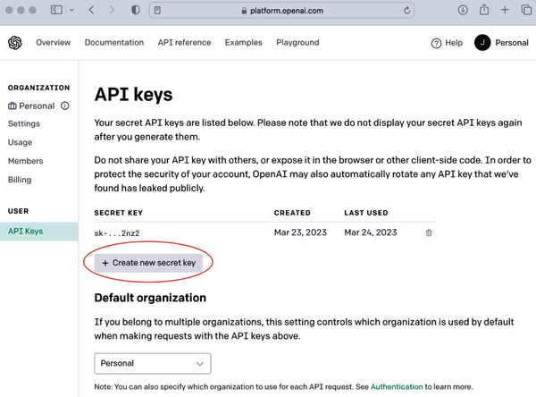

### Penyimpan Vektor

Seperti dibahas di bab‑bab sebelumnya, penyimpan vektor adalah basis data khusus yang bertanggung jawab menyimpan dan mengelola representasi vektor dari data‑mu—dengan kata lain, embedding. Penyimpan vektor memungkinkan pencarian kesamaan dan pengambilan konteks untuk membantu LLM menghasilkan jawaban akurat berdasarkan kueri pengguna.

Untuk pengerahan kita, kita akan menggunakan Supabase—basis data PostgreSQL—sebagai penyimpan vektor. Supabase menggunakan ekstensi `pgvector` untuk menyimpan embedding dan mengkueri vektor untuk pencarian kesamaan.

Jika kamu belum melakukannya, buat [akun Supabase](https://oreil.ly/CXDsx). Setelah membuat akun, klik "Proyek baru" di halaman dasbor. Ikuti langkah‑langkahnya dan simpan kata sandi basis data setelah membuatnya, seperti ditunjukkan dalam [Gambar 9‑2](#ch09_figure_2_1736545675498492).

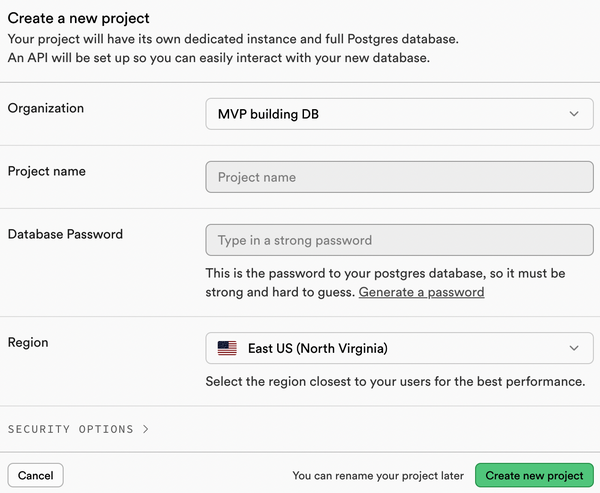

Setelah proyek Supabase‑mu dibuat, arahkan ke tab Pengaturan Proyek dan pilih API di bawah Konfigurasi. Di bawah tab baru ini, kamu akan melihat URL Proyek dan Kunci API Proyek.

Di file `.env`‑mu, salin dan tempel URL Proyek sebagai nilai untuk `SUPABASE_URL` dan kunci API rahasia `service_role` sebagai nilai untuk `SUPABASE_SERVICE_ROLE_KEY`.

Arahkan ke editor SQL di menu Supabase dan jalankan skrip SQL berikut. Pertama, mari aktifkan `pgvector`:

```
## Aktifkan ekstensi pgvector untuk bekerja dengan vektor embedding
create extension vector;
```

Sekarang buat tabel bernama `documents` untuk menyimpan vektor data‑mu:

```
## Buat tabel untuk menyimpan dokumen‑mu

create table documents (
  id bigserial primary key,
  content text, -- sesuai dengan Document.pageContent
  metadata jsonb, -- sesuai dengan Document.metadata
  embedding vector(1536) -- 1536 cocok untuk embedding OpenAI, ubah jika perlu
);
```

Sekarang kamu seharusnya melihat tabel `documents` di basis data Supabase.

Sekarang kamu dapat membuat skrip untuk menghasilkan embedding data‑mu, menyimpannya, dan mengkueri dari basis data. Buka editor SQL Supabase lagi dan jalankan skrip berikut:

```
## Buat fungsi untuk mencari dokumen
create function match_documents (
  query_embedding vector(1536),
  match_count int DEFAULT null,
  filter jsonb DEFAULT '{}'
) returns table (
  id bigint,
  content text,
  metadata jsonb,
  embedding jsonb,
  similarity float
)
language plpgsql
as $$
#variable_conflict use_column
begin
  return query
  select
    id,
    content,
    metadata,
    (embedding::text)::jsonb as embedding,
    1 - (documents.embedding <=> query_embedding) as similarity
  from documents
  where metadata @> filter
  order by documents.embedding <=> query_embedding
  limit match_count;
end;
$$;
```

Fungsi basis data `match_documents` mengambil vektor `query_embedding` dan membandingkannya dengan embedding di tabel `documents` menggunakan kesamaan kosinus. Ia menghitung skor kesamaan untuk setiap dokumen (1 - (`documents.embedding` <=> `query_embedding`)), lalu mengembalikan kecocokan paling mirip. Hasilnya adalah:

1. Difilter terlebih dahulu oleh kriteria metadata yang ditentukan dalam argumen filter (menggunakan keterkandungan JSON @>).
2. Diurutkan berdasarkan skor kesamaan (tertinggi pertama).
3. Dibatasi hingga jumlah kecocokan yang ditentukan dalam `match_count`.

Setelah fungsi kesamaan vektor dihasilkan, kamu dapat menggunakan Supabase sebagai penyimpan vektor dengan mengimpor kelas dan menyediakan parameter yang diperlukan. Berikut contoh cara kerjanya:

_Python_

```python
import os

from langchain_community.vectorstores import SupabaseVectorStore
from langchain_openai import OpenAIEmbeddings
from supabase.client import Client, create_client

supabase_url = os.environ.get("SUPABASE_URL")
supabase_key = os.environ.get("SUPABASE_SERVICE_ROLE_KEY")
supabase: Client = create_client(supabase_url, supabase_key)

embeddings = OpenAIEmbeddings()


## Asumsikan kamu sudah menghasilkan embedding data‑mu

vector_store = SupabaseVectorStore(
    embedding=embeddings,
    client=supabase,
    table_name="documents",
    query_name="match_documents",
)

## Uji bahwa pencarian kesamaan bekerja

query = "Dokumen ini tentang apa?"
matched_docs = vector_store.similarity_search(query)

print(matched_docs[0].page_content)
```

_JavaScript_

```javascript
import { SupabaseVectorStore } from "@langchain/community/vectorstores/supabase"
import { OpenAIEmbeddings } from "@langchain/openai"

import { createClient } from "@supabase/supabase-js"

const embeddings = new OpenAIEmbeddings()

const supabaseClient = createClient(
  process.env.SUPABASE_URL,
  process.env.SUPABASE_SERVICE_ROLE_KEY
)

const vectorStore = new SupabaseVectorStore(embeddings, {
  client: supabaseClient,
  tableName: "documents",
  queryName: "match_documents",
})

// Contoh struktur dokumen data‑mu

const document1: Document = {
  pageContent: "Pembangkit tenaga sel adalah mitokondria",
  metadata: { source: "https://example.com" },
}

const document2: Document = {
  pageContent: "Bangunan terbuat dari bata",
  metadata: { source: "https://example.com" },
}

const documents = [document1, document2]

// Embed dan simpan data di basis data

await vectorStore.addDocuments(documents, { ids: ["1", "2"] })

// Kueri Penyimpan Vektor

const filter = { source: "https://example.com" }

const similaritySearchResults = await vectorStore.similaritySearch(
  "biologi",
  2,
  filter
)

for (const doc of similaritySearchResults) {
  console.log(`* ${doc.pageContent} [${JSON.stringify(doc.metadata, null)}]`)
}
```

_Keluaran:_

```
Pembangkit tenaga sel adalah mitokondria [{"source":"https://example.com"}]
```

Kamu dapat meninjau logika lengkap implementasi penyimpan vektor Supabase di templat LangChain GitHub yang disebutkan sebelumnya.

### API Backend

Seperti dibahas di bab‑bab sebelumnya, LangGraph adalah kerangka kerja sumber terbuka tingkat rendah yang digunakan untuk membangun sistem agenik kompleks yang didukung oleh LLM. LangGraph memungkinkan kendali halus atas aliran dan status aplikasimu, persistensi bawaan, serta fitur manusia‑dalam‑putaran dan memori lanjutan. [Gambar 9‑3](#ch09_figure_3_1736545675498514) mengilustrasikan aliran kendali LangGraph.

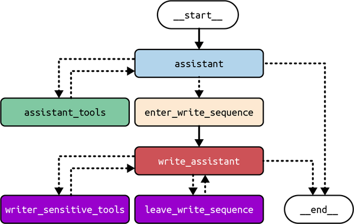

Untuk mendeploy aplikasi AI yang menggunakan LangGraph, kita akan menggunakan LangGraph Platform. LangGraph Platform adalah layanan terkelola untuk mendeploy dan menghosting agen LangGraph dalam skala besar.

Saat kasus penggunaan agenikmu mendapatkan daya tarik, distribusi tugas yang tidak merata di antara agen dapat membebani sistem, menyebabkan downtime. LangGraph Platform mengelola antrian tugas, server, dan penanda pos Postgres yang kuat untuk menangani banyak pengguna bersamaan dan menyimpan status serta utas besar secara efisien. Ini memastikan skalabilitas toleran‑kesalahan.

LangGraph Platform dirancang untuk mendukung pola interaksi dunia nyata. Selain fitur aliran dan manusia‑dalam‑putaran, LangGraph Platform memungkinkan hal‑hal berikut:

- Pengiriman ganda untuk menangani masukan pengguna baru pada utas grafik yang sedang berlangsung
- Pekerjaan latar belakang asinkron untuk tugas berjalan panjang
- Pekerjaan cron untuk menjalankan tugas umum sesuai jadwal

LangGraph Platform juga menyediakan solusi terintegrasi untuk berkolaborasi, mendeploy, dan memantau aplikasi AI agenik. Ini termasuk [LangGraph Studio](https://oreil.ly/2Now‑)—sebuah taman bermain visual untuk mendebug, menyunting, dan menguji agen. LangGraph Studio juga memungkinkanmu berbagi agen LangGraph‑mu dengan anggota tim untuk umpan balik kolaboratif dan iterasi cepat, seperti ditunjukkan [Gambar 9‑4](#ch09_figure_4_1736545675498542).

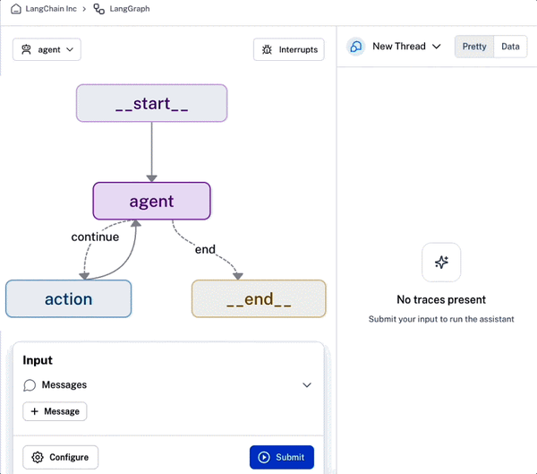

Selain itu, LangGraph Platform menyederhanakan pengerahan agenik dengan mengaktifkan pengiriman satu‑klik.

### Buat Akun LangSmith

LangSmith adalah platform pengembang semua‑dalam‑satu yang memungkinkanmu mendebug, berkolaborasi, menguji, dan memantau aplikasi LLM‑mu. LangGraph Platform terintegrasi mulus dengan LangSmith dan dapat diakses dari dalam antarmuka pengguna LangSmith.

Untuk mendeploy aplikasimu di LangGraph Platform, kamu perlu membuat [akun LangSmith](https://oreil.ly/2WVCn). Setelah masuk ke dasbor, arahkan ke halaman Pengaturan, lalu gulir ke bagian Kunci API dan klik Buat Kunci API. Kamu seharusnya melihat antarmuka pengguna serupa dengan [Gambar 9‑5](#ch09_figure_5_1736545675498579).

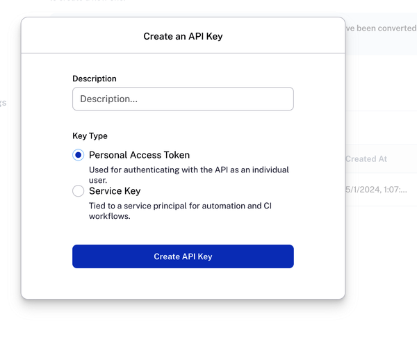

Salin nilai Kunci API sebagai `LANGCHAIN_API_KEY`‑mu di file `.env`‑mu.

Arahkan ke "Penggunaan dan penagihan" dan siapkan detail penagihanmu. Kemudian klik tab "Paket dan Penagihan" dan tombol "Tingkatkan ke Plus" untuk mendapatkan petunjuk tentang transisi ke paket LangSmith Plus, yang akan mengaktifkan penggunaan LangGraph Platform. Jika kamu lebih suka menggunakan pengerahan mandiri gratis, kamu dapat mengikuti [petunjuk di sini](https://oreil.ly/TBgSQ). Harap diperhatikan bahwa opsi ini memerlukan pengelolaan infrastruktur, termasuk menyiapkan dan memelihara basis data serta instance Redis yang diperlukan.

## Memahami API LangGraph Platform

Sebelum mendeploy aplikasi AI‑mu di LangGraph Platform, penting untuk memahami cara kerja setiap komponen API LangGraph. Komponen‑komponen ini umumnya dapat dibagi menjadi model data dan fitur.

### Model Data

API LangGraph Platform terdiri dari beberapa model data inti:

- Asisten
- Utas
- Proses
- Pekerjaan cron

#### Asisten

_Asisten_ adalah instance terkofigurasi dari `CompiledGraph`. Ia mengabstraksi arsitektur kognitif grafik dan berisi konfigurasi serta metadata spesifik instance. Beberapa asisten dapat merujuk ke grafik yang sama tetapi dapat berisi konfigurasi dan metadata berbeda—yang dapat membedakan perilaku asisten‑asisten tersebut. Seorang asisten (yaitu, grafik) dipanggil sebagai bagian dari proses.

API LangGraph Platform menyediakan beberapa endpoint untuk membuat dan mengelola asisten.

#### Utas

_Utas_ berisi status terkumpul dari sekelompok proses. Jika proses dieksekusi pada utas, maka status grafik dasar asisten akan bertahan ke utas. Status saat ini dan historis utas dapat diambil. Untuk mempertahankan status, utas harus dibuat sebelum mengeksekusi proses. Status utas pada titik waktu tertentu disebut _pos pemeriksaan_.

API LangGraph Platform menyediakan beberapa endpoint untuk membuat dan mengelola utas serta status utas.

#### Proses

_Proses_ adalah pemanggilan asisten. Setiap proses mungkin memiliki masukan, konfigurasi, dan metadata sendiri—yang dapat memengaruhi eksekusi dan keluaran grafik dasar. Sebuah proses dapat secara opsional dieksekusi pada utas.

API LangGraph Platform menyediakan beberapa endpoint untuk membuat dan mengelola proses.

#### Pekerjaan cron

LangGraph Platform mendukung _pekerjaan cron_, yang memungkinkan grafik dijalankan sesuai jadwal yang ditentukan pengguna. Pengguna menentukan jadwal, asisten, dan masukan. Kemudian LangGraph Platform membuat utas baru dengan asisten yang ditentukan dan mengirim masukan yang ditentukan ke utas tersebut.

### Fitur

API LangGraph Platform juga menawarkan beberapa fitur untuk mendukung arsitektur agen kompleks, termasuk berikut:

- Pengaliran
- Manusia‑dalam‑putaran
- Pengiriman ganda
- Proses tanpa status
- Webhook

#### Pengaliran

Pengaliran kritis untuk memastikan aplikasi LLM terasa responsif bagi pengguna akhir. Saat membuat proses pengaliran, mode pengaliran menentukan data apa yang dialirkan kembali ke klien API. API LangGraph Platform mendukung lima mode pengaliran:

- Nilai
  - Alirkan status lengkap grafik setelah setiap langkah‑super dieksekusi.
- Pesan
  - Alirkan pesan lengkap (di akhir eksekusi simpul) serta token untuk pesan apa pun yang dihasilkan di dalam simpul. Mode ini terutama dimaksudkan untuk menggerakkan aplikasi obrolan. Ini hanya opsi jika grafikmu berisi kunci `messages`.
- Pembaruan
  - Alirkan pembaruan ke status grafik setelah setiap simpul dieksekusi.
- Peristiwa
  - Alirkan semua peristiwa (termasuk status grafik) yang terjadi selama eksekusi grafik. Ini dapat digunakan untuk melakukan pengaliran token‑demi‑token untuk LLM.
- Debug
  - Alirkan peristiwa debug sepanjang eksekusi grafik.

#### Manusia‑dalam‑putaran

Jika dibiarkan berjalan secara otonom, agen kompleks dapat mengambil tindakan yang tidak diinginkan, mengakibatkan hasil aplikasi yang buruk. Untuk mencegah ini, intervensi manusia direkomendasikan, terutama di pos pemeriksaan di mana logika aplikasi melibatkan memanggil alat tertentu atau mengakses dokumen tertentu. LangGraph Platform memungkinkanmu menyisipkan perilaku manusia‑dalam‑putaran ini untuk memastikan grafikmu tidak memiliki hasil yang tidak diinginkan.

#### Pengiriman ganda

Eksekusi grafik mungkin membutuhkan waktu lebih lama dari yang diharapkan, dan sering kali pengguna mungkin mengirim satu pesan dan kemudian, sebelum grafik selesai berjalan, mengirim pesan kedua. Ini dikenal sebagai _pengiriman ganda_. Misalnya, pengguna mungkin melihat kesalahan ketik dalam permintaan asli mereka dan menyunting petunjuk serta mengirim ulang. Dalam skenario seperti itu, penting untuk mencegah grafik‑mu berperilaku dengan cara tak terduga dan memastikan pengalaman pengguna yang mulus. LangGraph Platform menyediakan empat solusi berbeda untuk menangani pengiriman ganda:

- Tolak
  - Ini menolak proses tindak lanjut apa pun dan tidak mengizinkan pengiriman ganda.
- Antre
  - Opsi ini melanjutkan proses pertama sampai menyelesaikan seluruh proses, lalu mengirim masukan baru sebagai proses terpisah.
- Interupsi
  - Opsi ini menginterupsi eksekusi saat ini tetapi menyimpan semua pekerjaan yang dilakukan hingga titik itu. Kemudian menyisipkan masukan pengguna dan melanjutkan dari sana. Jika kamu mengaktifkan opsi ini, grafikmu harus dapat menangani kasus tepi aneh yang mungkin muncul.
- Kembalikan
  - Opsi ini mengembalikan semua pekerjaan yang dilakukan hingga titik itu. Kemudian mengirim masukan pengguna—seolah‑olah baru saja mengikuti masukan proses asli.

#### Proses tanpa status

Semua proses menggunakan penanda pos bawaan untuk menyimpan pos pemeriksaan untuk proses. Namun, sering kali berguna hanya memulai proses tanpa khawatir membuat utas secara eksplisit dan menyimpan penanda pos tersebut. Proses _tanpa status_ memungkinkanmu melakukan ini dengan mengekspos endpoint yang melakukan hal‑hal berikut:

- Menerima masukan pengguna
- Membuat utas
- Menjalankan agen, tetapi melewatkan semua langkah penandaan pos
- Membersihkan utas setelahnya

Proses tanpa status diulang sambil menjaga memori tetap utuh. Namun, dalam kasus proses latar belakang tanpa status, jika pekerja tugas mati di tengah jalan, seluruh proses akan diulang dari awal.

#### Webhook

LangGraph Platform juga mendukung _webhook_ penyelesaian. URL webhook disediakan, yang memberi tahu aplikasimu setiap kali proses selesai.

## Mendeploy Aplikasi AI‑mu di LangGraph Platform

Pada titik ini, kamu telah membuat akun untuk layanan yang direkomendasikan, mengisi file `.env`‑mu dengan nilai semua variabel lingkungan yang diperlukan, dan menyelesaikan logika inti untuk aplikasi AI‑mu. Selanjutnya, kita akan mengambil langkah‑langkah yang diperlukan untuk mendeploy aplikasimu secara efektif.

### Buat Konfigurasi API LangGraph

Sebelum pengerahan, kamu perlu mengonfigurasi aplikasimu dengan [file konfigurasi API LangGraph bernama `langgraph.json`](https://oreil.ly/aVDhd). Berikut contoh tampilan file di repositori Python:

_Python_

```python
{
    "dependencies": ["./my_agent"],
    "graphs": {
        "agent": "./my_agent/agent.py:graph"
    },
    "env": ".env"
}
```

Dan berikut contoh struktur repositori:

```
my-app/
├── my_agent # semua kode proyek ada di sini
│   ├── utils # utilitas untuk grafikmu
│   │   ├── __init__.py
│   │   ├── tools.py # alat untuk grafikmu
│   │   ├── nodes.py # fungsi simpul untuk grafikmu
│   │   └── state.py # definisi status grafikmu
│   ├── requirements.txt # dependensi paket
│   ├── __init__.py
│   └── agent.py # kode untuk membangun grafikmu
├── .env # variabel lingkungan
└── langgraph.json # file konfigurasi untuk LangGraph
```

Perhatikan bahwa file `langgraph.json` ditempatkan pada tingkat yang sama atau lebih tinggi daripada file yang berisi grafik terkompilasi dan dependensi terkait.

Selain itu, dependensi ditentukan dalam file `requirements.txt`. Namun mereka juga dapat ditentukan dalam file `pyproject.toml`, `setup.py`, atau `package.json`.

Berikut arti setiap properti:

- Dependensi
  - Larik dependensi untuk server API LangGraph Platform
- Grafik
  - Pemetaan dari ID grafik ke jalur tempat grafik terkompilasi atau fungsi yang membuat grafik didefinisikan
- Env
  - Jalur ke file `.env`‑mu atau pemetaan dari variabel lingkungan ke nilainya (kamu dapat mempelajari lebih lanjut tentang konfigurasi untuk file `langgraph.json` [di sini](https://oreil.ly/bPA0W))

### Uji Aplikasi LangGraph‑mu Secara Lokal

Menguji aplikasimu secara lokal memastikan tidak ada kesalahan atau konflik dependensi sebelum pengerahan. Untuk melakukan ini, kita akan menggunakan CLI LangGraph, yang mencakup perintah untuk menjalankan server pengembangan lokal dengan kemampuan muat ulang panas dan debug.

Untuk Python, instal paket Python `langgraph‑cli` (catatan: ini memerlukan Python 3.11 atau lebih tinggi):

```
pip install -U "langgraph-cli[inmem]"
```

Atau untuk JavaScript, instal paket sebagai berikut:

```
npm i @langchain/langgraph-cli
```

Setelah CLI terinstal, jalankan perintah berikut untuk memulai API:

```
langgraph dev
```

Ini akan memulai server API LangGraph secara lokal. Jika ini berjalan dengan sukses, kamu seharusnya melihat sesuatu seperti ini:

```
Siap!
API: http://localhost:2024
Dokumen: http://localhost:2024/docs
```

Referensi API LangGraph Platform tersedia dengan setiap pengerahan di jalur URL `/docs` (`http://localhost:2024/docs`).

Cara termudah untuk berinteraksi dengan server API lokalmu adalah menggunakan antarmuka pengguna LangGraph Studio yang diluncurkan otomatis. Atau, kamu dapat berinteraksi dengan server API lokal menggunakan cURL, seperti terlihat dalam contoh ini:

```
curl --request POST \
    --url http://localhost:8123/runs/stream \
    --header 'Content-Type: application/json' \
    --data '{
    "assistant_id": "agent",
    "input": {
        "messages": [
            {
                "role": "user",
                "content": "Apa kabar?"
            }
        ]
    },
    "metadata": {},
    "config": {
        "configurable": {}
    },
    "multitask_strategy": "reject",
    "stream_mode": [
        "values"
    ]
}'
```

Jika kamu menerima respons yang valid, aplikasimu berfungsi dengan baik. Selanjutnya, kita dapat berinteraksi dengan server menggunakan SDK LangGraph.

Berikut contoh menginisialisasi klien SDK dan memanggil grafik:

_Python_

```python
from langgraph_sdk import get_client

# hanya berikan argumen url ke get_client() jika kamu mengubah port bawaan
# saat memanggil langgraph up
client = get_client()
# Menggunakan grafik yang dideploy dengan nama "agent"
assistant_id = "agent"
thread = await client.threads.create()


input = {"messages": [{"role": "user", "content": "bagaimana cuaca di sf"}]}
async for chunk in client.runs.stream(
    thread["thread_id"],
    assistant_id,
    input=input,
    stream_mode="updates",
):
    print(f"Menerima peristiwa baru tipe: {chunk.event}...")
    print(chunk.data)
    print("\n\n")
```

_JavaScript_

```javascript
import { Client } from "@langchain/langgraph-sdk"

// hanya atur apiUrl jika kamu mengubah port bawaan saat memanggil langgraph up
const client = new Client()
// Menggunakan grafik yang dideploy dengan nama "agent"
const assistantId = "agent"
const thread = await client.threads.create()

const input = {
  messages: [{ role: "user", content: "bagaimana cuaca di sf" }],
}

const streamResponse = client.runs.stream(thread["thread_id"], assistantId, {
  input: input,
  streamMode: "updates",
})
for await (const chunk of streamResponse) {
  console.log(`Menerima peristiwa baru tipe: ${chunk.event}...`)
  console.log(chunk.data)
  console.log("\n\n")
}
```

Jika aplikasi LangGraph‑mu bekerja dengan benar, kamu seharusnya melihat keluaran grafik‑mu ditampilkan di konsol.

### Deploy dari Antarmuka Pengguna LangSmith

Pada titik ini, kamu seharusnya telah menyelesaikan semua langkah prasyarat dan API LangGraph‑mu seharusnya bekerja secara lokal. Langkah berikutnya adalah menavigasi ke panel dasbor LangSmith‑mu dan klik tab Pengerahan. Kamu seharusnya melihat antarmuka pengguna serupa dengan [Gambar 9‑6](#ch09_figure_6_1736545675498598).

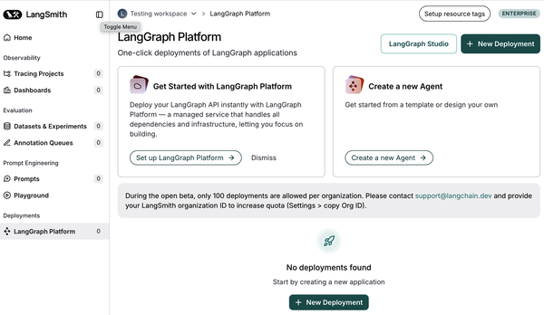

Selanjutnya, klik tombol Pengerahan Baru di pojok kanan atas halaman.

> **Catatan**
> Jika kamu tidak melihat halaman dengan tombol Pengerahan Baru, kemungkinan kamu belum meningkatkan ke paket LangSmith Plus sesuai petunjuk di pengaturan "Penggunaan dan penagihan".

Sekarang kamu seharusnya melihat halaman dengan tiga bidang formulir untuk dilengkapi.

#### Detail pengerahan

1. Pilih "Impor dengan GitHub" dan ikuti alur kerja OAuth GitHub untuk menginstal dan mengotorisasi aplikasi GitHub hosted‑langserve LangChain untuk mengakses repositori yang dipilih. Setelah instalasi selesai, kembali ke panel Buat Pengerahan Baru dan pilih repositori GitHub untuk dideploy dari menu tarik‑turun.
2. Tentukan nama untuk pengerahan dan jalur lengkap ke file konfigurasi API LangGraph, termasuk nama file. Misalnya, jika file `langgraph.json` ada di root repositori, cukup tentukan `langgraph.json`.
3. Tentukan referensi `git` yang diinginkan (nama cabang) dari repositorimu untuk dideploy.

#### Jenis pengembangan

Pilih Produksi dari tarik‑turun. Ini akan mengaktifkan pengerahan produksi yang dapat melayani hingga 500 permintaan/detik dan dilengkapi dengan penyimpanan sangat tersedia dan cadangan otomatis.

#### Variabel lingkungan

Berikan properti dan nilai di `.env`‑mu di sini. Untuk nilai sensitif, seperti `OPENAI_API_KEY`‑mu, pastikan untuk menandai kotak Rahasia sebelum memasukkan nilai.

Setelah kamu menyelesaikan bidang‑bidangnya, klik tombol untuk mengirim pengerahan dan tunggu beberapa detik untuk proses pembuatan selesai. Kamu seharusnya melihat revisi baru terkait dengan pengerahan.

Karena LangGraph Platform terintegrasi dalam LangSmith, kamu dapat mendapatkan visibilitas lebih dalam ke aplikasimu dan melacak serta memantau penggunaan, kesalahan, kinerja, dan biaya di produksi juga. [Gambar 9‑7](#ch09_figure_7_1736545675498618) menunjukkan bagian ringkasan Jumlah Jejak visual yang menunjukkan jejak berhasil, tertunda, dan kesalahan selama periode waktu tertentu. Kamu juga dapat melihat semua info pemantauan untuk server‑mu dengan mengklik tombol "Semua bagan".

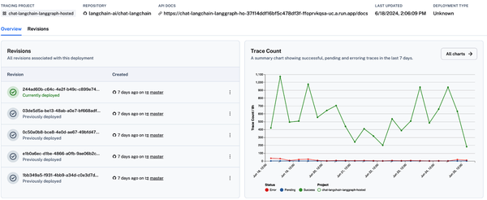

Untuk melihat log pembuatan dan pengerahan, pilih revisi yang diinginkan dari tab Revisi, lalu pilih tab Deploy untuk melihat riwayat log pengerahan lengkap. Kamu juga dapat menyesuaikan rentang tanggal dan waktu.

Untuk membuat pengerahan baru, klik tombol Revisi Baru di bilah navigasi. Isi bidang‑bidang yang diperlukan, termasuk jalur file konfigurasi API LangGraph, referensi git, dan variabel lingkungan, seperti dilakukan sebelumnya.

Terakhir, kamu dapat mengakses dokumentasi API dengan mengklik tautan dokumen API, yang seharusnya menampilkan halaman serupa dengan antarmuka pengguna yang ditunjukkan dalam [Gambar 9‑8](#ch09_figure_8_1736545675498636).

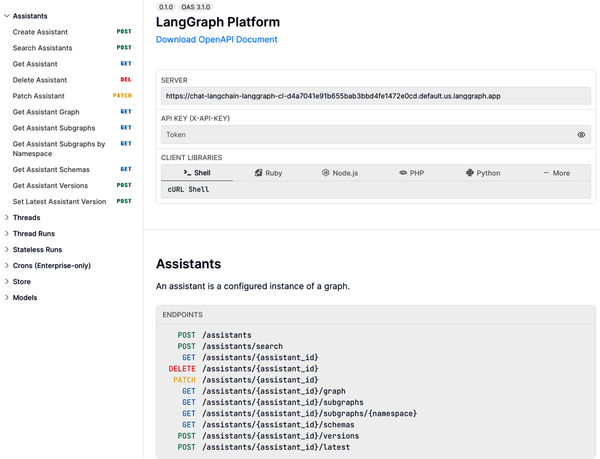

### Luncurkan LangGraph Studio

LangGraph Studio menyediakan IDE agen khusus untuk memvisualisasikan, berinteraksi dengan, dan mendebug aplikasi agenik kompleks. Ini memungkinkan pengembang mengubah hasil agen (atau logika yang mendasari simpul tertentu) di tengah jalur agen. Ini menciptakan proses iteratif dengan membiarkanmu berinteraksi dengan dan memanipulasi status pada titik waktu itu.

Setelah kamu mendeploy aplikasi AI‑mu, klik tombol LangGraph Studio di pojok kanan atas dasbor pengerahan, seperti yang dapat kamu lihat di [Gambar 9‑9](#ch09_figure_9_1736545675498656).

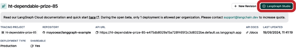

Setelah mengklik tombol, kamu seharusnya melihat antarmuka pengguna LangGraph Studio (misalnya, lihat [Gambar 9‑10](#ch09_figure_10_1736545675498675)).

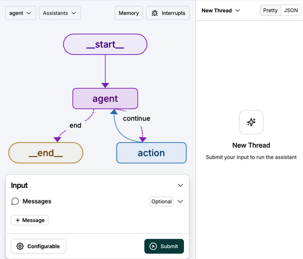

Untuk memanggil grafik dan memulai proses baru, ikuti langkah‑langkah ini:

1. Pilih grafik dari menu tarik‑turun di pojok kiri atas panel kiri. Grafik di [Gambar 9‑10](#ch09_figure_10_1736545675498675) disebut _agent_.
2. Di bagian Masukan, klik ikon "+ Pesan" dan masukkan pesan _manusia_, tetapi masukannya akan bervariasi tergantung definisi status aplikasimu.
3. Klik Kirim untuk memanggil grafik yang dipilih.
4. Lihat keluaran pemanggilan di panel kanan.

Keluaran grafik yang kamu panggil seharusnya terlihat seperti [Gambar 9‑11](#ch09_figure_11_1736545675498694).

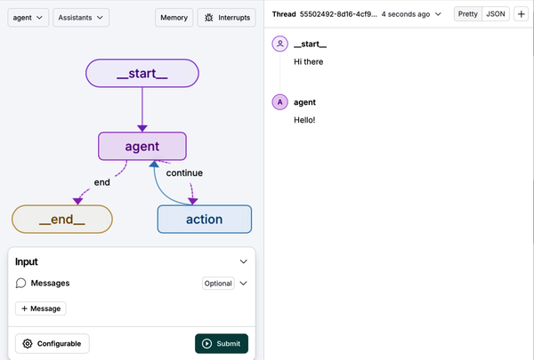

Selain pemanggilan, LangGraph Studio memungkinkanmu mengubah konfigurasi proses, membuat dan menyunting utas, menginterupsi grafik‑mu, menyunting kode grafik, dan mengaktifkan intervensi manusia‑dalam‑putaran. Kamu dapat membaca [panduan lengkap](https://oreil.ly/xUU37) untuk mempelajari lebih lanjut.

> **Catatan**
> LangGraph Studio juga tersedia sebagai aplikasi desktop (untuk silikon Apple), yang memungkinkanmu menguji aplikasi AI‑mu secara lokal.

Jika kamu telah mengikuti panduan instalasi di templat GitHub dan berhasil mendeploy aplikasi AI‑mu, kini ia siap digunakan untuk produksi. Tapi sebelum kamu membagikan ke pengguna eksternal atau menggunakan API backend di aplikasi yang ada, penting untuk menyadari pertimbangan keamanan kunci.

## Keamanan

Meskipun aplikasi AI kuat, mereka rentan terhadap beberapa risiko keamanan yang dapat menyebabkan kerusakan atau kehilangan data, akses tidak sah ke informasi rahasia, dan kinerja yang terganggu. Risiko‑risiko ini dapat membawa konsekuensi hukum, reputasional, dan finansial yang merugikan.

Untuk mengurangi risiko ini, disarankan untuk mengikuti praktik terbaik keamanan aplikasi umum, termasuk berikut:

- Batasi izin
  - Tentukan cakupan izin spesifik untuk kebutuhan aplikasi. Memberikan izin luas atau berlebihan dapat memperkenalkan kerentanan keamanan signifikan. Untuk menghindari kerentanan seperti itu, pertimbangkan menggunakan kredensial baca‑saja, melarang akses ke sumber daya sensitif, dan menggunakan teknik pengawasan (seperti menjalankan di dalam wadah).
- Antisipasi penyalahgunaan potensial
  - Selalu asumsikan bahwa akses sistem atau kredensial apa pun dapat digunakan dengan cara apa pun yang diizinkan oleh izin yang diberikan kepada mereka. Misalnya, jika sepasang kredensial basis data memungkinkan menghapus data, paling aman untuk mengasumsikan bahwa LLM apa pun yang dapat menggunakan kredensial tersebut mungkin benar‑benar menghapus data.
- Pertahanan berlapis
  - Seringkali terbaik untuk menggabungkan beberapa pendekatan keamanan berlapis daripada mengandalkan satu lapisan pertahanan untuk memastikan keamanan. Misalnya, gunakan izin baca‑saja dan pengawasan untuk memastikan LLM hanya dapat mengakses data yang secara eksplisit dimaksudkan untuk mereka gunakan.

Berikut tiga skenario contoh yang mengimplementasikan strategi mitigasi ini:

- Akses file
  - Pengguna mungkin meminta agen dengan akses ke sistem file untuk menghapus file yang tidak boleh dihapus atau membaca konten file yang berisi informasi sensitif. Untuk mengurangi risiko ini, batasi agen hanya menggunakan direktori tertentu dan hanya izinkan membaca atau menulis file yang aman untuk dibaca atau ditulis. Pertimbangkan untuk lebih mengawasi agen dengan menjalankannya di wadah.
- Akses API
  - Pengguna mungkin meminta agen dengan akses tulis ke API eksternal untuk menulis data berbahaya ke API atau menghapus data dari API itu. Untuk mengurangi, berikan kunci API baca‑saja kepada agen, atau batasi hanya menggunakan endpoint yang sudah tahan terhadap penyalahgunaan seperti itu.
- Akses basis data
  - Pengguna mungkin meminta agen dengan akses ke basis data untuk menjatuhkan tabel atau mengubah skema. Untuk mengurangi, tentukan cakupan kredensial hanya ke tabel yang perlu diakses agen dan pertimbangkan menerbitkan kredensial baca‑saja.

Selain langkah‑langkah keamanan sebelumnya, kamu dapat mengambil langkah lebih lanjut untuk mengurangi penyalahgunaan aplikasi AI‑mu. Karena ketergantungan pada penyedia API LLM eksternal (seperti OpenAI), ada biaya langsung terkait dengan menjalankan aplikasimu. Untuk mencegah penyalahgunaan API‑mu dan biaya eksponensial, kamu dapat mengimplementasikan hal‑hal berikut:

- Verifikasi pembuatan akun
  - Ini biasanya termasuk bentuk login autentikasi, seperti verifikasi email atau nomor telepon.
- Pembatasan laju
  - Implementasikan mekanisme pembatasan laju di middleware aplikasi untuk mencegah pengguna membuat terlalu banyak permintaan dalam waktu singkat. Ini harus memeriksa jumlah permintaan yang dibuat pengguna dalam X menit terakhir dan "menghentikan sementara" atau "melarang" pengguna jika penyalahgunaan parah.
- Implementasikan pagar pelindung injeksi petunjuk
  - _Injeksi petunjuk_ terjadi ketika pengguna berbahaya menyuntikkan petunjuk dalam upaya menipu LLM untuk bertindak dengan cara yang tidak diinginkan. Ini biasanya termasuk mengekstrak data rahasia atau menghasilkan keluaran tidak terkait. Untuk mengurangi ini, kamu harus memastikan LLM memiliki cakupan izin yang tepat dan bahwa petunjuk aplikasi spesifik dan ketat terhadap hasil yang diinginkan.

## Ringkasan

Sepanjang bab ini, kamu telah belajar praktik terbaik untuk mendeploy aplikasi AI‑mu dan mengaktifkan pengguna untuk berinteraksi dengannya. Kita menjelajahi layanan yang direkomendasikan untuk menangani berbagai komponen kunci aplikasi di produksi, termasuk LLM, penyimpan vektor, dan API backend.

Kita juga membahas menggunakan LangGraph Platform sebagai layanan terkelola untuk mendeploy dan menghosting agen LangGraph dalam skala besar—bersama dengan LangGraph Studio—untuk memvisualisasikan, berinteraksi dengan, dan mendebug aplikasimu.

Terakhir, kita menjelajahi berbagai praktik terbaik keamanan secara singkat untuk mengurangi risiko pelanggaran data yang sering dikaitkan dengan aplikasi AI.

Di [Bab 10](ch10.xhtml#ch10_testing_evaluation_monitoring_and_continuous_im_1736545678108525), kamu akan belajar cara mengevaluasi, memantau, membandingkan, dan meningkatkan kinerja aplikasi AI‑mu secara efektif.
