# Bab 10. Pengujian: Evaluasi, Pemantauan, dan Peningkatan Berkelanjutan

Di [Bab 9](ch09.xhtml#ch09_deployment_launching_your_ai_application_into_pro_1736545675509604), kamu belajar cara mendeploy aplikasi AI‑mu ke produksi dan menggunakan LangGraph Platform untuk menghosting dan mendebug aplikasimu.

Meskipun aplikasimu dapat menanggapi masukan pengguna dan mengeksekusi tugas kompleks, LLM dasarnya tidak deterministik dan rentan terhadap halusinasi. Seperti dibahas di bab‑bab sebelumnya, LLM dapat menghasilkan keluaran yang tidak akurat dan ketinggalan zaman karena berbagai alasan termasuk petunjuk, format masukan pengguna, dan konteks yang diambil. Selain itu, keluaran LLM yang berbahaya atau menyesatkan dapat merusak merek perusahaan dan loyalitas pelanggan secara signifikan.

Untuk melawan kecenderungan halusinasi ini, kamu perlu membangun sistem yang efisien untuk menguji, mengevaluasi, memantau, dan terus meningkatkan kinerja aplikasi LLM‑mu. Proses pengujian yang kuat ini akan memungkinkanmu untuk cepat mendebug dan memperbaiki masalah terkait AI sebelum dan setelah aplikasimu berada di produksi.

Dalam bab ini, kamu akan belajar cara membangun sistem pengujian berulang di seluruh tahap kunci siklus hidup pengembangan aplikasi LLM dan mempertahankan kinerja tinggi aplikasimu.

## Teknik Pengujian di Sepanjang Siklus Pengembangan Aplikasi LLM

Sebelum kita membangun sistem pengujian, mari tinjau singkat bagaimana pengujian dapat diterapkan di tiga tahap kunci pengembangan aplikasi LLM:

**Perancangan**
: Pada tahap ini, pengujian LLM diterapkan langsung ke aplikasimu. Pengujian ini dapat berupa asersi yang dieksekusi saat runtime yang mengumpankan kegagalan kembali ke LLM untuk koreksi diri. Tujuan pengujian pada tahap ini adalah penanganan kesalahan di dalam aplikasimu sebelum memengaruhi pengguna.

**Praproduksi**
: Pada tahap ini, pengujian dijalankan tepat sebelum pengerahan ke produksi. Tujuan pengujian pada tahap ini adalah menangkap dan memperbaiki regresi apa pun sebelum aplikasi dirilis ke pengguna nyata.

**Produksi**
: Pada tahap ini, pengujian dijalankan saat aplikasimu berada di produksi untuk membantu memantau dan menangkap kesalahan yang memengaruhi pengguna nyata. Tujuannya adalah mengidentifikasi masalah dan mengumpankannya kembali ke fase perancangan atau praproduksi.

Kombinasi pengujian di seluruh tahap ini menciptakan siklus peningkatan berkelanjutan di mana langkah‑langkah ini diulang: rancang, uji, deploy, pantau, perbaiki, dan rancang ulang. Lihat [Gambar 10‑1](#ch10_figure_1_1736545678095728).

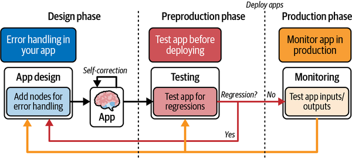

Pada dasarnya, siklus ini membantumu mengidentifikasi dan memperbaiki masalah produksi dengan cara yang efisien dan cepat.

Mari kita selami lebih dalam teknik pengujian di setiap tahap ini.

## Tahap Perancangan: RAG Koreksi Diri

Seperti dibahas sebelumnya, aplikasimu dapat menggabungkan penanganan kesalahan saat runtime yang mengumpankan kesalahan ke LLM untuk koreksi diri. Mari jelajahi kasus penggunaan RAG menggunakan LangGraph sebagai kerangka kerja untuk mengoordinasikan penanganan kesalahan.

Aplikasi AI berbasis RAG dasar rentan terhadap halusinasi karena pengambilan konteks relevan yang tidak akurat atau tidak lengkap untuk menghasilkan keluaran. Tetapi kamu dapat menggunakan LLM untuk menilai relevansi pengambilan dan memperbaiki masalah halusinasi.

LangGraph memungkinkanmu mengimplementasikan aliran kendali proses ini secara efektif, seperti ditunjukkan dalam [Gambar 10‑2](#ch10_figure_2_1736545678095764).

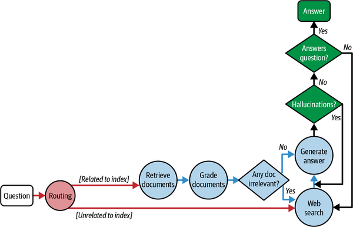

Langkah‑langkah aliran kendali adalah sebagai berikut:

1. Pada langkah perutean, setiap pertanyaan diarahkan ke metode pengambilan yang relevan, yaitu, penyimpan vektor dan pencarian web.
2. Jika, misalnya, pertanyaan diarahkan ke penyimpan vektor untuk pengambilan, LLM dalam aliran kendali akan mengambil dan menilai dokumen untuk relevansi.
3. Jika dokumen relevan, LLM melanjutkan untuk menghasilkan jawaban.
4. LLM akan memeriksa jawaban untuk halusinasi dan hanya melanjutkan untuk menampilkan jawaban kepada pengguna jika keluaran akurat dan relevan.
5. Sebagai cadangan, jika dokumen yang diambil tidak relevan atau jawaban yang dihasilkan tidak menjawab pertanyaan pengguna, aliran menggunakan pencarian web untuk mengambil informasi relevan sebagai konteks.

Proses ini memungkinkan aplikasimu secara berulang menghasilkan jawaban, mengoreksi kesalahan dan halusinasi sendiri, dan meningkatkan kualitas keluaran.

Mari kita jalankan contoh implementasi kode dari aliran kendali ini. Pertama, unduh paket yang diperlukan dan inisialisasi kunci API yang relevan. Untuk contoh‑contoh ini, kamu perlu mengatur kunci API OpenAI dan LangSmith‑mu sebagai variabel lingkungan.

Pertama, kita akan membuat indeks dari tiga posting blog:

_Python_

```python
from langchain.text_splitter import RecursiveCharacterTextSplitter
from langchain_community.document_loaders import WebBaseLoader
from langchain_community.vectorstores import InMemoryVectorStore
from langchain_openai import OpenAIEmbeddings
from langchain_core.prompts import ChatPromptTemplate
from pydantic import BaseModel, Field
from langchain_openai import ChatOpenAI


# --- Buat indeks dokumen ---

urls = [
    "https://blog.langchain.dev/top-5-langgraph-agents-in-production-2024/",
    "https://blog.langchain.dev/langchain-state-of-ai-2024/",
    "https://blog.langchain.dev/introducing-ambient-agents/",
]

docs = [WebBaseLoader(url).load() for url in urls]
docs_list = [item for sublist in docs for item in sublist]

text_splitter = RecursiveCharacterTextSplitter.from_tiktoken_encoder(
    chunk_size=250, chunk_overlap=0
)
doc_splits = text_splitter.split_documents(docs_list)

# Tambahkan ke vectorDB
vectorstore = InMemoryVectorStore.from_documents(
    documents=doc_splits,
    embedding=OpenAIEmbeddings(),
)
retriever = vectorstore.as_retriever()

# Ambil dokumen relevan
results = retriever.invoke(
    "Apa 2 agen LangGraph yang digunakan dalam produksi tahun 2024?")

print("Hasil: \n", results)
```

_JavaScript_

```javascript
import { RecursiveCharacterTextSplitter } from "@langchain/textsplitters"
import { CheerioWebBaseLoader } from "@langchain/community/document_loaders/web/cheerio"
import { InMemoryVectorStore } from "@langchain/community/vectorstores/in_memory"
import { OpenAIEmbeddings } from "@langchain/openai"
import { ChatPromptTemplate } from "@langchain/core/prompts"
import { z } from "zod"
import { ChatOpenAI } from "@langchain/openai"

const urls = [
  "https://blog.langchain.dev/top-5-langgraph-agents-in-production-2024/",
  "https://blog.langchain.dev/langchain-state-of-ai-2024/",
  "https://blog.langchain.dev/introducing-ambient-agents/",
]

// Muat dokumen dari URL
const loadDocs = async (urls) => {
  const docs = []
  for (const url of urls) {
    const loader = new CheerioWebBaseLoader(url)
    const loadedDocs = await loader.load()
    docs.push(...loadedDocs)
  }
  return docs
}

const docsList = await loadDocs(urls)

// Inisialisasi pemisah teks
const textSplitter = new RecursiveCharacterTextSplitter({
  chunkSize: 250,
  chunkOverlap: 0,
})

// Pisahkan dokumen menjadi potongan lebih kecil
const docSplits = textSplitter.splitDocuments(docsList)

// Tambahkan ke basis data vektor
const vectorstore = await InMemoryVectorStore.fromDocuments(
  docSplits,
  new OpenAIEmbeddings()
)

// Objek `retriever` sekarang dapat digunakan untuk mengkueri
const retriever = vectorstore.asRetriever()

const question =
  "Apa 2 agen LangGraph yang digunakan dalam produksi tahun 2024?"

const docs = retriever.invoke(question)

console.log("Dokumen yang diambil: \n", docs[0].pageContent)
```

Seperti dibahas sebelumnya, LLM akan menilai relevansi dokumen yang diambil dari indeks. Kita dapat menyusun instruksi ini dalam petunjuk sistem:

_Python_

```python
### Penilai Pengambilan
from langchain_core.prompts import ChatPromptTemplate
from langchain_core.pydantic_v1 import BaseModel, Field
from langchain_openai import ChatOpenAI


# Model data
class GradeDocuments(BaseModel):
    """Skor biner untuk pemeriksaan relevansi pada dokumen yang diambil."""

    binary_score: str = Field(
        description="Dokumen relevan dengan pertanyaan, 'ya' atau 'tidak'"
    )


# LLM dengan panggilan fungsi
llm = ChatOpenAI(model="gpt-3.5-turbo", temperature=0)
structured_llm_grader = llm.with_structured_output(GradeDocuments)

# Petunjuk
system = """Kamu adalah penilai yang menilai relevansi dokumen yang diambil terhadap
    pertanyaan pengguna.
    Jika dokumen mengandung kata kunci atau makna semantik terkait
    pertanyaan, nilai sebagai relevan.
    Berikan skor biner 'ya' atau 'tidak' untuk menunjukkan apakah dokumen
    relevan dengan pertanyaan."""
grade_prompt = ChatPromptTemplate.from_messages(
    [
        ("system", system),
        ("human", """Dokumen yang diambil: \n\n {document} \n\n  Pertanyaan pengguna:
            {question}"""),
    ]
)

retrieval_grader = grade_prompt | structured_llm_grader
question = "memori agen"
docs = retriever.get_relevant_documents(question)
doc_txt = docs[0].page_content # sebagai contoh
retrieval_grader.invoke({"question": question, "document": doc_txt})
```

_JavaScript_

```javascript
import { ChatPromptTemplate } from "@langchain/core/prompts"
import { z } from "zod"
import { ChatOpenAI } from "@langchain/openai"

// Definisikan skema menggunakan Zod
const GradeDocumentsSchema = z.object({
  binary_score: z.string().describe(`Dokumen relevan dengan pertanyaan, 
      'ya' atau 'tidak'`),
})

// Inisialisasi LLM dengan keluaran terstruktur menggunakan skema Zod
const llm = new ChatOpenAI({ model: "gpt-3.5-turbo", temperature: 0 })
const structuredLLMGrader = llm.withStructuredOutput(GradeDocumentsSchema)

// Pesan sistem dan templat petunjuk
const systemMessage = `Kamu adalah penilai yang menilai relevansi dokumen yang 
  diambil terhadap pertanyaan pengguna. 
Jika dokumen mengandung kata kunci atau makna semantik terkait 
  pertanyaan, nilai sebagai relevan.
Berikan skor biner 'ya' atau 'tidak' untuk menunjukkan apakah dokumen relevan 
  dengan pertanyaan.`

const gradePrompt = ChatPromptTemplate.fromMessages([
  { role: "system", content: systemMessage },
  {
    role: "human",
    content:
      "Dokumen yang diambil: \n\n {document} \n\n \
      Pertanyaan pengguna: {question}",
  },
])

// Gabungkan petunjuk dengan keluaran terstruktur
const retrievalGrader = gradePrompt.pipe(structuredLLMGrader)

const question = "memori agen"
const docs = await retriever.getRelevantDocuments(question)

await retrievalGrader.invoke({
  question,
  document: docs[1].pageContent,
})
```

_Keluaran:_

```
binary_score='ya'
```

Perhatikan penggunaan Pydantic/Zod untuk membantu memodelkan keluaran keputusan biner dalam format yang dapat digunakan untuk memutuskan secara terprogram simpul mana dalam aliran kendali yang akan dituju.

Di LangSmith, kamu dapat melihat jejak aliran logika di seluruh simpul yang dibahas sebelumnya (lihat [Gambar 10‑3](#ch10_figure_3_1736545678095796)).

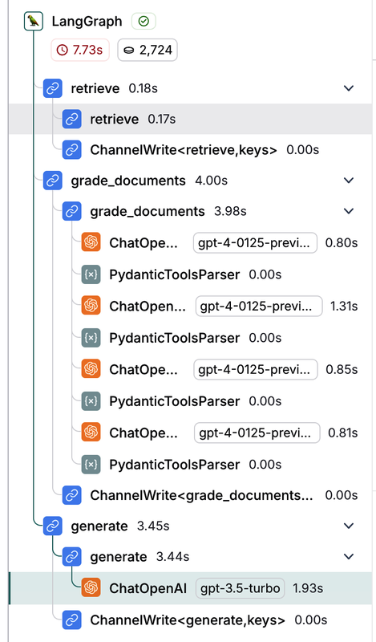

Mari kita uji untuk melihat apa yang terjadi ketika pertanyaan masukan tidak dapat dijawab oleh dokumen yang diambil dalam indeks.

Pertama, gunakan LangGraph untuk memudahkan membangun, mengeksekusi, dan mendebug aliran kendali penuh. Lihat definisi grafik lengkap di [repositori GitHub buku ini](https://oreil.ly/v63Vr). Perhatikan bahwa kita telah menambahkan simpul `transform_query` untuk membantu menulis ulang kueri masukan dalam format yang dapat digunakan pencarian web untuk mengambil hasil berkualitas lebih tinggi.

Sebagai langkah terakhir, kita menyiapkan alat pencarian web kita dan mengeksekusi grafik menggunakan pertanyaan di luar konteks. Jejak LangSmith menunjukkan bahwa alat pencarian web digunakan sebagai cadangan untuk mengambil informasi relevan sebelum jawaban akhir yang dihasilkan LLM (lihat [Gambar 10‑4](#ch10_figure_4_1736545678095829)).

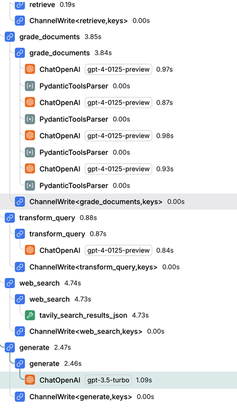

Mari kita lanjutkan ke tahap berikutnya dalam pengujian aplikasi LLM: praproduksi.

## Tahap Praproduksi

Tujuan tahap praproduksi pengujian adalah mengukur dan mengevaluasi kinerja aplikasimu sebelum produksi. Ini akan memungkinkanmu menilai akurasi, latensi, dan biaya penggunaan LLM secara efisien.

### Membuat Himpunan Data

Sebelum pengujian, kamu perlu mendefinisikan serangkaian skenario yang ingin kamu uji dan evaluasi. _Himpunan data_ adalah kumpulan contoh yang menyediakan masukan dan keluaran yang diharapkan digunakan untuk mengevaluasi aplikasi LLM‑mu.

Ini adalah tiga metode umum untuk membangun himpunan data untuk penilaian:

**Contoh yang dikurasi manual**
: Ini adalah contoh tulisan tangan berdasarkan masukan pengguna yang diharapkan dan keluaran yang dihasilkan ideal. Himpunan data kecil terdiri dari antara 10 dan 50 contoh berkualitas. Seiring waktu, lebih banyak contoh dapat ditambahkan ke himpunan data berdasarkan kasus tepi yang muncul di produksi.

**Log aplikasi**
: Setelah aplikasi berada di produksi, kamu dapat menyimpan masukan pengguna waktu‑nyata dan kemudian menambahkannya ke himpunan data. Ini akan membantu memastikan himpunan data realistis dan mencakup pertanyaan pengguna paling umum.

**Data sintetis**
: Ini adalah contoh yang dihasilkan secara artifisial yang mensimulasikan berbagai skenario dan kasus tepi. Ini memungkinkanmu menghasilkan masukan baru dengan mengambil sampel masukan yang ada, yang berguna ketika kamu tidak memiliki data nyata yang cukup untuk diuji.

Di LangSmith, kamu dapat membuat himpunan data baru dengan memilih Himpunan Data dan Pengujian di bilah sisi dan mengklik tombol "+ Himpunan Data Baru" di kanan atas aplikasi, seperti ditunjukkan dalam [Gambar 10‑5](#ch10_figure_5_1736545678095862).

Di jendela yang terbuka, masukkan detail himpunan data yang relevan, termasuk nama, deskripsi, dan tipe himpunan data. Jika kamu ingin menggunakan himpunan data‑mu sendiri, klik tombol "Unggah himpunan data CSV".

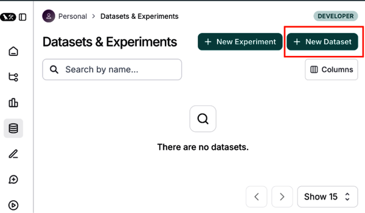

LangSmith menawarkan tiga tipe himpunan data berbeda:

**Himpunan data `kv` (kunci‑nilai)**
: - _Masukan_ dan _keluaran_ direpresentasikan sebagai pasangan kunci‑nilai arbitrer.

- Himpunan data `kv` adalah yang paling serbaguna, dan ini adalah tipe bawaan. Himpunan data `kv` cocok untuk berbagai skenario evaluasi.
- Tipe himpunan data ini ideal untuk mengevaluasi rantai dan agen yang memerlukan banyak masukan atau menghasilkan banyak keluaran.

**Himpunan data `llm` (model bahasa besar)**
: - Himpunan data `llm` dirancang untuk mengevaluasi model bahasa gaya penyelesaian.

- Kamus masukan berisi satu kunci masukan yang dipetakan ke string petunjuk.
- Kamus keluaran berisi satu kunci keluaran yang dipetakan ke string respons yang sesuai.
- Tipe himpunan data ini menyederhanakan evaluasi untuk LLM dengan menyediakan format standar untuk masukan dan keluaran.

**Himpunan data `chat`**
: - Himpunan data `chat` dirancang untuk mengevaluasi pesan obrolan terstruktur LLM sebagai masukan dan keluaran.

- Kamus _masukan_ berisi satu kunci _masukan_ yang dipetakan ke daftar pesan obrolan yang diserialisasi.
- Kamus _keluaran_ berisi satu kunci _keluaran_ yang dipetakan ke daftar pesan obrolan yang diserialisasi.
- Tipe himpunan data ini berguna untuk mengevaluasi sistem AI percakapan atau chatbot.

Opsi paling fleksibel adalah tipe data kunci‑nilai (lihat [Gambar 10‑6](#ch10_figure_6_1736545678095893)).

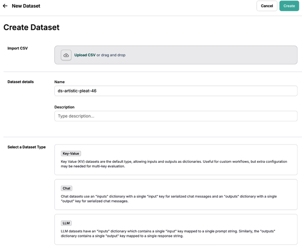

Selanjutnya, tambahkan contoh ke himpunan data dengan mengklik Tambah Contoh. Berikan contoh masukan dan keluaran sebagai objek JSON, seperti ditunjukkan dalam [Gambar 10‑7](#ch10_figure_7_1736545678095923).

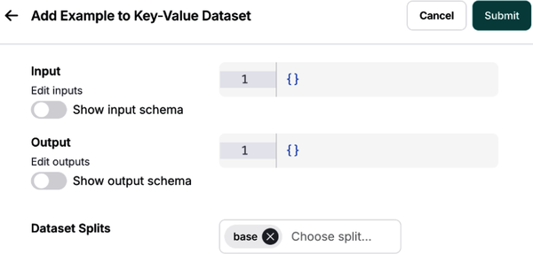

Kamu juga dapat mendefinisikan skema untuk himpunan data‑mu di bagian "Skema himpunan data", seperti ditunjukkan dalam [Gambar 10‑8](#ch10_figure_8_1736545678095955).

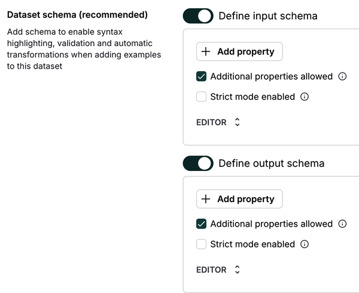

### Mendefinisikan Kriteria Evaluasimu

Setelah membuat himpunan data‑mu, kamu perlu mendefinisikan metrik evaluasi untuk menilai keluaran aplikasimu sebelum mendeploy ke produksi. Evaluasi batch pada rangkaian pengujian yang telah ditentukan ini sering disebut **evaluasi luring**.

Untuk evaluasi luring, kamu dapat secara opsional memberi label keluaran yang diharapkan (yaitu, referensi kebenaran dasar) untuk titik data yang kamu uji. Ini memungkinkanmu membandingkan respons aplikasimu dengan referensi kebenaran dasar, seperti ditunjukkan dalam [Gambar 10‑9](#ch10_figure_9_1736545678095982).

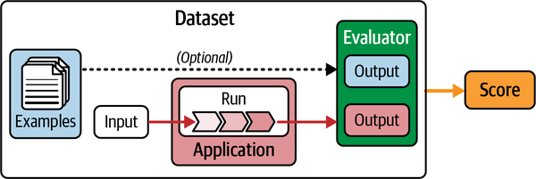

Ada tiga penilai utama untuk menilai kinerja aplikasi LLM‑mu:

**Penilai manusia**
: Jika kamu tidak dapat mengekspresikan persyaratan pengujian‑mu sebagai kode, kamu dapat menggunakan umpan balik manusia untuk mengekspresikan karakteristik kualitatif dan memberi label respons aplikasi dengan skor. LangSmith mempercepat proses mengumpulkan dan menggabungkan umpan balik manusia dengan antrean anotasi.

**Penilai heuristik**
: Ini adalah fungsi dan asersi yang dikodekan keras yang melakukan komputasi untuk menentukan skor. Kamu dapat menggunakan heuristik tanpa‑referensi (misalnya, memeriksa apakah keluaran adalah JSON valid) atau heuristik berbasis‑referensi seperti akurasi. Evaluasi berbasis‑referensi membandingkan keluaran dengan kebenaran dasar yang telah ditentukan, sedangkan evaluasi tanpa‑referensi menilai karakteristik kualitatif tanpa kebenaran dasar. Penilai heuristik kustom berguna untuk tugas pembuatan kode seperti pemeriksaan skema dan pengujian unit dengan logika evaluasi yang dikodekan keras.

**Penilai LLM‑sebagai‑hakim**
: Penilai ini mengintegrasikan aturan penilaian manusia ke dalam petunjuk LLM untuk mengevaluasi apakah keluaran benar relatif terhadap jawaban referensi yang disediakan dari keluaran himpunan data. Saat kamu berulang dalam praproduksi, kamu perlu mengaudit skor dan menyetel LLM‑sebagai‑hakim untuk menghasilkan skor yang dapat diandalkan.

Untuk memulai dengan evaluasi, mulai sederhana dengan penilai heuristik. Kemudian implementasikan penilai manusia sebelum beralih ke LLM‑sebagai‑hakim untuk mengotomatiskan tinjauan manusia‑mu. Ini memungkinkanmu menambah kedalaman dan skala setelah kriteria‑mu terdefinisi dengan baik.

> **Tip**
> Saat menggunakan penilai LLM‑sebagai‑hakim, gunakan petunjuk lugas yang dapat dengan mudah direplikasi dan dipahami oleh manusia. Misalnya, hindari meminta LLM untuk menghasilkan skor pada rentang 0 hingga 10 dengan perbedaan samar antar skor.

[Gambar 10‑10](#ch10_figure_10_1736545678096002) mengilustrasikan penilai LLM‑sebagai‑hakim dalam konteks kasus penggunaan RAG. Perhatikan bahwa jawaban referensi adalah kebenaran dasar.

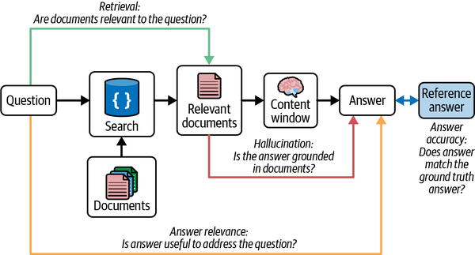

#### Meningkatkan kinerja penilai LLM‑sebagai‑hakim

Menggunakan LLM‑sebagai‑hakim adalah metode efektif untuk menilai keluaran bahasa alami dari aplikasi LLM. Ini melibatkan penerusan keluaran yang dihasilkan ke LLM terpisah untuk penilaian dan evaluasi. Tapi bagaimana kamu dapat mempercayai hasil evaluasi LLM‑sebagai‑hakim?

Seringkali, beberapa putaran rekayasa petunjuk diperlukan untuk meningkatkan akurasi, yang merepotkan dan memakan waktu. Untungnya, LangSmith menyediakan solusi petunjuk _few‑shot_ di mana koreksi manusia terhadap keluaran LLM‑sebagai‑hakim disimpan sebagai contoh few‑shot, yang kemudian diumpankan kembali ke petunjuk dalam iterasi mendatang.

Dengan menggunakan pembelajaran few‑shot, LLM dapat meningkatkan akurasi dan menyelaraskan keluaran dengan preferensi manusia dengan memberikan contoh perilaku benar. Ini terutama berguna ketika sulit menyusun instruksi tentang bagaimana LLM harus berperilaku atau diformat.

Penilai few‑shot mengikuti langkah‑langkah ini:

1. Penilai LLM memberikan umpan balik pada keluaran yang dihasilkan, menilai faktor seperti kebenaran, relevansi, atau kriteria lain.
2. Ia menambahkan koreksi manusia untuk memodifikasi atau mengoreksi umpan balik penilai LLM di LangSmith. Di sinilah preferensi dan penilaian manusia ditangkap.
3. Koreksi‑koreksi ini disimpan sebagai contoh few‑shot di LangSmith, dengan opsi untuk meninggalkan penjelasan untuk koreksi.
4. Contoh few‑shot digabungkan ke dalam petunjuk mendatang sebagai proses evaluasi berikutnya.

Seiring waktu, penilai few‑shot akan semakin selaras dengan preferensi manusia. Mekanisme peningkatan‑diri ini mengurangi kebutuhan akan rekayasa petunjuk yang memakan waktu, sambil meningkatkan akurasi dan relevansi evaluasi LLM‑sebagai‑hakim.

Berikut cara mudah menyiapkan penilai LLM‑sebagai‑hakim di LangSmith untuk evaluasi luring. Pertama, navigasikan ke bagian "Himpunan Data dan Pengujian" di bilah sisi dan pilih himpunan data yang ingin kamu konfigurasi penilainya. Klik tombol Tambah Penilai‑Otomatis di kanan atas dasbor untuk menambahkan penilai ke himpunan data. Ini akan membuka modal yang dapat kamu gunakan untuk mengonfigurasi penilai.

Pilih opsi LLM‑sebagai‑hakim dan beri nama untuk penilaian‑mu. Sekarang kamu akan memiliki opsi untuk mengatur petunjuk sebaris atau memuat petunjuk dari hub petunjuk yang akan digunakan untuk mengevaluasi hasil proses dalam percobaan. Untuk contoh ini, pilih opsi Buat Penilai Few‑Shot, seperti ditunjukkan dalam [Gambar 10‑11](#ch10_figure_11_1736545678096023).

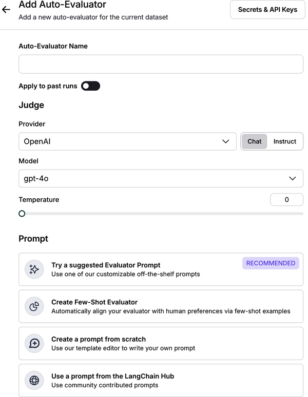

Opsi ini akan membuat himpunan data yang menyimpan contoh few‑shot yang akan terisi otomatis saat kamu membuat koreksi pada umpan balik penilai. Contoh‑contoh dalam himpunan data ini akan disisipkan dalam pesan petunjuk sistem.

Kamu juga dapat menentukan kriteria penilaian di bidang Skema dan beralih antar tipe primitif—misalnya, bilangan bulat dan Boolean (lihat [Gambar 10‑12](#ch10_figure_12_1736545678096045)).

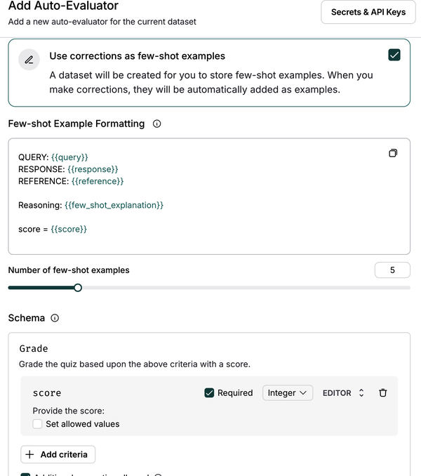

Simpan penilai dan navigasikan kembali ke halaman detail himpunan data. Ke depan, setiap proses percobaan berikutnya dari himpunan data akan dievaluasi oleh penilai yang kamu konfigurasi.

#### Evaluasi berpasangan

Mengurutkan keluaran LLM berdasarkan preferensi dapat kurang menuntut kognitif bagi penilai manusia atau LLM‑sebagai‑hakim. Misalnya, menilai keluaran mana yang lebih informatif, spesifik, atau aman. Evaluasi berpasangan membandingkan dua keluaran secara bersamaan dari versi berbeda suatu aplikasi untuk menentukan versi mana yang lebih memenuhi kriteria evaluasi.

LangSmith secara asli mendukung menjalankan dan memvisualisasikan pembangkitan aplikasi LLM berpasangan, menyoroti preferensi untuk satu pembangkitan di atas yang lain berdasarkan pedoman yang ditetapkan oleh penilai berpasangan. Evaluasi berpasangan LangSmith memungkinkanmu melakukan hal‑hal berikut:

- Mendefinisikan penilai LLM‑sebagai‑hakim berpasangan kustom menggunakan kriteria apa pun yang diinginkan
- Membandingkan dua pembangkitan LLM menggunakan penilai ini

Sesuai [dokumen](https://oreil.ly/ruFvy) LangSmith, kamu dapat menggunakan penilai berpasangan kustom di SDK LangSmith dan memvisualisasikan hasil evaluasi berpasangan di antarmuka pengguna LangSmith.

Setelah membuat percobaan evaluasi, kamu dapat menavigasikan ke tab Percobaan Berpasangan di bagian Himpunan Data & Percobaan. Antarmuka pengguna memungkinkanmu menyelami setiap percobaan berpasangan, menunjukkan pembangkitan LLM mana yang lebih disukai berdasarkan kriteria kita. Jika kamu mengklik skor PREFERENSI_DIURUTKAN di bawah setiap jawaban, kamu dapat menyelami lebih dalam setiap jejak evaluasi (lihat [Gambar 10‑13](#ch10_figure_13_1736545678096064)).

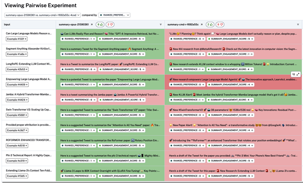

### Pengujian Regresi

Dalam pengembangan perangkat lunak tradisional, pengujian diharapkan lulus 100% berdasarkan persyaratan fungsional. Ini memastikan perilaku stabil setelah pengujian divalidasi. Sebaliknya, bagaimanapun, kinerja keluaran model AI dapat bervariasi signifikan karena _pergeseran_ model (penurunan karena perubahan distribusi data atau pembaruan model). Akibatnya, menguji aplikasi AI mungkin tidak selalu menghasilkan skor sempurna pada himpunan data evaluasi.

Ini memiliki beberapa implikasi. Pertama, penting untuk melacak hasil dan kinerja pengujian‑mu dari waktu ke waktu untuk mencegah regresi kinerja aplikasimu. Pengujian _regresi_ memastikan bahwa pembaruan atau perubahan terakhir model LLM aplikasimu tidak _regresi_ (berkinerja lebih buruk) relatif terhadap dasar.

Kedua, penting untuk membandingkan titik data individual antara dua atau lebih proses percobaan untuk melihat di mana model benar atau salah.

Tampilan perbandingan LangSmith memiliki dukungan asli untuk pengujian regresi, memungkinkanmu cepat melihat contoh yang telah berubah relatif terhadap dasar. Proses yang mengalami regresi atau membaik disorot berbeda di dasbor LangSmith (lihat [Gambar 10‑14](#ch10_figure_14_1736545678096104)).

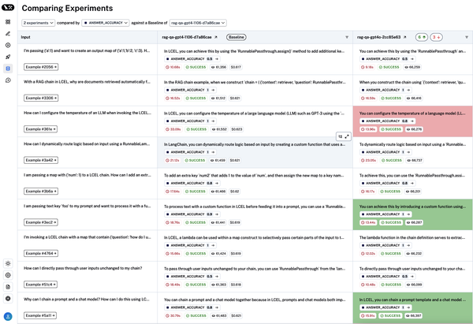

Di dasbor Membandingkan Percobaan LangSmith, kamu dapat melakukan hal‑hal berikut:

- Membandingkan banyak percobaan dan proses yang terkait dengan himpunan data. Statistik agregat proses berguna untuk migrasi model atau petunjuk, yang dapat menghasilkan peningkatan kinerja atau regresi pada contoh spesifik.
- Menetapkan proses dasar dan membandingkannya dengan versi aplikasi sebelumnya untuk mendeteksi regresi tak terduga. Jika regresi terjadi, kamu dapat mengisolasi baik versi aplikasi maupun contoh spesifik yang mengandung perubahan kinerja.
- Menyelami titik data yang berperilaku berbeda antara percobaan dan proses yang dibandingkan.

Pengujian regresi ini penting untuk memastikan aplikasimu mempertahankan kinerja tinggi seiring waktu terlepas dari pembaruan dan perubahan LLM.

Sekarang setelah kita membahas berbagai strategi pengujian praproduksi, mari jelajahi kasus penggunaan spesifik.

### Mengevaluasi Kinerja Ujung‑ke‑Ujung Agen

Meskipun agen menunjukkan banyak janji dalam mengeksekusi tugas dan alur kerja otonom, menguji kinerja agen bisa menantang. Di bab‑bab sebelumnya, kamu belajar bagaimana agen menggunakan pemanggilan alat dengan perencanaan dan memori untuk menghasilkan respons. Khususnya, pemanggilan alat memungkinkan model merespons petunjuk tertentu dengan menghasilkan alat untuk dipanggil dan argumen masukan yang diperlukan untuk mengeksekusi alat.

Karena agen menggunakan LLM untuk memutuskan aliran kendali aplikasi, setiap proses agen dapat memiliki hasil yang sangat berbeda. Misalnya, alat berbeda mungkin dipanggil, agen mungkin terjebak dalam lingkaran, atau jumlah langkah dari awal hingga akhir dapat bervariasi signifikan.

Idealnya, agen harus diuji pada tiga tingkat granularitas berbeda:

**Respons**
: Respons akhir agen untuk fokus pada kinerja ujung‑ke‑ujung. Masukan adalah petunjuk dan daftar alat opsional, sedangkan keluaran adalah respons akhir agen.

**Langkah tunggal**
: Setiap langkah tunggal penting agen untuk menyelami panggilan alat atau keputusan spesifik. Dalam hal ini, keluaran adalah panggilan alat.

**Jejak**
: Jejak lengkap agen. Dalam hal ini, keluaran adalah daftar panggilan alat.

[Gambar 10‑15](#ch10_figure_15_1736545678096126) mengilustrasikan tingkat‑tingkat ini:

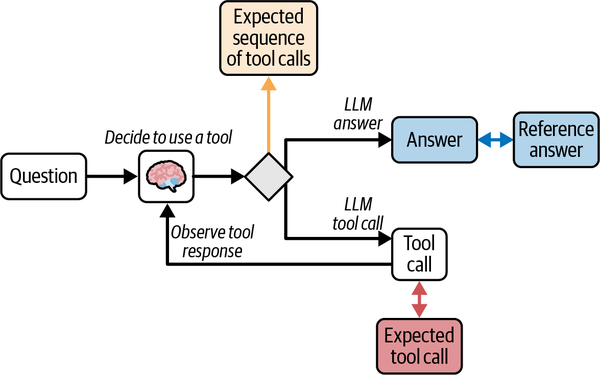

Mari kita selami lebih dalam masing‑masing dari tiga granularitas pengujian‑agen ini.

#### Menguji respons akhir agen

Untuk menilai kinerja keseluruhan agen pada suatu tugas, kamu dapat memperlakukan agen sebagai kotak hitam dan mendefinisikan keberhasilan berdasarkan apakah ia menyelesaikan tugas atau tidak.

Pengujian untuk respons akhir agen biasanya melibatkan hal‑hal berikut:

**Masukan**
: Masukan pengguna dan (opsional) alat yang telah ditentukan

**Keluaran**
: Respons akhir agen

**Penilai**
: LLM‑sebagai‑hakim

Untuk mengimplementasikan ini secara terprogram, pertama buat himpunan data yang mencakup pertanyaan dan jawaban yang diharapkan dari agen:

_Python_

```python
from langsmith import Client

client = Client()

# Buat himpunan data
examples = [
    ("Pelanggan negara mana yang menghabiskan paling banyak? Dan berapa yang mereka habiskan?",
        """Negara yang pelanggannya menghabiskan paling banyak adalah USA, dengan total
        pengeluaran $523.06"""),
    ("Lagu apa yang paling banyak dibeli tahun 2013?",
        "Lagu yang paling banyak dibeli tahun 2013 adalah Hot Girl."),
    ("Berapa album yang dimiliki artis Led Zeppelin?",
        "Led Zeppelin memiliki 14 album"),
    ("Berapa harga total album 'Big Ones'?",
        "Harga total album 'Big Ones' adalah 14.85"),
    ("Agen penjualan mana yang menghasilkan penjualan terbanyak tahun 2009?",
        "Steve Johnson menghasilkan penjualan terbanyak tahun 2009"),
]

dataset_name = "Respons Agen SQL"
if not client.has_dataset(dataset_name=dataset_name):
    dataset = client.create_dataset(dataset_name=dataset_name)
    inputs, outputs = zip(
        *({"input": text}, {"output": label}) for text, label in examples
    )
    client.create_examples(inputs=inputs, outputs=outputs, dataset_id=dataset.id)

## rantai
def predict_sql_agent_answer(example: dict):
    """Gunakan ini untuk evaluasi jawaban"""
    msg = {"messages": ("user", example["input"])}
    messages = graph.invoke(msg, config)
    return {"response": messages['messages'][-1].content}
```

_JavaScript_

```javascript
import { Client } from "langsmith"

const client = new Client()

// Buat himpunan data
const examples = [
  [
    "Pelanggan negara mana yang menghabiskan paling banyak? Dan berapa yang mereka habiskan?",
    `Negara yang pelanggannya menghabiskan paling banyak adalah USA, dengan total 
    pengeluaran $523.06`,
  ],
  [
    "Lagu apa yang paling banyak dibeli tahun 2013?",
    "Lagu yang paling banyak dibeli tahun 2013 adalah Hot Girl.",
  ],
  [
    "Berapa album yang dimiliki artis Led Zeppelin?",
    "Led Zeppelin memiliki 14 album",
  ],
  [
    "Berapa harga total album 'Big Ones'?",
    "Harga total album 'Big Ones' adalah 14.85",
  ],
  [
    "Agen penjualan mana yang menghasilkan penjualan terbanyak tahun 2009?",
    "Steve Johnson menghasilkan penjualan terbanyak tahun 2009",
  ],
]

const datasetName = "Respons Agen SQL"

async function createDataset() {
  const hasDataset = await client.hasDataset({ datasetName })

  if (!hasDataset) {
    const dataset = await client.createDataset(datasetName)
    const inputs = examples.map(([text]) => ({ input: text }))
    const outputs = examples.map(([, label]) => ({ output: label }))

    await client.createExamples({ inputs, outputs, datasetId: dataset.id })
  }
}

createDataset()

// Fungsi rantai
async function predictSqlAgentAnswer(example) {
  // Gunakan ini untuk evaluasi jawaban
  const msg = { messages: [{ role: "user", content: example.input }] }
  const output = await graph.invoke(msg, config)
  return { response: output.messages[output.messages.length - 1].content }
}
```

Selanjutnya, seperti dibahas sebelumnya, kita dapat menggunakan LLM untuk membandingkan jawaban yang dihasilkan dengan jawaban referensi:

_Python_

```python
from langchain import hub
from langchain_openai import ChatOpenAI
from langsmith.evaluation import evaluate

# Petunjuk penilaian
grade_prompt_answer_accuracy = hub.pull("langchain-ai/rag-answer-vs-reference")

def answer_evaluator(run, example) -> dict:
    """
    Penilai sederhana untuk akurasi jawaban RAG
    """

    # Dapatkan pertanyaan, jawaban kebenaran dasar, jawaban rantai RAG
    input_question = example.inputs["input"]
    reference = example.outputs["output"]
    prediction = run.outputs["response"]

    # Penilai LLM
    llm = ChatOpenAI(model="gpt-4o", temperature=0)

    # Petunjuk terstruktur
    answer_grader = grade_prompt_answer_accuracy | llm

    # Jalankan penilai
    score = answer_grader.invoke({"question": input_question,
                                  "correct_answer": reference,
                                  "student_answer": prediction})
    score = score["Score"]

    return {"key": "answer_v_reference_score", "score": score}


## Jalankan evaluasi
experiment_results = evaluate(
    predict_sql_agent_answer,
    data=dataset_name,
    evaluators=[answer_evaluator],
    num_repetitions=3,
)
```

_JavaScript_

```javascript
import { pull } from "langchain/hub"
import { ChatOpenAI } from "langchain_openai"
import { evaluate } from "langsmith/evaluation"

async function answerEvaluator(run, example) {
  /**
   * Penilai sederhana untuk akurasi jawaban RAG
   */

  // Dapatkan pertanyaan, jawaban kebenaran dasar, jawaban rantai RAG
  const inputQuestion = example.inputs["input"]
  const reference = example.outputs["output"]
  const prediction = run.outputs["response"]

  // Penilai LLM
  const llm = new ChatOpenAI({ model: "gpt-4o", temperature: 0 })

  // Petunjuk penilaian
  const gradePromptAnswerAccuracy = pull("langchain-ai/rag-answer-vs-reference")

  // Petunjuk terstruktur
  const answerGrader = gradePromptAnswerAccuracy.pipe(llm)

  // Jalankan penilai
  const scoreResult = await answerGrader.invoke({
    question: inputQuestion,
    correct_answer: reference,
    student_answer: prediction,
  })

  const score = scoreResult["Score"]

  return { key: "answer_v_reference_score", score: score }
}

// Jalankan evaluasi
const experimentResults = evaluate(predictSqlAgentAnswer, {
  data: datasetName,
  evaluators: [answerEvaluator],
  numRepetitions: 3,
})
```

#### Menguji satu langkah agen

Menguji tindakan atau keputusan individual agen memungkinkanmu mengidentifikasi dan menganalisis secara spesifik di mana aplikasimu berkinerja buruk. Pengujian untuk satu langkah agen melibatkan hal‑hal berikut:

**Masukan**
: Masukan pengguna ke satu langkah (misalnya, petunjuk pengguna, set alat). Ini juga dapat mencakup langkah‑langkah yang sebelumnya diselesaikan.

**Keluaran**
: Respons LLM dari langkah masukan, yang sering berisi panggilan alat yang menunjukkan tindakan apa yang harus diambil agen selanjutnya.

**Penilai**
: Skor biner untuk pemilihan alat yang benar dan penilaian heuristik terhadap akurasi masukan alat.

Contoh berikut memeriksa panggilan alat spesifik menggunakan penilai kustom:

_Python_

```python
from langsmith.schemas import Example, Run

def predict_assistant(example: dict):
    """Panggil asisten untuk evaluasi panggilan alat tunggal"""
    msg = [ ("user", example["input"]) ]
    result = assistant_runnable.invoke({"messages":msg})
    return {"response": result}


def check_specific_tool_call(root_run: Run, example: Example) -> dict:
    """
    Periksa apakah panggilan alat pertama dalam respons sesuai dengan panggilan alat yang diharapkan.
    """
    # Panggilan alat yang diharapkan
    expected_tool_call = 'sql_db_list_tables'

    # Proses
    response = root_run.outputs["response"]

    # Dapatkan panggilan alat
    try:
        tool_call = getattr(response, 'tool_calls', [])[0]['name']
    except (IndexError, KeyError):
        tool_call = None

    score = 1 if tool_call == expected_tool_call else 0
    return {"score": score, "key": "single_tool_call"}

experiment_results = evaluate(
    predict_assistant,
    data=dataset_name,
    evaluators=[check_specific_tool_call],
    num_repetitions=3,
    metadata={"version": metadata},
)
```

_JavaScript_

```javascript
import { evaluate } from "langsmith/evaluation"

// Prediksi Asisten
function predictAssistant(example) {
  /**
   * Panggil asisten untuk evaluasi panggilan alat tunggal
   */
  const msg = [{ role: "user", content: example.input }]
  const result = assistantRunnable.invoke({ messages: msg })
  return { response: result }
}

// Periksa Panggilan Alat Spesifik
function checkSpecificToolCall(rootRun, example) {
  /**
   * Periksa apakah panggilan alat pertama dalam respons sesuai dengan
   * panggilan alat yang diharapkan.
   */

  // Panggilan alat yang diharapkan
  const expectedToolCall = "sql_db_list_tables"

  // Proses
  const response = rootRun.outputs.response

  // Dapatkan panggilan alat
  let toolCall
  try {
    toolCall = response.tool_calls?.[0]?.name
  } catch (error) {
    toolCall = null
  }

  const score = toolCall === expectedToolCall ? 1 : 0
  return { score, key: "single_tool_call" }
}

// Hasil Percobaan
const experimentResults = evaluate(predictAssistant, {
  data: datasetName,
  evaluators: [checkSpecificToolCall],
  numRepetitions: 3,
})
```

Blok kode sebelumnya mengimplementasikan komponen‑komponen berbeda ini:

- Panggil asisten, `assistant_runnable`, dengan petunjuk dan periksa apakah panggilan alat yang dihasilkan sesuai harapan.
- Gunakan agen khusus di mana alat dikodekan keras daripada diteruskan dengan masukan himpunan data.
- Tentukan panggilan alat referensi untuk langkah yang kita evaluasi untuk `expected_tool_call`.

#### Menguji jejak agen

Penting untuk melihat kembali langkah‑langkah yang diambil agen untuk menilai apakah jejak sejalan dengan harapan agen—yaitu, jumlah langkah atau urutan langkah yang diambil.

Menguji jejak agen melibatkan hal‑hal berikut:

**Masukan**
: Masukan pengguna dan (opsional) alat yang telah ditentukan.

**Keluaran**
: Urutan panggilan alat yang diharapkan atau daftar panggilan alat dalam urutan apa pun.

**Penilai**
: Fungsi atas langkah‑langkah yang diambil. Untuk menguji keluaran, kamu dapat melihat skor biner kecocokan tepat atau metrik yang berfokus pada jumlah langkah yang salah. Kamu perlu mengevaluasi jejak lengkap agen terhadap jejak referensi dan kemudian kompilasi sebagai set pesan untuk diteruskan ke LLM‑sebagai‑hakim.

Contoh berikut menilai jejak panggilan alat menggunakan penilai kustom:

_Python_

```python
def predict_sql_agent_messages(example: dict):
    """Gunakan ini untuk evaluasi jawaban"""
    msg = {"messages": ("user", example["input"])}
    messages = graph.invoke(msg, config)
    return {"response": messages}

def find_tool_calls(messages):
    """
    Temukan semua panggilan alat dalam pesan yang dikembalikan
    """
    tool_calls = [
        tc['name']
        for m in messages['messages'] for tc in getattr(m, 'tool_calls', [])
    ]
    return tool_calls

def contains_all_tool_calls_any_order(
    root_run: Run, example: Example
) -> dict:
    """
    Periksa apakah semua alat yang diharapkan dipanggil dalam urutan apa pun.
    """
    expected = [
        'sql_db_list_tables',
        'sql_db_schema',
        'sql_db_query_checker',
        'sql_db_query',
        'check_result'
    ]
    messages = root_run.outputs["response"]
    tool_calls = find_tool_calls(messages)
    # Opsional, catat panggilan alat -
    #print("Ini panggilan alat saya:")
    #print(tool_calls)
    if set(expected) <= set(tool_calls):
        score = 1
    else:
        score = 0
    return {"score": int(score), "key": "multi_tool_call_any_order"}

def contains_all_tool_calls_in_order(root_run: Run, example: Example) -> dict:
    """
    Periksa apakah semua alat yang diharapkan dipanggil dalam urutan tepat.
    """
    messages = root_run.outputs["response"]
    tool_calls = find_tool_calls(messages)
    # Opsional, catat panggilan alat -
    #print("Ini panggilan alat saya:")
    #print(tool_calls)
    it = iter(tool_calls)
    expected = [
        'sql_db_list_tables',
        'sql_db_schema',
        'sql_db_query_checker',
        'sql_db_query',
        'check_result'
    ]
    if all(elem in it for elem in expected):
        score = 1
    else:
        score = 0
    return {"score": int(score), "key": "multi_tool_call_in_order"}

def contains_all_tool_calls_in_order_exact_match(
    root_run: Run, example: Example
) -> dict:
    """
    Periksa apakah semua alat yang diharapkan dipanggil dalam urutan tepat dan tanpa
        panggilan alat tambahan.
    """
    expected = [
        'sql_db_list_tables',
        'sql_db_schema',
        'sql_db_query_checker',
        'sql_db_query',
        'check_result'
    ]
    messages = root_run.outputs["response"]
    tool_calls = find_tool_calls(messages)
    # Opsional, catat panggilan alat -
    #print("Ini panggilan alat saya:")
    #print(tool_calls)
    if tool_calls == expected:
        score = 1
    else:
        score = 0

    return {"score": int(score), "key": "multi_tool_call_in_exact_order"}

experiment_results = evaluate(
    predict_sql_agent_messages,
    data=dataset_name,
    evaluators=[
        contains_all_tool_calls_any_order,
        contains_all_tool_calls_in_order,
        contains_all_tool_calls_in_order_exact_match
    ],
    num_repetitions=3,
)
```

_JavaScript_

```javascript
import { evaluate } from "langsmith/evaluation"

// Prediksi Pesan Agen SQL
function predictSqlAgentMessages(example) {
  /**
   * Gunakan ini untuk evaluasi jawaban
   */
  const msg = { messages: [{ role: "user", content: example.input }] }
  // Ganti dengan grafik dan konfigurasi‑mu
  const messages = graph.invoke(msg, config)
  return { response: messages }
}

// Temukan Panggilan Alat
function findToolCalls({ messages }) {
  /**
   * Temukan semua panggilan alat dalam pesan yang dikembalikan
   */
  return messages.flatMap((m) => m.tool_calls?.map((tc) => tc.name) || [])
}

// Berisi Semua Panggilan Alat (Urutan Apa Pun)
function containsAllToolCallsAnyOrder(rootRun, example) {
  /**
   * Periksa apakah semua alat yang diharapkan dipanggil dalam urutan apa pun.
   */
  const expected = [
    "sql_db_list_tables",
    "sql_db_schema",
    "sql_db_query_checker",
    "sql_db_query",
    "check_result",
  ]
  const messages = rootRun.outputs.response
  const toolCalls = findToolCalls(messages)

  const score = expected.every((tool) => toolCalls.includes(tool)) ? 1 : 0
  return { score, key: "multi_tool_call_any_order" }
}

// Berisi Semua Panggilan Alat (Dalam Urutan)
function containsAllToolCallsInOrder(rootRun, example) {
  /**
   * Periksa apakah semua alat yang diharapkan dipanggil dalam urutan tepat.
   */
  const messages = rootRun.outputs.response
  const toolCalls = findToolCalls(messages)

  const expected = [
    "sql_db_list_tables",
    "sql_db_schema",
    "sql_db_query_checker",
    "sql_db_query",
    "check_result",
  ]

  const score = expected.every((tool) => {
    let found = false
    for (let call of toolCalls) {
      if (call === tool) {
        found = true
        break
      }
    }
    return found
  })
    ? 1
    : 0

  return { score, key: "multi_tool_call_in_order" }
}

// Berisi Semua Panggilan Alat (Urutan Tepat, Kecocokan Tepat)
function containsAllToolCallsInOrderExactMatch(rootRun, example) {
  /**
   * Periksa apakah semua alat yang diharapkan dipanggil dalam urutan tepat dan tanpa
   * panggilan alat tambahan.
   */
  const expected = [
    "sql_db_list_tables",
    "sql_db_schema",
    "sql_db_query_checker",
    "sql_db_query",
    "check_result",
  ]
  const messages = rootRun.outputs.response
  const toolCalls = findToolCalls(messages)

  const score = JSON.stringify(toolCalls) === JSON.stringify(expected) ? 1 : 0
  return { score, key: "multi_tool_call_in_exact_order" }
}

// Hasil Percobaan
const experimentResults = evaluate(predictSqlAgentMessages, {
  data: datasetName,
  evaluators: [
    containsAllToolCallsAnyOrder,
    containsAllToolCallsInOrder,
    containsAllToolCallsInOrderExactMatch,
  ],
  numRepetitions: 3,
})
```

Contoh implementasi ini mencakup hal‑hal berikut:

- Memanggil agen LangGraph terkompilasi `graph.invoke` dengan petunjuk
- Menggunakan agen khusus di mana alat dikodekan keras daripada diteruskan dengan masukan himpunan data
- Mengekstraksi daftar alat yang dipanggil menggunakan fungsi `find_tool_calls`
- Memeriksa apakah semua alat yang diharapkan dipanggil dalam urutan apa pun menggunakan fungsi `contains_all_tool_calls_any_order` atau dipanggil berurutan menggunakan `contains_all_tool_calls_in_order`
- Memeriksa apakah semua alat yang diharapkan dipanggil dalam urutan tepat menggunakan `contains_all_tool_calls_in_order_exact_match`

Ketiga metode evaluasi agen ini dapat diamati dan didebug di antarmuka pengguna percobaan LangSmith (lihat [Gambar 10‑16](#ch10_figure_16_1736545678096148)).

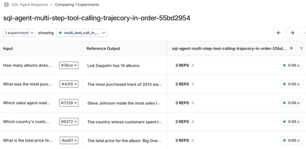

Secara umum, pengujian‑pengujian ini adalah titik awal yang solid untuk membantu mengurangi biaya dan ketidakandalan agen karena pemanggilan LLM dan variabilitas dalam pemanggilan alat.

## Produksi

Meskipun pengujian dalam fase praproduksi berguna, bug dan kasus tepi tertentu mungkin tidak muncul sampai aplikasi LLM‑mu berinteraksi dengan pengguna langsung. Masalah‑masalah ini dapat memengaruhi latensi, serta relevansi dan akurasi keluaran. Selain itu, keteramatan dan proses _evaluasi daring_ dapat membantu memastikan ada pagar pelindung untuk masukan atau keluaran LLM. Pagar pelindung ini dapat memberikan perlindungan yang sangat dibutuhkan dari injeksi petunjuk dan toksisitas.

Langkah pertama dalam proses ini adalah menyiapkan fitur pelacakan LangSmith.

### Pelacakan

_Jejak_ adalah serangkaian langkah yang diambil aplikasimu dari masukan ke keluaran. LangSmith memudahkan untuk memvisualisasikan, mendebug, dan menguji setiap jejak yang dihasilkan dari aplikasimu.

Setelah kamu menginstal dependensi LangChain dan LLM yang relevan, yang perlu kamu lakukan adalah mengonfigurasi variabel lingkungan pelacakan berdasarkan kredensial akun LangSmith‑mu:

```
export LANGCHAIN_TRACING_V2=true
export LANGCHAIN_API_KEY=<kunci-api‑mu>

# Contoh di bawah menggunakan API OpenAI, meskipun kamu dapat menggunakan penyedia LLM lain

export OPENAI_API_KEY=<kunci-api‑openai‑mu>
```

Setelah variabel lingkungan diatur, tidak diperlukan kode lain untuk mengaktifkan pelacakan. Jejak akan secara otomatis dicatat ke proyek spesifik mereka di bagian "Proyek Pelacakan" dasbor LangSmith. Metrik yang disediakan mencakup volume jejak, tingkat keberhasilan dan kegagalan, latensi, jumlah token dan biaya, dan lainnya—seperti ditunjukkan dalam [Gambar 10‑17](#ch10_figure_17_1736545678096172).

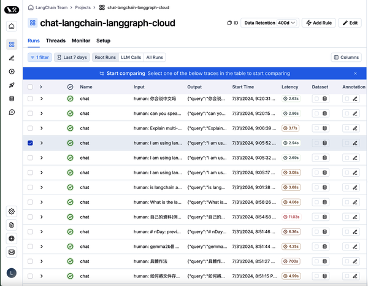

Kamu dapat meninjau berbagai strategi untuk mengimplementasikan pelacakan berdasarkan kebutuhan‑mu.

### Kumpulkan Umpan Balik di Produksi

Tidak seperti fase praproduksi, penilai untuk pengujian produksi tidak memiliki respons referensi berbasis dasar untuk dibandingkan LLM. Sebaliknya, penilai perlu menilai kinerja secara waktu‑nyata saat aplikasimu memproses masukan pengguna. Evaluasi waktu‑nyata tanpa‑referensi ini sering disebut _evaluasi daring_.

Setidaknya ada dua jenis umpan balik yang dapat kamu kumpulkan di produksi untuk meningkatkan kinerja aplikasi:

**Umpan balik dari pengguna**
: Kamu dapat secara langsung mengumpulkan umpan balik pengguna secara eksplisit atau implisit. Misalnya, memberi pengguna kemampuan untuk mengklik tombol suka dan tidak suka atau memberikan umpan balik terperinci berdasarkan keluaran aplikasi adalah cara efektif untuk melacak kepuasan pengguna. Di LangSmith, kamu dapat melampirkan umpan balik pengguna ke jejak apa pun atau proses antara (yaitu, rentang) jejak, termasuk memberi anotasi jejak sebaris atau meninjau proses bersama dalam antrean anotasi.

**Umpan balik dari penilai LLM‑sebagai‑hakim**
: Seperti dibahas sebelumnya, penilai ini dapat diimplementasikan langsung pada jejak untuk mengidentifikasi halusinasi dan respons toksik.

Bagian praproduksi sebelumnya sudah membahas cara menyiapkan evaluasi otomatis LangSmith di bagian Himpunan Data & Percobaan dasbor.

### Klasifikasi dan Penandaan

Untuk mengimplementasikan pagar pelindung efektif terhadap toksisitas atau mengumpulkan wawasan tentang analisis sentimen pengguna, kita perlu membangun sistem efektif untuk memberi label masukan pengguna dan keluaran yang dihasilkan.

Sistem ini sangat bergantung pada apakah kamu memiliki himpunan data yang berisi label referensi. Jika kamu tidak memiliki label yang telah ditetapkan, kamu dapat menggunakan penilai LLM‑sebagai‑hakim untuk membantu melakukan klasifikasi dan penandaan berdasarkan kriteria yang ditentukan.

Namun, jika label klasifikasi kebenaran dasar disediakan, maka penilai heuristik kustom dapat digunakan untuk menilai keluaran rantai relatif terhadap label kelas kebenaran dasar.

### Memantau dan Memperbaiki Kesalahan

Setelah aplikasimu berada di produksi, pelacakan LangSmith akan menangkap kesalahan dan kasus tepi. Kamu dapat menambahkan kesalahan ini ke himpunan data pengujian‑mu untuk evaluasi luring guna mencegah pengulangan masalah yang sama.

Strategi berguna lainnya adalah merilis aplikasimu secara bertahap kepada sekelompok kecil pengguna beta sebelum audiens yang lebih besar dapat mengakses fitur‑fiturnya. Ini akan memungkinkanmu mengungkap bug penting, mengembangkan himpunan data evaluasi yang solid dengan referensi kebenaran dasar, dan menilai kinerja umum aplikasi termasuk biaya, latensi, dan kualitas keluaran.

## Ringkasan

Seperti dibahas dalam bab ini, pengujian yang kuat penting untuk memastikan aplikasi LLM‑mu akurat, andal, cepat, bebas toksik, dan hemat biaya. Tiga tahap kunci pengembangan aplikasi LLM menciptakan siklus data yang membantu memastikan kinerja tinggi sepanjang masa hidup aplikasi.

Selama fase perancangan, penanganan kesalahan dalam aplikasi memungkinkan koreksi diri sebelum kesalahan mencapai pengguna. Pengujian praproduksi memastikan setiap pembaruan aplikasimu menghindari regresi dalam metrik kinerja. Akhirnya, pemantauan produksi mengumpulkan wawasan waktu‑nyata dan kesalahan aplikasi yang menginformasikan proses perancangan berikutnya dan siklus berulang.

Pada akhirnya, proses pengujian, evaluasi, pemantauan, dan peningkatan berkelanjutan ini akan membantumu memperbaiki masalah dan berulang lebih cepat, dan yang paling penting, memberikan produk yang dapat dipercaya pengguna untuk secara konsisten memberikan hasil yang mereka inginkan.
