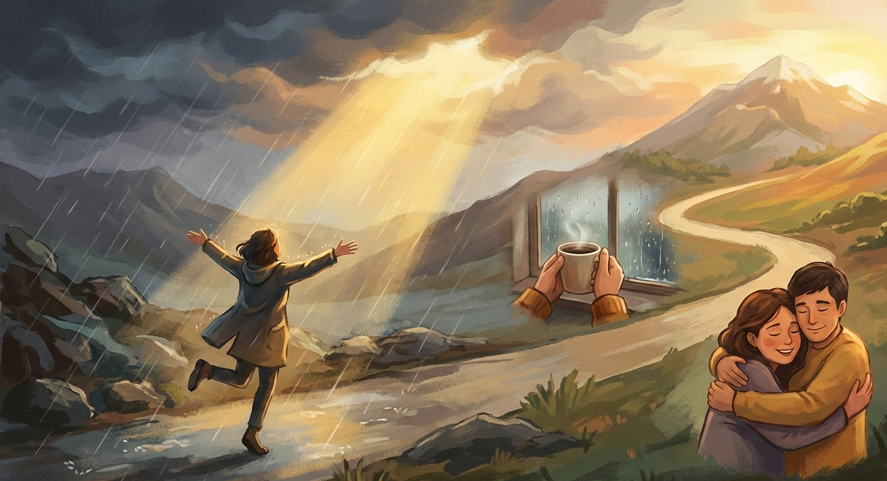
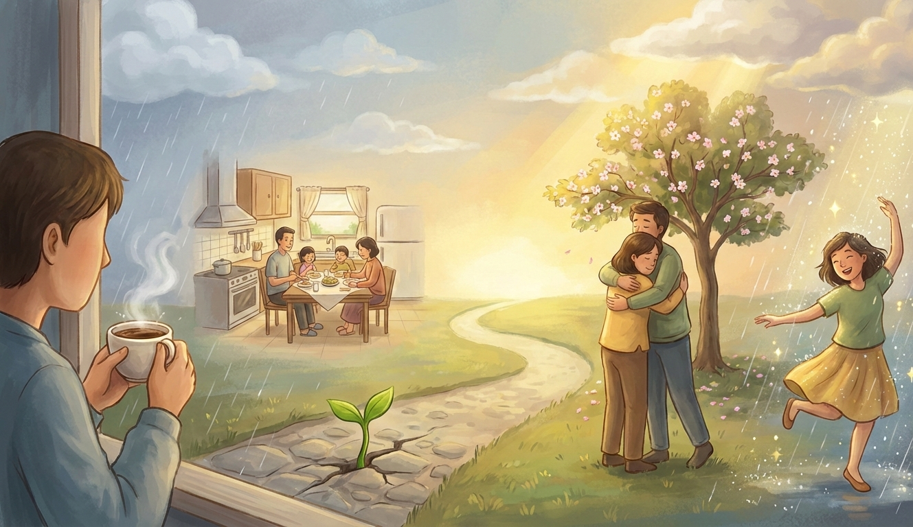

### **Hidup Itu Indah**

Hidup adalah perjalanan kompleks yang penuh dengan pasang surut, tetapi keindahannya bukan terletak pada kemudahan atau kebahagiaan yang konstan. Keindahan hidup justru muncul dari **makna, pertumbuhan, dan hubungan** yang kita bangun dalam setiap pengalaman. Bukan berarti kita harus menutup mata terhadap penderitaan, tetapi dengan kesadaran dan rasa syukur, kita mampu melihat bahwa hidup ini tetaplah indah—meskipun tidak selalu mudah. Dalam esai ini, saya ingin menunjukkan bahwa keindahan hidup bisa ditemukan dalam kesederhanaan, dalam hubungan antarmanusia, dan bahkan dalam tantangan yang kita hadapi.

Keindahan hidup sering kali tersembunyi dalam hal-hal yang kita anggap biasa. Seorang ibu yang menyiapkan sarapan pagi dengan penuh cinta, secangkir kopi yang kita nikmati di pagi hari, atau suara hujan yang menenangkan—semuanya adalah keindahan sederhana yang tak ternilai. Viktor Frankl, dalam bukunya *Man’s Search for Meaning*, menyatakan bahwa bahkan dalam keterbatasan dan penderitaan, manusia tetap bisa menemukan makna dan keindahan. Ini membuktikan bahwa keindahan bukan tergantung pada keadaan eksternal, tetapi pada cara kita memaknai dan menyikapi hidup itu sendiri.

Lebih dari itu, keindahan hidup juga terpancar dari hubungan yang kita jalin dengan orang lain. Cinta, empati, dan kepedulian menjadi sumber kebahagiaan yang tak ternilai. Ketika seorang teman menemani kita dalam kesedihan, atau seorang ayah rela bekerja keras demi keluarganya, kita menyaksikan keindahan yang lahir dari kemanusiaan. Film seperti *The Pursuit of Happyness* dan buku *A Man Called Ove* menunjukkan bahwa keindahan hidup muncul bukan dari kesuksesan materi, tetapi dari hubungan, harapan, dan kepedulian terhadap sesama.

Tantangan dan kesedihan pun memiliki peran penting dalam membentuk keindahan hidup. Mereka bukan musuh, melainkan guru yang mengajarkan arti ketahanan, kebijaksanaan, dan pertumbuhan. Tanpa kesedihan, kita tak akan mengenal arti kebahagiaan. Tanpa kegagalan, kita tak akan menghargai keberhasilan. Saya pernah melewati masa ketika segalanya terasa suram. Kehilangan pekerjaan, konflik keluarga, dan rasa putus asa hampir menguasai pikiran saya. Namun, dalam keheningan malam, saya menyadari bahwa keindahan hidup justru muncul saat saya memilih untuk tetap berdiri. Saya belajar bahwa keindahan bukanlah ketiadaan masalah, tetapi keberanian untuk menemukan makna di tengahnya. Dari situlah saya mulai memahami bahwa hidup itu indah, bukan karena mudah, tetapi karena kita mampu bertahan dan tumbuh.

Dengan segala dinamika dan ketidakpastiannya, hidup tetaplah indah. Bukan karena segalanya berjalan sesuai harapan, tetapi karena kita diberi kesempatan untuk merasakan, belajar, dan tumbuh. Keindahan hidup terletak pada kesadaran kita untuk melihat cahaya bahkan dalam kegelapan. Sebagaimana kata Rumi, “Hidup bukanlah tentang menunggu badai berlalu, tetapi belajar menari dalam hujan.” Dengan hati yang terbuka dan pikiran yang bijak, kita bisa mengatakan bahwa hidup ini adalah anugerah yang layak disyukuri, dirayakan, dan dihargai sepenuhnya.
